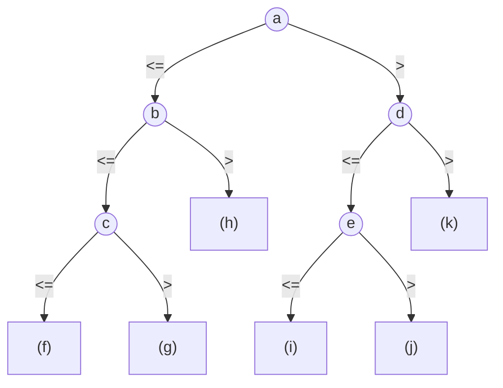

# 名古屋工業大学 工学研究科 工学専攻 情報工学系 2025年度 計算機ソフトウェア（データ構造とアルゴリズム）

## **Author**
GPT-5.6 Sol, 祭音Myyura

## **Description**

題意の要約。

次のソートに関する問いに答えよ。すべて昇順ソートとし、数値列がソート済みになっても処理を途中で打ち切らないものとする。

### (1)

次の記述が正しければ ○、誤っていれば × と答えよ。

1. バブルソートの最悪時間計算量は $\Theta(N^3)$ である。
2. 昇順ソート済みの $N$ 個の数値に挿入ソートを適用すると、$O(N)$ 時間で終了する。
3. 昇順ソート済みの $N$ 個の数値にバブルソートを適用すると、$O(N)$ 時間で終了する。
4. クイックソートはピボットの決め方によらず $O(N\log N)$ 時間となる。ピボット選択自体の時間は無視できる。
5. 比較ソートでは $\Omega(N\log N)$ が最悪時間計算量の下界である。
6. 基数ソートは比較ソートの一種である。

### (2)

次の (i)--(iii) は、数値列 `15, 140, 6, 57, 2` に、A: 挿入ソート、B: 基数ソート、C: バブルソート、D: 選択ソートのいずれかを適用した実行途中の状態である。1 行目は共通の初期列、最後の行はソート済みの列であり、各表は互いに異なるアルゴリズムを表す。(i)--(iii) が A--D のどれかを答えよ。

#### (i)

| 段階 | 数値列 |
|---:|---|
| 0 | `15 140 6 57 2` |
| 1 | `140 2 15 6 57` |
| 2 | `2 6 15 140 57` |
| 3 | `2 6 15 57 140` |

#### (ii)

| 段階 | 数値列 |
|---:|---|
| 0 | `15 140 6 57 2` |
| 1 | `15 6 57 2 140` |
| 2 | `6 15 2 57 140` |
| 3 | `6 2 15 57 140` |
| 4 | `2 6 15 57 140` |

#### (iii)

| 段階 | 数値列 |
|---:|---|
| 0 | `15 140 6 57 2` |
| 1 | `15 140 6 57 2` |
| 2 | `6 15 140 57 2` |
| 3 | `6 15 57 140 2` |
| 4 | `2 6 15 57 140` |

### (3)

図1の `Sort` は、サイズ $N$ の配列 `data` と非負整数 `low`, `high` を受け取り、マージソートで `data[low]` から `data[high]` を昇順に並べる。配列全体を並べるときは `Sort(data, 0, N-1)` と呼ぶ。`and` と `or` は短絡評価される。

```text
Sort(data, low, high)
    if (low < high)
        mid <- floor((low + high) / 2)

        Sort(data, [A], mid)
        Sort(data, [B], [C])

        新規配列 temp に data[low], ..., data[high] をこの順に格納する
        i <- low
        j <- mid + 1
        for (k <- low to high)
            if ((i <= mid) and ((j > high) or ([E] [D] [F])))
                data[k] <- [E]
                i <- i + 1
            else
                data[k] <- [F]
                j <- j + 1
```

#### (i)

空欄 (A)--(F) を埋めよ。ただし、(A)--(C) は `0`, `low`, `mid-1`, `mid`, `mid+1`, `high`, `N-1` のいずれか、(D) は `<=`, `>=` のいずれかとする。なお、`N` はグローバル変数として `Sort` 内からも参照できる。

#### (ii)

配列に三数 $a_1,a_2,a_3$ がこの順に格納されている。図1のマージソートによる比較決定木を次に示す。内部節点 (a)--(e) に比較式を、葉 (f)--(k) にソート後の数値列を入れよ。比較式は `a1:a2` のように添字の小さい方を左に書き、比較が `<=` なら左、`>` なら右へ進む。



出典：[名古屋工業大学 2025年度 原問題](https://www.nitech.ac.jp/examination/test/files/2025_08_joho.pdf)。

## **Kai**

### (1)

1. $\boxed{\times}$。バブルソートの最悪時間は $\Theta(N^2)$ である。
2. $\boxed{\bigcirc}$。各挿入で直前の要素との比較だけで済むため、全体で $\Theta(N)$ である。
3. $\boxed{\times}$。途中終了をしない条件なので、比較回数は $\Theta(N^2)$ である。
4. $\boxed{\times}$。毎回極端に偏って分割されると $\Theta(N^2)$ になる。
5. $\boxed{\bigcirc}$。比較決定木には $N!$ 個以上の葉が必要であり、高さは $\Omega(\log(N!))=\Omega(N\log N)$ である。
6. $\boxed{\times}$。基数ソートは桁を利用する非比較ソートである。

### (2)

(i) は一の位、十の位、百の位の順に安定ソートした状態なので、

$$
\boxed{\text{(i) B：基数ソート}}
$$

である。

(ii) は各走査で未整列部分の最大値 $140,57,15,6$ が順に右端へ移動しているので、

$$
\boxed{\text{(ii) C：バブルソート}}
$$

である。

(iii) は左側の整列済み部分へ $140,6,57,2$ を順に挿入しているので、

$$
\boxed{\text{(iii) A：挿入ソート}}
$$

である。

### (3)

#### (i)

左右の再帰区間は $[low,mid]$ と $[mid+1,high]$ である。また、`temp[0]` は元の `data[low]` に対応するため、元配列の添字 $i,j$ に対応する一時配列の要素はそれぞれ `temp[i-low]`, `temp[j-low]` である。左の要素を採用する条件は、右側を使い切ったか、両側に要素があり `temp[i-low] <= temp[j-low]` となる場合である。したがって、

```text
(A) low
(B) mid + 1
(C) high
(D) <=
(E) temp[i - low]
(F) temp[j - low]
```

となる。

#### (ii)

最初の二要素のマージで $a_1:a_2$ を比較する。その後 $a_3$ を二要素の整列列へマージすると、空欄は次のようになる。

| 空欄 | 内容 |
|---|---|
| (a) | `a1:a2` |
| (b) | `a1:a3` |
| (c) | `a2:a3` |
| (d) | `a2:a3` |
| (e) | `a1:a3` |
| (f) | $a_1,a_2,a_3$ |
| (g) | $a_1,a_3,a_2$ |
| (h) | $a_3,a_1,a_2$ |
| (i) | $a_2,a_1,a_3$ |
| (j) | $a_2,a_3,a_1$ |
| (k) | $a_3,a_2,a_1$ |

三数が相異なる場合、各葉は $3!=6$ 通りの大小順序に一対一に対応する。

## **Reference**

- [名古屋工業大学 2025年度 情報工学系 入学試験問題](https://www.nitech.ac.jp/examination/test/files/2025_08_joho.pdf)
