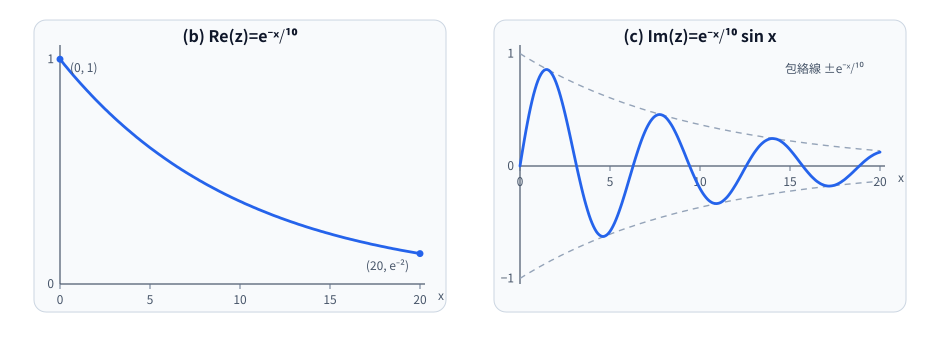

# 名古屋大学 情報学研究科 知能システム学専攻 2022年8月実施 解析・線形代数 [2]

## **Author**
[思齐塾](https://www.siqishu.com/), 祭音Myyura

## **Description**

出典：[名古屋大学・令和5年度知能システム学専攻入試問題](https://www.i.nagoya-u.ac.jp/wp-content/uploads/2022/09/0c8cfd0a7f9c85180fb8c16d9c008ae0.pdf)。

複素数 $z = e^{i(a + \frac{b}{10}i)x}$ について,次の問いに答えよ。ただし、 $i$ は虚数単位である。

(a) $z$ の実部 $\text{Re}(z)$ と虚部 $\text{Im}(z)$ をそれぞれ示せ。

(b) $a = 0, b = 1$ のとき, $\text{Re}(z)$ のグラフの概形を描け。ただし、横軸を $x$ とし, $0 \leq x \leq 20$ とする。

(c) $a = 1, b = 1$ のとき, $\text{Im}(z)$ のグラフの概形を描け。ただし、横軸を $x$ とし, $0 \leq x \leq 20$ とする。

### 题目描述

给定复数

$$
z=e^{\,i\left(a+\frac{b}{10}i\right)x},
$$

其中 $i$ 为虚数单位。

1. 分别写出 $z$ 的实部 $\operatorname{Re}(z)$ 与虚部 $\operatorname{Im}(z)$；
2. 当 $a=0,b=1$ 时，以 $x$ 为横轴，在 $0\le x\le20$ 上画出 $\operatorname{Re}(z)$ 的大致图像；
3. 当 $a=1,b=1$ 时，以 $x$ 为横轴，在 $0\le x\le20$ 上画出 $\operatorname{Im}(z)$ 的大致图像。

## **Kai**

(a) まず、 $z$ を変形します。

$$
z = e^{i(a + \frac{b}{10}i)x} = e^{i ax - \frac{b}{10}x} = e^{-\frac{b}{10}x + i ax} = e^{-\frac{b}{10}x} e^{i ax}
$$

オイラーの公式より、 $e^{i ax} = \cos(ax) + i \sin(ax)$ なので、

$$
z = e^{-\frac{b}{10}x} (\cos(ax) + i \sin(ax)) = e^{-\frac{b}{10}x} \cos(ax) + i e^{-\frac{b}{10}x} \sin(ax)
$$

したがって、

$$
\text{Re}(z) = e^{-\frac{b}{10}x} \cos(ax)
$$

$$
\text{Im}(z) = e^{-\frac{b}{10}x} \sin(ax)
$$

(b) $a = 0, b = 1$ のとき、

$$
\text{Re}(z) = e^{-\frac{1}{10}x} \cos(0) = e^{-\frac{1}{10}x}
$$

$0 \leq x \leq 20$ において、これは単調減少な指数関数になります。グラフは $x=0$ で $1$ を通り、 $x$ が増加するにつれて $0$ に近づきます。

(c) $a = 1, b = 1$ のとき、

$$
\text{Im}(z) = e^{-\frac{1}{10}x} \sin(x)
$$

$0 \leq x \leq 20$ において、これは指数関数 $e^{-\frac{1}{10}x}$ と三角関数 $\sin(x)$ の積になります。グラフは $x=0$ で $0$ を通り、 $x$ が増加するにつれて振動しながら減衰していきます。

(b), (c) の概形は次のとおりである。破線は (c) の包絡線 $y=\pm e^{-x/10}$ を表す。

