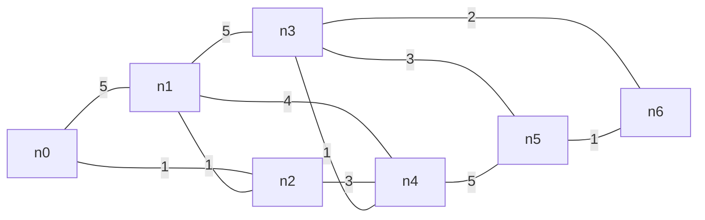

# 名古屋大学 情報学研究科 複雑系科学専攻 2017年8月実施 情3

## **Author**
祭音Myyura

## **Description**
スタート節点を $n_0$、ゴール節点を $n_6$ とする無向重み付きグラフで、最小コスト経路を探索する。

辺とコストは次の通りである。

基本手続き `g_search` は次の通りである。

1. コスト情報付き節点の集合 $C,D$ を空集合とする。
2. $n_0[0]$ を $C$ に加える。
3. 以下を繰り返す。
4. $C$ 内で評価値最小の節点 $p$ がゴールなら終了する。
5. $p$ を $C$ から除き、$D$ に加える。
6. $p$ に隣接し $D$ にない各節点 $q$ について、$q$ の旧ラベルを $C$ から除き、内部節点として $D$ の節点だけを通る $n_0$ から $q$ への最小コスト経路を求め、新しいラベルを $C$ に加える。

\[1\] 節点 $n_i$ までの経路コストを $g(n_i)$ とし、未確定集合 $C$ と確定集合 $D$ を用いる基本アルゴリズムの実行過程を示し、決定された経路を答える。

\[2\] 次の見積もり値を用い、節点の評価値を

$$
f(n_i)=g(n_i)+h(n_i)
$$

に変更した拡張アルゴリズムの実行過程を示す。

| 節点 | $n_0$ | $n_1$ | $n_2$ | $n_3$ | $n_4$ | $n_5$ | $n_6$ |
|---|---:|---:|---:|---:|---:|---:|---:|
| $h(n_i)$ | 7 | 6 | 5 | 2 | 2 | 1 | 0 |

また、最適経路を保証するために $h$ に必要な条件を述べる。

\[3\] \[1\] と \[2\] で手続きの4行目の実行回数が異なる理由を、$h$ の効果を踏まえて説明する。

## **Kai**

以下では、`n_i[c]` を「節点 $n_i$ の評価値が $c$」という意味で用いる。  
隣接節点は添字の小さい順に処理し、集合内の並び順は区別しない。表中の `—` は内容に変化がないことを表す。

### \[1\]

評価値が $g(n)$ のみなので、この手続きは Dijkstra 法である。

| 行番号 | $C$ の内容 | $D$ の内容 | 節点 $p$ | 節点 $q$ |
|---:|---|---|---|---|
| 1 | $\varnothing$ | $\varnothing$ | — | — |
| 2 | $\{n_0[0]\}$ | — | — | — |
| 4 | — | — | $n_0$ | — |
| 5 | $\varnothing$ | $\{n_0[0]\}$ | — | — |
| 6 | $\{n_1[5]\}$ | — | — | $n_1$ |
| 6 | $\{n_1[5], n_2[1]\}$ | — | — | $n_2$ |
| 4 | — | — | $n_2$ | — |
| 5 | $\{n_1[5]\}$ | $\{n_0[0], n_2[1]\}$ | — | — |
| 6 | $\{n_1[2]\}$ | — | — | $n_1$ |
| 6 | $\{n_1[2], n_4[4]\}$ | — | — | $n_4$ |
| 4 | — | — | $n_1$ | — |
| 5 | $\{n_4[4]\}$ | $\{n_0[0], n_1[2], n_2[1]\}$ | — | — |
| 6 | $\{n_3[7], n_4[4]\}$ | — | — | $n_3$ |
| 6 | — | — | — | $n_4$ |
| 4 | — | — | $n_4$ | — |
| 5 | $\{n_3[7]\}$ | $\{n_0[0], n_1[2], n_2[1], n_4[4]\}$ | — | — |
| 6 | $\{n_3[5]\}$ | — | — | $n_3$ |
| 6 | $\{n_3[5], n_5[9]\}$ | — | — | $n_5$ |
| 4 | — | — | $n_3$ | — |
| 5 | $\{n_5[9]\}$ | $\{n_0[0], n_1[2], n_2[1], n_3[5], n_4[4]\}$ | — | — |
| 6 | $\{n_5[8]\}$ | — | — | $n_5$ |
| 6 | $\{n_5[8], n_6[7]\}$ | — | — | $n_6$ |
| 4 | — | — | $n_6$ | — |

4行目で選ばれる節点は

$$
n_0,\ n_2,\ n_1,\ n_4,\ n_3,\ n_6
$$

の順である。

$n_6[7]$ は $n_3$ から更新され、さらに更新元を逆にたどると

$$
n_6 \leftarrow n_3 \leftarrow n_4 \leftarrow n_2 \leftarrow n_0
$$

となる。したがって、最適経路と総コストは

$$
\boxed{n_0 \to n_2 \to n_4 \to n_3 \to n_6},\qquad
1+3+1+2=\boxed{7}
$$

である。

### \[2\]

表中のラベルは $f(n)=g(n)+h(n)$ である。

| 行番号 | $C$ の内容 | $D$ の内容 | 節点 $p$ | 節点 $q$ |
|---:|---|---|---|---|
| 1 | $\varnothing$ | $\varnothing$ | — | — |
| 2 | $\{n_0[7]\}$ | — | — | — |
| 4 | — | — | $n_0$ | — |
| 5 | $\varnothing$ | $\{n_0[7]\}$ | — | — |
| 6 | $\{n_1[11]\}$ | — | — | $n_1$ |
| 6 | $\{n_1[11], n_2[6]\}$ | — | — | $n_2$ |
| 4 | — | — | $n_2$ | — |
| 5 | $\{n_1[11]\}$ | $\{n_0[7], n_2[6]\}$ | — | — |
| 6 | $\{n_1[8]\}$ | — | — | $n_1$ |
| 6 | $\{n_1[8], n_4[6]\}$ | — | — | $n_4$ |
| 4 | — | — | $n_4$ | — |
| 5 | $\{n_1[8]\}$ | $\{n_0[7], n_2[6], n_4[6]\}$ | — | — |
| 6 | — | — | — | $n_1$ |
| 6 | $\{n_1[8], n_3[7]\}$ | — | — | $n_3$ |
| 6 | $\{n_1[8], n_3[7], n_5[10]\}$ | — | — | $n_5$ |
| 4 | — | — | $n_3$ | — |
| 5 | $\{n_1[8], n_5[10]\}$ | $\{n_0[7], n_2[6], n_3[7], n_4[6]\}$ | — | — |
| 6 | — | — | — | $n_1$ |
| 6 | $\{n_1[8], n_5[9]\}$ | — | — | $n_5$ |
| 6 | $\{n_1[8], n_5[9], n_6[7]\}$ | — | — | $n_6$ |
| 4 | — | — | $n_6$ | — |

4行目で選ばれる節点は

$$
n_0,\ n_2,\ n_4,\ n_3,\ n_6
$$

の順であり、得られる最適経路は [1] と同じ

$$
\boxed{n_0 \to n_2 \to n_4 \to n_3 \to n_6},\qquad
\boxed{g(n_6)=7}
$$

である。

#### $h$ に求められる条件

設問で通常想定される条件は、$h(n)$ がゴールまでの真の最短コスト $h^*(n)$ を過大評価しないことである。

$$
0\le h(n)\le h^*(n),\qquad h(n_6)=0
$$

これは **許容性（admissibility）** と呼ばれる。本問の真の残余コストは

$$
(h^*(n_0),\ldots,h^*(n_6))=(7,7,6,2,3,1,0)
$$

であり、与えられた $h=(7,6,5,2,2,1,0)$ はすべてこれ以下なので許容的である。

> 厳密な補足：この手続きのように、一度 $D$ に入れた節点を再オープンしない graph-search で一般に最適性を保証する十分条件は、各辺 $(u,v)$（コスト $c(u,v)$）について
>
> $$
> h(u)\le c(u,v)+h(v)
> $$
>
> を満たす **整合性（consistency）** である。与えられた $h$ は $n_0\to n_2$ で $7>1+5$ となり整合的ではないが、この具体的なグラフでは上記の最適経路が得られる。

### \[3\]

4行目の実行回数は次の通りである。

| アルゴリズム | 4行目で選ばれる $p$ | 回数 |
|---|---|---:|
| 基本アルゴリズム | $n_0,n_2,n_1,n_4,n_3,n_6$ | 6 |
| 拡張アルゴリズム | $n_0,n_2,n_4,n_3,n_6$ | 5 |

$n_2$ を展開した直後、基本アルゴリズムでは

$$
g(n_1)=2<g(n_4)=4
$$

なので $n_1$ を先に展開する。一方、拡張アルゴリズムでは

$$
f(n_1)=2+6=8,\qquad f(n_4)=4+2=6
$$

となるため、ゴールに近いと見積もられる $n_4$ が先に選ばれる。結果として $n_1$ を展開せずに $n_6$ へ到達し、4行目の実行が1回減る。
