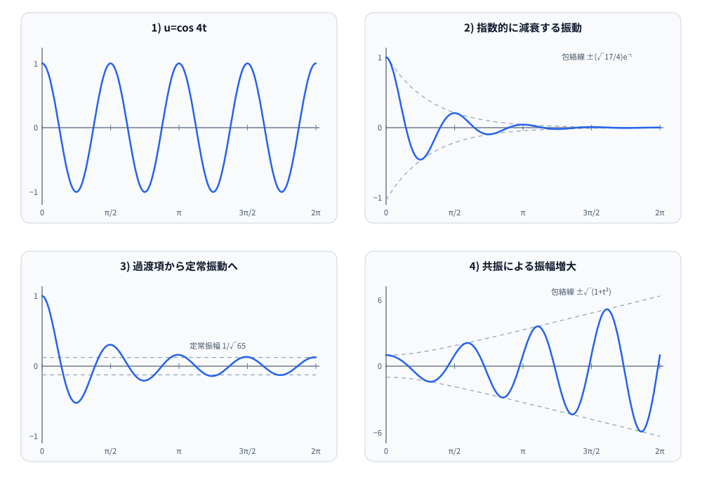

# 名古屋大学 情報学研究科 複雑系科学専攻 2018年8月実施 数2 [1]

## **Author**
[思齐塾](https://www.siqishu.com/), 祭音Myyura

## **Description**

実数変数 $t$ の実数値関数 $u(t)$ の第1階微分を $\dot{u}(t)$ , 第2階微分を $\ddot{u}(t)$ と書く。

(i) 以下に示す各微分方程式の一般解を求めよ。

(ii) 初期値を $u(0) = 1, \dot{u}(0) = 0$ とした場合の各微分方程式の解 $u(t)$ を求め、そのグラフの概形を描け。グラフの横軸・縦軸には目安となる数値も書け。円周率は $\pi$ のままでよい。

1) $\ddot{u} + 16u = 0$

2) $\ddot{u} + 2\dot{u} + 17u = 0$

3) $\ddot{u} + 2\dot{u} + 17u = -\sin 4t$

4) $\ddot{u} + 16u = 8\cos 4t$

### 题目描述

设 $u(t)$ 是实变量 $t$ 的实值函数，以 $\dot u(t)$、$\ddot u(t)$ 分别表示其一阶、二阶导数。对下面每一个微分方程：

- 求通解；
- 在初始条件

  $$
  u(0)=1,\qquad\dot u(0)=0
  $$

  下求解 $u(t)$，并画出图像的大致形状；横、纵坐标轴上还须标出可作参考的数值，圆周率可以保留为 $\pi$。

四个方程为：

1. $\ddot u+16u=0$；
2. $\ddot u+2\dot u+17u=0$；
3. $\ddot u+2\dot u+17u=-\sin4t$；
4. $\ddot u+16u=8\cos4t$。

## **Kai**

解答：

1) $\ddot{u} + 16u = 0$
特性方程式は $r^2 + 16 = 0$ 。 よって $r = \pm 4i$ 。 一般解は $u(t) = c_1 \cos 4t + c_2 \sin 4t$ 。
初期条件より $u(0) = c_1 = 1$ , $\dot{u}(0) = -4c_1 \sin 4t + 4c_2 \cos 4t |_{t=0} = 4c_2 = 0$ 。 よって $c_2 = 0$ 。 したがって $u(t) = \cos 4t$ 。

2) $\ddot{u} + 2\dot{u} + 17u = 0$
特性方程式は $r^2 + 2r + 17 = 0$ 。 よって $r = \frac{-2 \pm \sqrt{4 - 4(17)}}{2} = -1 \pm 4i$ 。 一般解は $u(t) = e^{-t} (c_1 \cos 4t + c_2 \sin 4t)$ 。
初期条件より $u(0) = c_1 = 1$ , $\dot{u}(0) = -e^{-t} (c_1 \cos 4t + c_2 \sin 4t) + e^{-t} (-4c_1 \sin 4t + 4c_2 \cos 4t) |_{t=0} = -c_1 + 4c_2 = 0$ 。 よって $c_2 = \frac{1}{4}$ 。 したがって $u(t) = e^{-t} (\cos 4t + \frac{1}{4} \sin 4t)$ 。

3) $\ddot{u} + 2\dot{u} + 17u = -\sin 4t$
斉次方程式 $\ddot{u} + 2\dot{u} + 17u = 0$ の一般解は、2) より $u_h(t) = e^{-t} (c_1 \cos 4t + c_2 \sin 4t)$ 。 特解を $u_p(t) = A \cos 4t + B \sin 4t$ と仮定する。 $\dot{u}_p(t) = -4A \sin 4t + 4B \cos 4t$ , $\ddot{u}_p(t) = -16A \cos 4t - 16B \sin 4t$ 。 代入すると、
$-16A \cos 4t - 16B \sin 4t + 2(-4A \sin 4t + 4B \cos 4t) + 17(A \cos 4t + B \sin 4t) = -\sin 4t$
$(A + 8B) \cos 4t + (B - 8A) \sin 4t = -\sin 4t$
$A + 8B = 0$ , $B - 8A = -1$ 。 よって $B = -\frac{A}{8}$ , $-\frac{A}{8} - 8A = -1$ , $-\frac{65}{8}A = -1$ , $A = \frac{8}{65}$ , $B = -\frac{1}{65}$ 。 特解は $u_p(t) = \frac{8}{65} \cos 4t - \frac{1}{65} \sin 4t$ 。 一般解は $u(t) = e^{-t} (c_1 \cos 4t + c_2 \sin 4t) + \frac{8}{65} \cos 4t - \frac{1}{65} \sin 4t$ 。
初期条件より $u(0) = c_1 + \frac{8}{65} = 1$ , $c_1 = \frac{57}{65}$ 。特解の微分は $t=0$ で $4B=-\frac{4}{65}$ なので、

$$
\dot{u}(0)=-c_1+4c_2-\frac{4}{65}=0.
$$

したがって

$$
c_2=\frac14\left(\frac{57}{65}+\frac{4}{65}\right)
=\frac{61}{260}.
$$

解は

$$
u(t)=e^{-t}\left(\frac{57}{65}\cos4t+\frac{61}{260}\sin4t\right)
+\frac{8}{65}\cos4t-\frac{1}{65}\sin4t.
$$

4) $\ddot{u} + 16u = 8 \cos 4t$
斉次方程式 $\ddot{u} + 16u = 0$ の一般解は、1) より $u_h(t) = c_1 \cos 4t + c_2 \sin 4t$ 。 特解を $u_p(t) = At \cos 4t + Bt \sin 4t$ と仮定する。 $\dot{u}_p(t) = A \cos 4t - 4At \sin 4t + B \sin 4t + 4Bt \cos 4t$ , $\ddot{u}_p(t) = -4A \sin 4t - 4A \sin 4t - 16At \cos 4t + 4B \cos 4t + 4B \cos 4t - 16Bt \sin 4t = -8A \sin 4t - 16At \cos 4t + 8B \cos 4t - 16Bt \sin 4t$ 。 代入すると、
$-8A \sin 4t - 16At \cos 4t + 8B \cos 4t - 16Bt \sin 4t + 16(At \cos 4t + Bt \sin 4t) = 8 \cos 4t$
$-8A \sin 4t + 8B \cos 4t = 8 \cos 4t$
よって $A = 0$ , $B = 1$ 。 特解は $u_p(t) = t \sin 4t$ 。 一般解は $u(t) = c_1 \cos 4t + c_2 \sin 4t + t \sin 4t$ 。
初期条件より $u(0) = c_1 = 1$ , $\dot{u}(0) = -4c_1 \sin 4t + 4c_2 \cos 4t + \sin 4t + 4t \cos 4t |_{t=0} = 4c_2 = 0$ 。 よって $c_2 = 0$ 。 解は $u(t) = \cos 4t + t \sin 4t$ 。

グラフの概形は次のようになる。

- 1) は振幅1、周期 $\pi/2$ の余弦波で、 $t=0$ で最大値1、 $t=\pi/8$ で最初の零点、 $t=\pi/4$ で最小値 $-1$ をとる。
- 2) は周期 $\pi/2$ で振動しながら指数的に0へ減衰する。極値時刻は $t=n\pi/4$ で、値は $(-1)^n e^{-n\pi/4}$ である。
- 3) は過渡項が $e^{-t}$ で消え、最終的に振幅 $1/\sqrt{65}$ 、周期 $\pi/2$ の定常振動 $\frac8{65}\cos4t-\frac1{65}\sin4t$ に近づく。
- 4) は共振解で、包絡線の大きさは $\sqrt{1+t^2}$ とともに増大する。例えば $u(n\pi/4)=(-1)^n$ であり、その間の振幅が次第に大きくなる。

横軸を $0\leq t\leq2\pi$ とした4つのグラフの概形を次に示す。破線は、それぞれ減衰振動、定常振動、共振解の振幅の目安となる包絡線である。

