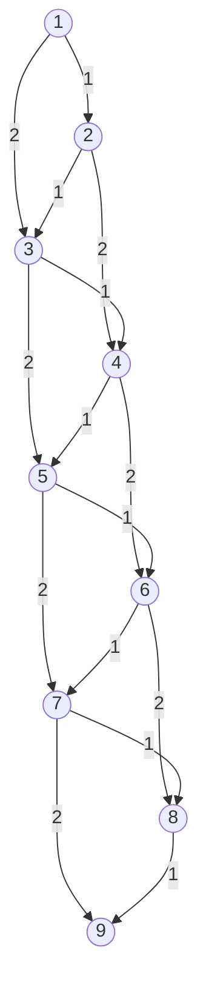
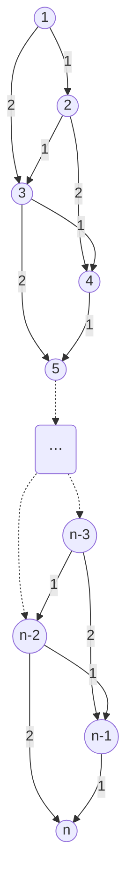

# 名古屋大学 情報学研究科 複雑系科学専攻 2022年8月実施 情3

## **Author**
祭音Myyura

## **Description**
### \[1\]

丸で示す節点と、矢印で示す有向辺からなる有向グラフにおいて、最短距離とその経路を探索する。節点 $n$ から節点 $m$ への辺は矢印で図示し、$(n,m)$ と表す。また、辺の傍の数字は距離を示す。

(1) 図 1 の有向グラフにおいて、直接結合している 2 節点間の最短距離とその経路を、節点 1 から節点 5 までに関して表 1 にまとめる。表 1 の空欄 (a) から (f) を埋めなさい。

#### 
 図1

#### 
 表1

| 節点 | 節点 | 最短距離 | 最短距離の経路 |
|---:|---:|---:|---|
| 1 | 2 | 3 | $(1,2)$ |
| 1 | 3 | 5 | $(1,2),(2,3)$ |
| 2 | 3 | 2 | $(2,3)$ |
| 2 | 4 | (a) | (b) |
| 3 | 4 | 2 | $(3,4)$ |
| 3 | 5 | (c) | (d) |
| 4 | 5 | (e) | (f) |

(2) 問題を部分問題へと分割し、分割した問題を解いた結果を、たとえば表 1 のように記録し、記録した部分問題の解を参照しながら問題を解く方法は、動的計画法とよばれる。
動的計画法を用いて、図 1 に示す有向グラフの節点 1 から節点 9 までの最短距離と、その経路を求めなさい。また、求める過程についても説明しなさい。

### \[2\]

(1) 図 2 の有向グラフにおいて、節点 1 から節点 9 までの最短距離とその経路の総数を求めなさい。また、求める過程についても説明しなさい。

#### 
 図2

(2) 図 3 の有向グラフにおいて、節点 1 から節点 $n$ までの最短距離とその経路の総数を考える。以下の『 』で囲まれた文章の（あ）と（い）の空欄に入る、適切な数式を答えなさい。

> 『節点 1 から節点 $m-1$ までの最短距離の経路の総数を関数 $dp(m-1)$ と表すと、
>
> $$
> dp(n)=(\text{あ})
> $$
>
> となる。また最短距離は（い）である。』

#### 
 図3

### 题目描述

**[1] 最短路径**：对图 1 所示带权有向图：

1. 填写表 1 的 (a)—(f)，给出节点 2 到 4、3 到 5、4 到 5 的最短距离与对应边序列。
2. 使用动态规划，求节点 1 到 9 的最短距离和路径，并说明如何记录、复用子问题结果。

**[2] 最短路径计数**：

1. 对图 2，求节点 1 到 9 的最短距离及最短路径总数，并说明过程。
2. 对图 3 的一般 $n$ 节点结构，记从节点 1 到节点 $m-1$ 的最短路径数为 $dp(m-1)$，填写
   $$
   dp(n)=(\text{あ})
   $$
   及节点 1 到 $n$ 的最短距离 (い)。

所有图、边权和表格的完整信息均见上文。

## **Kai**
### \[1\]
#### (1)

節点 2 から節点 4 までは，

$$
2\to4: 5,\qquad
2\to3\to4: 2+2=4
$$

より，

$$
\boxed{(a)=4},\qquad
\boxed{(b)=(2,3),(3,4)}
$$

である。

節点 3 から節点 5 までは，

$$
3\to5: 6,\qquad
3\to4\to5: 2+3=5
$$

より，

$$
\boxed{(c)=5},\qquad
\boxed{(d)=(3,4),(4,5)}
$$

である。

節点 4 から節点 5 までは直接辺の距離が 3 であるから，

$$
\boxed{(e)=3},\qquad
\boxed{(f)=(4,5)}
$$

である。

#### (2)

節点 1 から節点 $i$ までの最短距離を $d(i)$ とする。  
各節点について，直前の節点からの距離を比較すると，

$$
d(1)=0
$$

$$
d(2)=3
$$

$$
d(3)=\min\{8,\ 3+2\}=5
$$

$$
d(4)=\min\{3+5,\ 5+2\}=7
$$

$$
d(5)=\min\{5+6,\ 7+3\}=10
$$

$$
d(6)=\min\{7+3,\ 10+1\}=10
$$

$$
d(7)=\min\{10+5,\ 10+3\}=13
$$

$$
d(8)=\min\{10+6,\ 13+4\}=16
$$

$$
d(9)=\min\{13+2,\ 16+3\}=15
$$

となる。

最短距離を与える直前の節点を逆にたどると，

$$
9\leftarrow7\leftarrow6\leftarrow4\leftarrow3\leftarrow2\leftarrow1
$$

である。したがって，

$$
\boxed{\text{最短距離は }15}
$$

$$
\boxed{\text{最短経路は }
1\to2\to3\to4\to6\to7\to9}
$$

すなわち，

$$
\boxed{(1,2),(2,3),(3,4),(4,6),(6,7),(7,9)}
$$

である。

### \[2\]
節点 $n$ へは，節点 $n-1$ または節点 $n-2$ から到達するので，

$$
\boxed{dp(n)=dp(n-1)+dp(n-2)}
$$

である。

また，各辺の距離は節点番号の差に等しいため，節点 1 から節点 $n$ までの経路の距離は常に，

$$
n-1
$$

となる。よって，

$$
\boxed{\text{最短距離は }n-1}
$$

である。

従って、節点 1 から節点 9 までの任意の経路の距離は $8$ となって、最短経路の総数は $34$ である。
