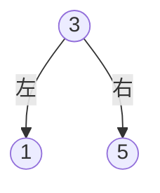
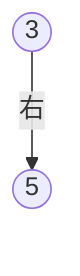
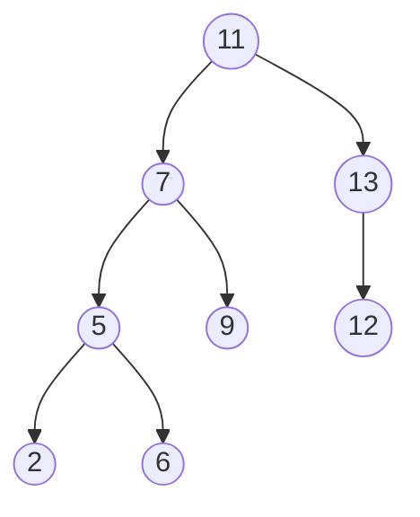
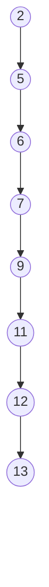

# 名古屋大学 情報学研究科 複雑系科学専攻 2023年8月実施 情3

## **Author**
祭音Myyura

## **Description**
下図のように，カードの表に 2，5，6，7，9，11，12，13 のうちどれかの数字が 1 つ書かれたカードがあるとする。

| 2 | 5 | 6 | 7 | 9 | 11 | 12 | 13 |
|---:|---:|---:|---:|---:|----:|----:|----:|

カードを裏返し十分にシャッフルして並べ替え，カードを裏返したまま，以下の図のように積み上げる。これを以下では「山」とよぶ。

1) 山の上から 1 枚ずつカードをめくる。11 と書かれたカードをひくまでの枚数の期待値を理由とともに示しなさい。

2) 山の上からカードを 1 枚ずつめくっていくと，1 枚目から 8 枚目のカードに書かれた数字はそれぞれ，

$$
11,\ 7,\ 13,\ 5,\ 9,\ 6,\ 2,\ 12
$$

であった。この順に値を空の二分探索木に挿入した場合に得られる二分探索木を，途中経過とともに示しなさい。

なお，データ構造のひとつである木構造のうち，どのノードも 2 つ以下の子ノードをもつ木構造は二分木とよばれる。二分木のなかでも各ノードの値が，左の子ノードの値よりも大きく，右の子ノードの値よりも小さい場合は二分探索木とよばれる

$$
\text{左の子ノードの値}<\text{親ノードの値}<\text{右の子ノードの値}
$$

二分探索木の例を以下に示す。

3) 2) で作成した二分探索木を通りがけ順（中間順／in-order）で走査する場合，訪問するノードの値を最初から順に示しなさい。

なお，通りがけ順とは，まず左部分木を走査，次に節点，次に右部分木を再帰的に走査する方法である。

4) 3) で得た値の順に空の二分探索木に挿入して得られる二分探索木を示しなさい。

5) ノード数が $N$ の二分探索木に，任意の値をもつノードが存在するかを探索する場合を考える。探索に要する最悪と最良の時間計算量を示し，それぞれの理由を二分探索木の構造に対応させて説明せよ。

## **Kai**
### 1)

11 のカードの位置を $X$ とする。十分にシャッフルされているので，

$$
P(X=k)=\frac18 \qquad (k=1,2,\ldots,8)
$$

である。したがって，

$$
E[X]
=\sum_{k=1}^{8}k\cdot\frac18
=\frac{1+2+\cdots+8}{8}
=\frac{36}{8}
=\frac92
$$

よって，求める期待値は

$$
\boxed{\frac92\text{ 枚}}
$$

である。

### 2)

挿入順は

$$
11,\ 7,\ 13,\ 5,\ 9,\ 6,\ 2,\ 12
$$

である。

#### 途中経過

1. $11$ を根とする。  
2. $7<11$ より，7 は 11 の左。  
3. $13>11$ より，13 は 11 の右。  
4. $5<11,\ 5<7$ より，5 は 7 の左。  
5. $9<11,\ 9>7$ より，9 は 7 の右。  
6. $6<11,\ 6<7,\ 6>5$ より，6 は 5 の右。  
7. $2<11,\ 2<7,\ 2<5$ より，2 は 5 の左。  
8. $12>11,\ 12<13$ より，12 は 13 の左。  

最終的な二分探索木は次の通りである。

### 3)

通りがけ順は

$$
\text{左部分木}\rightarrow\text{節点}\rightarrow\text{右部分木}
$$

である。したがって，訪問順は

$$
\boxed{2,\ 5,\ 6,\ 7,\ 9,\ 11,\ 12,\ 13}
$$

となる。

### 4)

3) で得た列は昇順であるため，各値は常に右の子ノードとして挿入される。

よって，右にのみ伸びる二分探索木となる。

### 5)

二分探索木の探索時間は，木の高さを $h$ とすると

$$
\Theta(h)
$$

である。

- 木が平衡に近い場合，高さは $\Theta(\log N)$ なので，

$$
\boxed{\Theta(\log N)}
$$

- 木が一方向に偏り，連結リストのようになった場合，高さは $\Theta(N)$ なので，

$$
\boxed{\Theta(N)}
$$

したがって，木の構造に着目した場合，最良計算量は $\Theta(\log N)$，最悪計算量は $\Theta(N)$ である。

なお，探索する値が根にある場合の 1 回の探索だけを考えれば，最良の場合は $\Theta(1)$ である。
