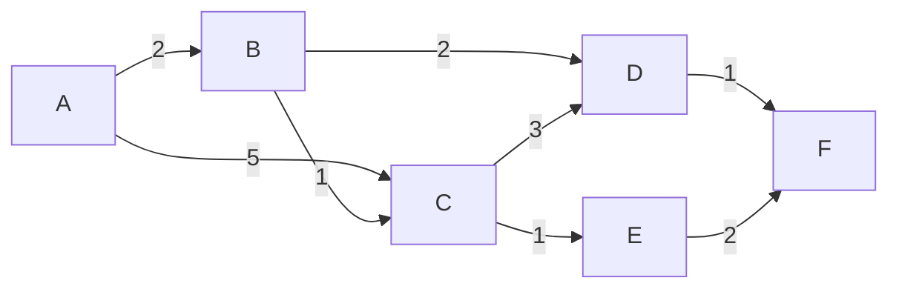
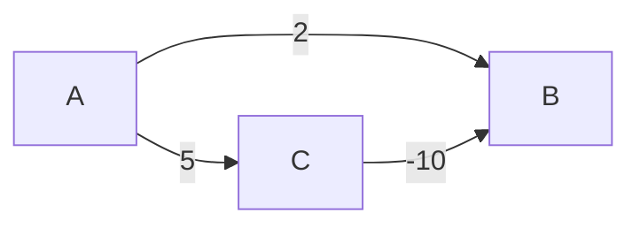

# 名古屋大学 情報学研究科 複雑系科学専攻 2025年8月実施 情3

## **Author**
祭音Myyura

## **Description**
### \[1\]
10 個のデータからなる以下の配列 `a` について、バブルソート法を用いて昇順にソートするときの置換結果（パスごとの配列の状態）を全て記せ。

```text
a: 18, 21, 13, 15, 22, 17, 26, 20, 10, 29
```

### \[2\]
要素をランダムな順序で挿入して構築した二分探索木について、以下の問いに答えよ。

1. 要素集合 $\{1,2,3,4,5,6,7\}$ に対して、$7!$ 通りの挿入順を考えた時、木の平均探索コスト（ノード深さの平均）を求める計算手順を以下の例を参考に示せ。

   （例  
   1：～～を構築。  
   2：～～を計算。  
   3：～～を求める。）

2. 全通りの内、平均探索コストが最小となる挿入順を一つ示し、その時の二分探索木を示せ。

3. 探索したい要素が等確率でない場合、平均探索コストを最小化する二分探索木を再構成するための手法を説明せよ。

### \[3\]
次の重み付き有向グラフを考える（ノード数：6、ノード：A、B、C、D、E、F）。

各辺の重みは、

- $A \to B\ (2)$
- $A \to C\ (5)$
- $B \to C\ (1)$
- $B \to D\ (2)$
- $C \to D\ (3)$
- $C \to E\ (1)$
- $D \to F\ (1)$
- $E \to F\ (2)$

とする。

ここで、$(\ )$ 内の数字はこの辺の重みを示す。例えば、$A \to B\ (2)$ は A から B への有向辺を示し、2 はこの辺の重みである。

以下の問いに答えよ。

1. ダイクストラ法に基づいて始点 A から各ノードに至る最短経路を求める手順を示し、各ノードに至る最短距離を全て求めよ。また、重み付き有向グラフを示せ。

2. ダイクストラ法が負の重みを含む辺を持つグラフに適用できない理由を説明せよ。

## **Kai**
### \[1\]
ここでは、各パスで左から右へ隣接要素を比較し、左の要素が右の要素より大きい場合に交換する方式を用いる。

| パス | 配列の状態 |
|---:|---|
| 初期 | 18, 21, 13, 15, 22, 17, 26, 20, 10, 29 |
| 1 | 18, 13, 15, 21, 17, 22, 20, 10, 26, 29 |
| 2 | 13, 15, 18, 17, 21, 20, 10, 22, 26, 29 |
| 3 | 13, 15, 17, 18, 20, 10, 21, 22, 26, 29 |
| 4 | 13, 15, 17, 18, 10, 20, 21, 22, 26, 29 |
| 5 | 13, 15, 17, 10, 18, 20, 21, 22, 26, 29 |
| 6 | 13, 15, 10, 17, 18, 20, 21, 22, 26, 29 |
| 7 | 13, 10, 15, 17, 18, 20, 21, 22, 26, 29 |
| 8 | 10, 13, 15, 17, 18, 20, 21, 22, 26, 29 |
| 9 | 10, 13, 15, 17, 18, 20, 21, 22, 26, 29 |

### \[2\]
#### \[2\]-1
以下では、根ノードの深さを $0$ とする。

要素集合は

$$
K=\{1,2,3,4,5,6,7\}
$$

であり、挿入順は全部で

$$
7! = 5040
$$

通り存在する。

全挿入順を列挙する方法

1. 集合 $K$ の全ての順列を生成する。
2. 各順列について、先頭から順に要素を二分探索木へ挿入する。
3. 構築された木の各ノードの深さを求める。
4. 各木について、平均ノード深さを求める。
5. 5040 通りの平均を取る。

#### \[2\]-2
平均探索コストを最小にするには、木をできるだけ平衡にすればよい。

一例として、次の挿入順がある。

$$
\boxed{4,2,6,1,3,5,7}
$$

この順に挿入すると、次の二分探索木が得られる。

```text
        4
      /   \
     2     6
    / \   / \
   1   3 5   7
```

深さの総和は

$$
0\cdot1+1\cdot2+2\cdot4=10
$$

である。したがって、平均ノード深さは

$$
\boxed{\frac{10}{7}\approx1.42857}
$$

となる。

#### \[2\]-3
$DP[i][j]$ を、キー $i,i+1,\ldots,j$ から構成される二分探索木の最小加重探索コストとする。

また、区間 $[i,j]$ の確率和を $W(i,j)=\sum_{k=i}^{j}p_k$ とする。

空区間については $DP[i][i-1]=0$ と定義する。

区間 $[i,j]$ の根として $r$ を選ぶと、

- 左部分木：$[i,r-1]$
- 右部分木：$[r+1,j]$

となる。

左右部分木の全ノードは 1 段深くなるため、区間全体の確率和 $W(i,j)$ が追加される。

よって、漸化式は

$$
DP[i][j]
=
\min_{r=i}^{j}
\left\{
DP[i][r-1]
+
DP[r+1][j]
+
W(i,j)
\right\}
$$

となる。

```text
## 擬似コード

for i = 1 to n + 1:
    DP[i][i - 1] = 0

for length = 1 to n:
    for i = 1 to n - length + 1:
        j = i + length - 1
        DP[i][j] = infinity

        for r = i to j:
            cost = DP[i][r - 1]
                 + DP[r + 1][j]
                 + W(i, j)

            if cost < DP[i][j]:
                DP[i][j] = cost
                Root[i][j] = r
```

### \[3\]
#### \[3\]-1 始点 A からの最短経路



距離の更新表

| ステップ | 確定ノード | $d(A)$ | $d(B)$ | $d(C)$ | $d(D)$ | $d(E)$ | $d(F)$ |
|---:|---|---:|---:|---:|---:|---:|---:|
| 初期 | なし | 0 | ∞ | ∞ | ∞ | ∞ | ∞ |
| 1 | A | 0 | 2 | 5 | ∞ | ∞ | ∞ |
| 2 | B | 0 | 2 | 3 | 4 | ∞ | ∞ |
| 3 | C | 0 | 2 | 3 | 4 | 4 | ∞ |
| 4 | D | 0 | 2 | 3 | 4 | 4 | 5 |
| 5 | E | 0 | 2 | 3 | 4 | 4 | 5 |
| 6 | F | 0 | 2 | 3 | 4 | 4 | 5 |

最終結果

| 終点 | 最短距離 | 最短経路 |
|---|---:|---|
| A | 0 | A |
| B | 2 | A → B |
| C | 3 | A → B → C |
| D | 4 | A → B → D |
| E | 4 | A → B → C → E |
| F | 5 | A → B → D → F |

#### \[3\]-2
ダイクストラ法では、未確定ノードの中から暫定距離が最小のノードを選び、その距離を最短距離として確定する。

この操作が正しいためには、全ての辺の重みが $0$ 以上でなければならない。

辺の重みが非負であれば、未確定ノードを経由して戻ってくる経路によって、すでに確定した距離が小さくなることはない。

しかし、負の重みを持つ辺が存在すると、後から処理されるノードを経由することで、すでに確定したノードの距離がさらに小さくなる可能性がある。

**反例**


