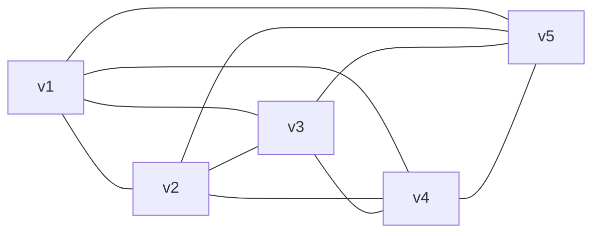

# 名古屋大学 情報学研究科 情報システム学専攻 2024年8月実施 専門 問4

## **Author**
祭音Myyura

## **Description**
頂点の集合が $V$、辺の集合が $E$ の無向グラフを $G =(V, E)$ と表記する。
頂点 $v_1, v_2$ を端点とする辺は $\{v_1, v_2\} \in E$として表す。
この問題では，ループや多重辺を持たない単純グラフのみを考え，グラフに関する用語を以下のように定義する。

- $G =(V, E)$ が**完全グラフ**：異なる任意の頂点の組 $v_1, v_2 \in V$ に対し，辺 $\{v_1, v_2\} \in E$ が存在する。
- $G =(V, E)$ が**正則グラフ**：$V$ の全ての頂点が同一の次数を持つ。頂点の次数とは，その頂点を端点に持つ辺の本数である。
- $G' =(V', E')$ が $G =(V, E)$ の**補グラフ**：$V' = V$ であり，異なる頂点の組 $v_1, v_2 \in V$ に対し，$\{v_1, v_2\} \notin E$ のとき，かつそのときのみ $\{v_1, v_2\} \in E'$。
- グラフ $G' =(V', E')$ が $G =(V, E)$ と**同型**：次の性質を満たす全単射 $f : V \to V'$ が存在する；$\{v_1, v_2\} \in E$ のとき，かつそのときのみ $\{f(v_1), f(v_2)\} \in E'$。

(1) 頂点数 $5$ の完全グラフを示せ。

(2) 頂点数 $n$ の完全グラフが持つ辺の本数を答えよ。

(3) 図 1 で与えられるグラフの補グラフを示せ。解答のグラフには頂点名を記すこと。

(4) 図 2 の $a$ から $d$ に示す 4 つのグラフのそれぞれについて，図 1 のグラフと同型であるかどうかを答え，同型の場合は頂点間の全単射を示し，同型でない場合は，同型でないと判断する理由を述べよ。

<figure style="text-align:center;">
  
</figure>

<figure style="text-align:center;">
  
</figure>

## **Kai**
### (1)

### (2)

頂点数$n$の完全グラフでは，異なる $2$ 頂点の組の数だけ辺がある。
これは組合せの数 $\binom{n}{2}$ に等しいので，辺の本数は

$$
\binom{n}{2} = \frac{n(n-1)}{2}
$$

である。

### (3)

図 1 のグラフの頂点は$v_1, v_2, v_3, v_4, v_5$であり，図から読み取れる辺は

$$
\{v_1,v_2\},\ \{v_1,v_4\},\ \{v_2,v_3\},\ \{v_2,v_4\},\ \{v_3,v_4\},\ \{v_4,v_5\}
$$

の $6$ 本である。

補グラフ $G'=(V,E')$ は

$$
E' = \{\{v_1,v_3\},\ \{v_1,v_5\},\ \{v_2,v_5\},\ \{v_3,v_5\}\}
$$

となる。

### (4)
まず，図 1 のグラフ $G$ の各頂点の次数を調べる：

- $\deg(v_1)= 2$（$v_2,v_4$ と接続）
- $\deg(v_2)= 3$（$v_1,v_3,v_4$ と接続）
- $\deg(v_3)= 2$（$v_2,v_4$ と接続）
- $\deg(v_4)= 4$（$v_1,v_2,v_3,v_5$ と接続）
- $\deg(v_5)= 1$（$v_4$ のみと接続）

したがって次数列（次数の多重集合）は
$(\{1,2,2,3,4\}$である。

以下，各図との比較を行う。

---

図 2 (a) について、次の全単射 $f$ を考えると、図 2 (a) のグラフは図 1 のグラフと同型であることが分かる。

$$
f(v_1)=u_2,\quad
f(v_2)=u_1,\quad
f(v_3)=u_4,\quad
f(v_4)=u_5,\quad
f(v_5)=u_3.
$$

<!-- 図 1 の各辺が $(a)$の辺に移るか確認すると，

- $\{v_1,v_2\} \mapsto \{u_2,u_1\}$（辺あり）
- $\{v_1,v_4\} \mapsto \{u_2,u_5\}$（辺あり）
- $\{v_2,v_3\} \mapsto \{u_1,u_4\}$（辺あり）
- $\{v_2,v_4\} \mapsto \{u_1,u_5\}$（辺あり）
- $\{v_3,v_4\} \mapsto \{u_4,u_5\}$（辺あり）
- $\{v_4,v_5\} \mapsto \{u_5,u_3\}$（辺あり）

となり，逆に $(a)$ 側の辺もすべて図 1 の辺から来ているので，
$a$ のグラフは図 1 のグラフと同型である。 -->

図 2 (b) についての次数を調べると，

- $\deg(u_1)=2$
- $\deg(u_2)=3$
- $\deg(u_3)=3$
- $\deg(u_4)=1$
- $\deg(u_5)=3$

となり，次数列は $\{1,2,3,3,3\}$ である。

図 1 の次数列は $\{1,2,2,3,4\}$ であり，一致しない。
次数列はグラフ同型では不変なので，$(b)$ のグラフは図 1 のグラフと**同型ではない**。

図 2 (c) についての次数を調べると，

- $\deg(u_1)=3$
- $\deg(u_2)=3$
- $\deg(u_3)=3$
- $\deg(u_4)=4$
- $\deg(u_5)=1$

であり，次数列は $\{1,3,3,3,4\}$ となる。
これも図 1 の次数列 $\{1,2,2,3,4\}$ と一致しないため，
(c) のグラフも図 1 のグラフと**同型ではない**。

図 2 (d) について、次の全単射 $f$

$$
f(v_1)=u_2,\quad
f(v_2)=u_1,\quad
f(v_3)=u_4,\quad
f(v_4)=u_5,\quad
f(v_5)=u_3
$$

をとると，図 2 (d) のグラフは図 1 のグラフと同型であることが分かる。
