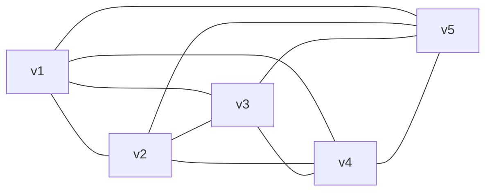

# 名古屋大学 情報学研究科 情報システム学専攻 2024年8月実施 専門 問4

## **Author**
祭音Myyura

## **Description**

出典：[名古屋大学公表問題](https://www.i.nagoya-u.ac.jp/wp-content/uploads/2017/09/9452bf5c52a4e504caf5a437910d3930.pdf)。

頂点の集合が $V$、辺の集合が $E$ の無向グラフを $G =(V, E)$ と表記する。
頂点 $v_1, v_2$ を端点とする辺は $\{v_1, v_2\} \in E$として表す。
この問題では，ループや多重辺を持たない単純グラフのみを考え，グラフに関する用語を以下のように定義する。

- $G =(V, E)$ が**完全グラフ**：異なる任意の頂点の組 $v_1, v_2 \in V$ に対し，辺 $\{v_1, v_2\} \in E$ が存在する。
- $G =(V, E)$ が**正則グラフ**：$V$ の全ての頂点が同一の次数を持つ。頂点の次数とは，その頂点を端点に持つ辺の本数である。
- $G' =(V', E')$ が $G =(V, E)$ の**補グラフ**：$V' = V$ であり，異なる頂点の組 $v_1, v_2 \in V$ に対し，$\{v_1, v_2\} \notin E$ のとき，かつそのときのみ $\{v_1, v_2\} \in E'$。
- グラフ $G' =(V', E')$ が $G =(V, E)$ と**同型**：次の性質を満たす全単射 $f : V \to V'$ が存在する；$\{v_1, v_2\} \in E$ のとき，かつそのときのみ $\{f(v_1), f(v_2)\} \in E'$。

(1) 頂点数 $5$ の完全グラフを示せ。

(2) 頂点数 $n$ の完全グラフが持つ辺の本数を答えよ。

(3) 図 1 で与えられるグラフの補グラフを示せ。解答のグラフには頂点名を記すこと。

(4) 図 2 の $a$ から $d$ に示す 4 つのグラフのそれぞれについて，図 1 のグラフと同型であるかどうかを答え，同型の場合は頂点間の全単射を示し，同型でない場合は，同型でないと判断する理由を述べよ。

(5) $G$ が補グラフと同型であるとする。非負整数 $k$ を用いて、頂点数が $n=4k$ または $n=4k+1$ と表されることを示せ。

(6) (5) の条件に加えて $G$ が正則ならば、$n=4k+1$ となることを示せ。

### 题目描述

设简单无向图 $G=(V,E)$ 不含自环和重边，边 $\{v_1,v_2\}$ 以两个端点表示。定义如下：

- 完全图：任意两个不同顶点之间都有边；
- 正则图：所有顶点的度数相同；
- 补图 $G'=(V',E')$：$V'=V$，且两个不同顶点在 $G'$ 中相邻当且仅当它们在 $G$ 中不相邻；
- 图同构：存在保持相邻关系的顶点集合双射。

回答下列问题。

1. 画出一个有 5 个顶点的完全图。
2. 求有 $n$ 个顶点的完全图的边数。
3. 画出图 1 所示图的补图，并标出顶点名称。
4. 对图 2 的 a 至 d 四个图，逐一判断其是否与图 1 同构；若同构，给出顶点间的双射；若不同构，说明判定理由。
5. 若图 $G$ 与其补图同构，证明顶点数 $n$ 必可写成 $4k$ 或 $4k+1$，其中 $k$ 为非负整数。
6. 在第 5 问的条件下，进一步证明：若 $G$ 还是正则图，则其顶点数必为 $n=4k+1$。

## **Kai**
### (1)

```mermaid
graph LR
  v1 --- v2
  v1 --- v3
  v1 --- v4
  v1 --- v5
  v2 --- v3
  v2 --- v4
  v2 --- v5
  v3 --- v4
  v3 --- v5
  v4 --- v5
```

### (2)

頂点数 $n$ の完全グラフでは，異なる $2$ 頂点の組の数だけ辺がある。
これは組合せの数 $\binom{n}{2}$ に等しいので，辺の本数は

$$
\binom{n}{2} = \frac{n(n-1)}{2}
$$

である。

### (3)

図 1 のグラフの頂点は$v_1, v_2, v_3, v_4, v_5$であり，図から読み取れる辺は

$$
\{v_1,v_2\},\ \{v_1,v_4\},\ \{v_2,v_3\},\ \{v_2,v_4\},\ \{v_3,v_4\},\ \{v_4,v_5\}
$$

の $6$ 本である。

補グラフ $G'=(V,E')$ は

$$
E' = \{\{v_1,v_3\},\ \{v_1,v_5\},\ \{v_2,v_5\},\ \{v_3,v_5\}\}
$$

となる。

### (4)
まず，図 1 のグラフ $G$ の各頂点の次数を調べる：

- $\deg(v_1)= 2$（$v_2,v_4$ と接続）
- $\deg(v_2)= 3$（$v_1,v_3,v_4$ と接続）
- $\deg(v_3)= 2$（$v_2,v_4$ と接続）
- $\deg(v_4)= 4$（$v_1,v_2,v_3,v_5$ と接続）
- $\deg(v_5)= 1$（$v_4$ のみと接続）

したがって次数列（次数の多重集合）は
$\{1,2,2,3,4\}$ である。

以下，各図との比較を行う。

---

図 2 (a) について、次の全単射 $f$ を考えると、図 2 (a) のグラフは図 1 のグラフと同型であることが分かる。

$$
f(v_1)=u_2,\quad
f(v_2)=u_1,\quad
f(v_3)=u_4,\quad
f(v_4)=u_5,\quad
f(v_5)=u_3.
$$

図 2 (b) についての次数を調べると，

- $\deg(u_1)=2$
- $\deg(u_2)=3$
- $\deg(u_3)=3$
- $\deg(u_4)=1$
- $\deg(u_5)=3$

となり，次数列は $\{1,2,3,3,3\}$ である。

図 1 の次数列は $\{1,2,2,3,4\}$ であり，一致しない。
次数列はグラフ同型では不変なので，$(b)$ のグラフは図 1 のグラフと**同型ではない**。

図 2 (c) についての次数を調べると，

- $\deg(u_1)=3$
- $\deg(u_2)=3$
- $\deg(u_3)=3$
- $\deg(u_4)=4$
- $\deg(u_5)=1$

であり，次数列は $\{1,3,3,3,4\}$ となる。
これも図 1 の次数列 $\{1,2,2,3,4\}$ と一致しないため，
(c) のグラフも図 1 のグラフと**同型ではない**。

図 2 (d) について、次の全単射 $f$

$$
f(v_1)=u_2,\quad
f(v_2)=u_1,\quad
f(v_3)=u_4,\quad
f(v_4)=u_5,\quad
f(v_5)=u_3
$$

をとると，図 2 (d) のグラフは図 1 のグラフと同型であることが分かる。

### (5)
グラフ $G$ の辺の数は $|E|$、補グラフ $G'$ の辺の数は $|E'|$ とおくと、任意の2つの頂点の組み合わせ $\binom{n}{2}$ に辺が存在するので、次の関係が成立する。

$$
|E| + |E'| = \binom{n}{2} = \frac{n(n-1)}{2}
$$

$G$ と $G'$ が同型であることから、$|E| = |E'|$ が得られるので、

$$
2|E| = \frac{n(n-1)}{2} \Rightarrow |E| = \frac{n(n-1)}{4}
$$

$|E|$ は整数でなければならないため、$n$ は $n = 4k$ または $n = 4k + 1$ として表されることがわかる。

### (6)

頂点を少なくとも 1 個持つ場合を考える。グラフ $G$ が正則で、グラフ $G' も正則グラフである。グラフ $G$ のすべての頂点の次数が $d$ とおくと、

$$
d = n-1-d \Rightarrow d = \frac{n-1}{2}
$$

が得られる。$d$ は整数でなければならないため、$n$ は $n = 2k + 1$ （奇数）として表される。(5) の結論により、$n$ は $n = 4k + 1$ として表されることがわかる。

頂点を持たない空グラフも正則と定義する場合、$n=0$ は例外となる。
