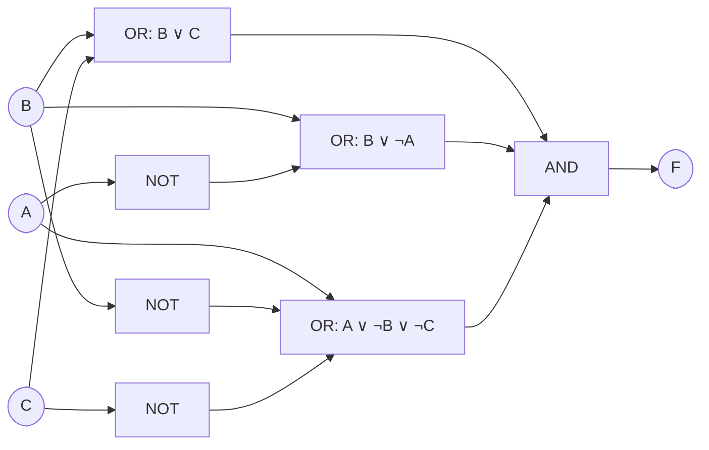

# お茶の水女子大学 人間文化創成科学研究科 理学専攻 情報科学コース 2017年2月実施 情報基礎 問題2

## **Author**
祭音Myyura (co-authored with GPT 5.6 SOL)

## **Description**
入力が論理式 $A,B,C$、出力が論理式

$$
A\lor C\to A\land\neg B\leftrightarrow\neg(\neg B\lor A) \qquad (\dagger)
$$

で表される論理回路について、以下の問いに答えよ。

1. 論理式 $(\dagger)$ の真偽値表を書け。
2. 論理式 $(\dagger)$ の連言標準形（CNF）を求めよ。ただし論理式の（意味論的同値性に基づく）変形を行う場合は、過程と根拠を明記すること。
3. この論理回路を AND, OR, NOT ゲートのみを用いて設計せよ。

### 题目描述

逻辑电路的输入为命题 $A,B,C$，输出由题给逻辑式表示。

1. 写出该逻辑式的真值表。
2. 求其合取范式（CNF）；若使用语义等价变形，须写明过程和依据。
3. 仅使用 AND、OR、NOT 门设计该逻辑电路。

## **Kai**

通常の優先順位 $\neg,\land,\lor,\to,\leftrightarrow$ に従い、$(\dagger)$ を

$$
F=\bigl((A\lor C)\to(A\land\neg B)\bigr)
\leftrightarrow\neg(\neg B\lor A)
$$

と読む。次の二式をおく。

$$
X=(A\lor C)\to(A\land\neg B),
\qquad
Y=\neg(\neg B\lor A).
$$

### (1)

真を $1$、偽を $0$ と書くと、真偽値表は次の通りである。

| $A$ | $B$ | $C$ | $X$ | $Y$ | $F=X\leftrightarrow Y$ |
|---:|---:|---:|---:|---:|---:|
| 0 | 0 | 0 | 1 | 0 | 0 |
| 0 | 0 | 1 | 0 | 0 | 1 |
| 0 | 1 | 0 | 1 | 1 | 1 |
| 0 | 1 | 1 | 0 | 1 | 0 |
| 1 | 0 | 0 | 1 | 0 | 0 |
| 1 | 0 | 1 | 1 | 0 | 0 |
| 1 | 1 | 0 | 0 | 0 | 1 |
| 1 | 1 | 1 | 0 | 0 | 1 |

### (2)

$F=0$ となる行は $(A,B,C)=(0,0,0),(0,1,1),(1,0,0),(1,0,1)$ である。各行でのみ偽になる選言節を作り、その連言をとると、真偽値表と同値な完全 CNF

$$
\begin{aligned}
F\equiv{}&(A\lor B\lor C)
\land(A\lor\neg B\lor\neg C)\\
&\land(\neg A\lor B\lor C)
\land(\neg A\lor B\lor\neg C)
\end{aligned}
$$

を得る。これは「偽となる各行を一つずつ排除する」という真偽値表の定義に基づく。

分配則、吸収則およびコンセンサス則で冗長なリテラルを除けば、

$$
\boxed{F\equiv(B\lor C)\land(B\lor\neg A)
\land(A\lor\neg B\lor\neg C)}
$$

となる。右辺が偽になる行は上記の $4$ 行に限られるため、元の真偽値表との同値性も確認できる。

### (3)

(2) の CNF をそのまま実現する。まず $\neg A,\neg B,\neg C$ を NOT ゲートで作り、三つの選言節を OR ゲートで作って、最後に AND ゲートへ入力する。

したがって出力は

$$
F=(B\lor C)\land(B\lor\neg A)\land(A\lor\neg B\lor\neg C)
$$

となり、AND, OR, NOT ゲートだけで実現できる。
