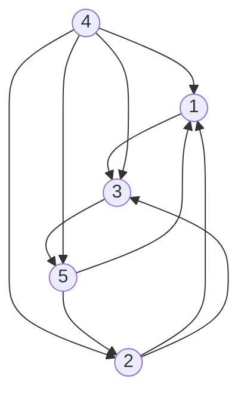

# 大阪大学 情報科学研究科 情報数理学専攻 2017年7月実施 情報数理学 情報基礎

## **Author**

祭音Myyura (co-authored with GPT 5.6 SOL)

## **Description**

### 1

任意の相異なる2頂点がただ一つの有向辺で結ばれる有向グラフをトーナメントという。有向辺に沿って全頂点を1度ずつ通る路をハミルトン路という。

(1) 次のトーナメントのハミルトン路をすべて、頂点番号の列で示せ。



(2) 頂点数が $N$ 未満の任意のトーナメントにハミルトン路があると仮定し、頂点数 $N$ の場合にも存在することを示せ。

### 2

文字集合 $A$ の文字からなる、長さ $M$ の文字列 $U=u_1\cdots u_M$ と長さ $N$ の文字列 $V=v_1\cdots v_N$ を考える。長さ0は空文字列とする。挿入は $0\le k\le M$ の位置に $A$ の1文字を加える操作、削除と置換は $M>0$ のとき $1\le k\le M$ の文字をそれぞれ除く、または $A$ の1文字へ置き換える操作である。

距離 $d(U,V)$ を、これらを繰り返して $U$ を $V$ にする最小操作回数とする。$0\le m\le M$, $0\le n\le N$ に対して $U_m=u_1\cdots u_m$, $V_n=v_1\cdots v_n$ とし、添字0は空文字列を表す。

(1) $d(U_0,V_n)$ と $d(U_m,V_0)$ を求めよ。

(2) $m,n\ge1$ のとき、$d(U_m,V_n)$ を $d(U_{m-1},V_n)$, $d(U_m,V_{n-1})$, $d(U_{m-1},V_{n-1})$ と $u_m,v_n$ から計算できることを説明せよ。

(3) $d(U,V)$ を求めるアルゴリズムと時間計算量を、理由とともに示せ。

### 3

$N$ 個のノード $1,\ldots,N$ の各々が、次のノード番号 $\operatorname{next}(i)\in\{1,\ldots,N\}$ を保持する。$x_0=1$, $x_{k+1}=\operatorname{next}(x_k)$ とする。

(1) $x_m=x_{m+n}$ となる $m\ge0,n>0$ が存在し、そのとき任意の $k\ge m$ について $x_k=x_{k+n}$ であることを示せ。

(2) 次のアルゴリズムが必ず停止することを示せ。

```text
p ← next(1)
q ← next(next(1))
while p ≠ q do
    p ← next(p)
    q ← next(next(q))
end while
```

## **Kai**

### 1

(1) 頂点4に入る辺がないので、4は必ず先頭である。残りの頂点の順序を調べると、全ハミルトン路は

$$
\boxed{(4,1,3,5,2),\ (4,2,1,3,5),\ (4,2,3,5,1),\ (4,3,5,2,1),\ (4,5,2,1,3)}.
$$

(2) 1頂点 $v$ を除いたトーナメントには、帰納法の仮定よりハミルトン路 $v_1\to\cdots\to v_{N-1}$ がある。
$v\to v_i$ となる最初の添字 $i$ が存在すれば、$i=1$ のとき先頭に、$i>1$ のとき $v_{i-1}$ と $v_i$ の間に $v$ を挿入する。後者では最小性より $v_{i-1}\to v$ である。そのような $i$ がなければ $v_{N-1}\to v$ なので末尾に加える。いずれも全頂点を通る路が得られる。

### 2

(1) 長さを変えるのに必要な回数より

$$
d(U_0,V_n)=n,\qquad d(U_m,V_0)=m.
$$

(2) $D_{m,n}=d(U_m,V_n)$, $\delta_{m,n}=0$（$u_m=v_n$）, $1$（$u_m\ne v_n$）とおく。最適な文字対応の末尾は、削除・挿入・一致または置換のいずれかであるから

$$
\boxed{D_{m,n}=\min\{D_{m-1,n}+1,\ D_{m,n-1}+1,\ D_{m-1,n-1}+\delta_{m,n}\}}.
$$

各候補は実際の操作列で達成でき、どの対応もいずれかに分類されるので、この最小値は必要十分である。

(3) 第0行・第0列を(1)で初期化し、$m=1,\ldots,M$, $n=1,\ldots,N$ の順に(2)で表を埋めて $D_{M,N}$ を返す。各要素の計算は定数時間なので、時間計算量は $\boxed{O(MN+M+N)}$（$M,N\ge1$ なら $O(MN)$）。必要記憶量は表全体で $O(MN)$、直前の行だけ保存すれば $O(\min(M,N)+1)$ にできる。

### 3

(1) $x_0,\ldots,x_N$ は $N+1$ 個だが値は $N$ 種類なので、鳩の巣原理より $x_m=x_{m+n}$ となる $0\le m<m+n\le N$ がある。両辺に $\operatorname{next}$ を繰り返し適用すれば、任意の $k\ge m$ で $x_k=x_{k+n}$ を得る。

(2) 初期化後と各反復後のポインタは、ある整数 $t\ge1$ に対して $p=x_t$, $q=x_{2t}$ である。$t\ge m$ かつ $n\mid t$ となる $t$ を選ぶと、(1)の周期性から $x_t=x_{2t}$。したがって、それ以前に停止していなければこの時点で停止する。
