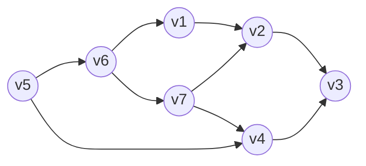

# 大阪大学 情報科学研究科 情報数理学専攻 2018年8月実施 情報数理学 情報基礎

## **Author**

祭音Myyura (co-authored with GPT 5.6 SOL)

## **Description**

### 1

配列 $T[1..n]$, $P[1..m]$ に1桁の非負整数 $0,\ldots,9$ が格納され、$n>m$ とする。次のアルゴリズムを考える。

```text
アルゴリズム A
t ← 0; p ← 0
for i ← 1 until m do
    t ← 10t + T[i]
    p ← 10p + P[i]
end for
for s ← 0 until n-m do
    if t = p then print s end if
    if s < n-m then
        t ← 10t + T[s+m+1] - 10^m T[s+1]
    end if
end for

アルゴリズム B
for s ← 0 until n-m do
    c ← 0
    for i ← 1 until m do
        if (a) then c ← c+1 end if
    end for
    if c = m then print s end if
end for
```

(1) $n=8$, $m=2$, $T=(7,4,7,8,9,4,7,2)$, $P=(4,7)$ のとき、Aの出力を求めよ。

(2) BがAと同じ機能を持つように空欄(a)を埋めよ。

(3) 比較（if文）の実行回数を時間計算量とするとき、A、Bそれぞれの計算量と $n,m$ の関係を示せ。

### 2

$P_i\in\mathbb R^{q_{i-1}\times q_i}$（$i=1,\ldots,N$）の積を、通常の定義 $[AB]_{ij}=\sum_k a_{ik}b_{kj}$ で計算する。

(1) $(P_1P_2)P_3$ と $P_1(P_2P_3)$ の各スカラー乗算回数を示せ。

(2) $P_s\cdots P_t$ の最小乗算回数を $\alpha[s,t]$ とする。$\alpha[s,s]=0$ とし、$s<t$ に対する漸化式を示せ。

(3) $P_1\in\mathbb R^{3\times4}$, $P_2\in\mathbb R^{4\times5}$, $P_3\in\mathbb R^{5\times2}$, $P_4\in\mathbb R^{2\times4}$ のとき、すべての $\alpha[s,t]$ と最適な括弧付けを求めよ。

### 3

有向閉路、自己ループ、多重辺を持たない有向グラフ $G=(V,E)$ に次のアルゴリズムSを実行する。

```text
L ← 空リスト
すべての v ∈ V に対して T(v) を実行

function T(v)
    if v が未訪問 then
        v に訪問済みの印を付ける
        v から出る各辺の終点 w に対して T(w) を実行
        v を L の先頭に追加
    end if
```

(1) 次のグラフで訪問順と最終的な $L$ を示せ。頂点と隣接頂点を調べる順は適宜定めてよい。



(2) 最終リスト $L$ で $v_i$ が $v_j$ より前にあれば、辺 $v_j\to v_i$ は存在しないことを示せ。

(3) $G$ にハミルトン路があるなら、最終リスト $L$ は探索順によらず一意であることを示せ。

## **Kai**

### 1

(1) 一致する部分列は $T[2..3]$ と $T[6..7]$ なので、出力は $\boxed{1,5}$。

(2) $\boxed{T[s+i]=P[i]}$。

(3) Aは各 $s$ で2回のif判定を行うから $\boxed{2(n-m+1)}$ 回、Bは各 $s$ で $m+1$ 回行うから $\boxed{(m+1)(n-m+1)}$ 回である。したがって、それぞれ $\Theta(n-m+1)$、$\Theta(m(n-m+1))$ となる。

### 2

(1)

$$
\boxed{(P_1P_2)P_3:\ q_0q_1q_2+q_0q_2q_3,\qquad
P_1(P_2P_3):\ q_1q_2q_3+q_0q_1q_3}.
$$

(2) 最後の積を $(P_s\cdots P_r)(P_{r+1}\cdots P_t)$ と分けると

$$
\boxed{\alpha[s,t]=\min_{s\le r<t}\{\alpha[s,r]+\alpha[r+1,t]+q_{s-1}q_rq_t\}}.
$$

(3) 区間長の小さい順に計算すると

$$
\begin{array}{c|rrrr}
\alpha[s,t]&t=1&t=2&t=3&t=4\\\hline
s=1&0&60&64&88\\
s=2&&0&40&72\\
s=3&&&0&40\\
s=4&&&&0
\end{array}
$$

最適括弧付けは $\boxed{(P_1(P_2P_3))P_4}$、乗算回数は $40+24+24=\boxed{88}$ 回。

### 3

(1) 外側の頂点も各頂点の出辺も、添字の昇順で調べるとする。訪問順は

$$
\boxed{v_1,v_2,v_3,v_4,v_5,v_6,v_7}.
$$

終了順は $v_3,v_2,v_1,v_4,v_7,v_6,v_5$ なので

$$
\boxed{L=(v_5,v_6,v_7,v_4,v_1,v_2,v_3)}.
$$

(2) 辺 $u\to v$ を調べたとき、$v$ が未訪問なら $T(v)$ は $T(u)$ より先に終了する。訪問済みなら、$v$ が再帰呼出しの途中にある場合は有向閉路を生むので不可能であり、既に終了している。したがってどの場合も $v$ が先に、$u$ が後に終了し、先頭挿入により $L$ では $u$ が $v$ より前となる。よって逆向きの辺は存在しない。

(3) ハミルトン路を $w_1\to w_2\to\cdots\to w_{|V|}$ とする。(2)より各 $w_i$ は $w_{i+1}$ より前に置かれるため、最終リストは必ず $(w_1,\ldots,w_{|V|})$ である。
