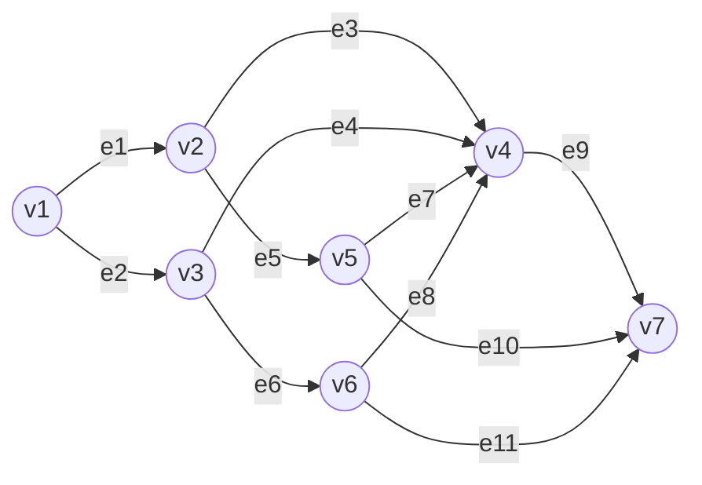

# 大阪大学 情報科学研究科 情報数理学専攻 2019年8月実施 情報数理学 情報基礎

## **Author**

祭音Myyura (co-authored with GPT 5.6 SOL)

## **Description**

### 1

(1) 正の実数 $n$ 個からなるリスト $A$ に、次の SORT-1 を適用する時間計算量を求めよ。

```text
SORT-1(A)
    for j ← 2 to n do
        s ← A[j]
        i ← j-1
        while i > 0 and A[i] > s do
            A[i+1] ← A[i]
            i ← i-1
        end while
        A[i+1] ← s
    end for
```

(2) 正の実数を最大値で割り、$(0,1]$ に正規化した $A[1],\ldots,A[n]$ を、次の SORT-2 で整列する。$\lceil x\rceil$ は切上げを表す。

```text
SORT-2(A)
    B[1],...,B[n] ← 空リスト
    for i ← 1 to n do
        A[i] を B[ceil(n A[i])] に挿入
    end for
    for i ← 1 to n do
        SORT-1(B[i])
    end for
    B[1],...,B[n] を順に連接
```

(i) $A[i]$ が独立に $(0,1]$ 上で一様分布すると仮定する。各バケットの要素数の期待値・分散と、SORT-1$(B[i])$ の平均時間計算量を求めよ。

(ii) SORT-2 の平均・最悪時間計算量を求めよ。

### 2

$n$ 桁の正整数の乗算で必要な1桁整数同士の乗算回数を考える。

(1) $n$ が偶数のとき $x=a10^{n/2}+b$, $y=c10^{n/2}+d$ と分けると

$$
xy=ac10^n+\{ac+bd-(a-b)(c-d)\}10^{n/2}+bd
$$

である。この3回の部分乗算を再帰的に用いる回数 $T(n)$ の漸化式を示し、$T(n)=O(n^{\log_2 3})$ を示せ。

(2) 再帰的に3分割して乗算するときの回数 $S(n)$ の漸化式を示し、$S(n)=O(n^{\log_3 6})$ を示せ。

(3) 十分大きい $n$ で $T(n),S(n)$ を比較せよ。$\log_2 3<1.6$ を用いてよい。

### 3

自己ループを持たず、各頂点間に高々1本の辺がある有向グラフの接続行列 $B=(b_{ij})\in\mathbb R^{|V|\times|E|}$ を、辺 $e_j$ が頂点 $v_i$ から出るとき $-1$、入るとき $1$、それ以外を0として定義する。

$BB^T$ と $B^TB$ の各要素の意味を説明し、次のグラフについて両行列を求めよ。頂点順は $v_1,\ldots,v_7$、辺順は $e_1,\ldots,e_{11}$ とする。



## **Kai**

### 1

(1) SORT-1 は挿入ソートである。最悪の場合、第 $j$ 回に $j-1$ 個を移動するので

$$
\sum_{j=2}^n(j-1)=\frac{n(n-1)}2
$$

より、最悪時間計算量は $\boxed{\Theta(n^2)}$。無作為な順列に対する平均も $\Theta(n^2)$、既に整列済みの場合は $\Theta(n)$ である。

(2)(i) バケット $i$ の要素数を $N_i$ とする。各要素が入る確率は $1/n$ なので $N_i\sim\operatorname{Bin}(n,1/n)$、したがって

$$
\boxed{E[N_i]=1,\qquad V[N_i]=1-\frac1n},\qquad E[N_i^2]=2-\frac1n.
$$

挿入ソートの時間は $O(1+N_i^2)$ で抑えられるから、平均は $\boxed{\Theta(1)}$。

(ii) 分配と連接に $\Theta(n)$、全バケットの平均整列時間に $\sum_iO(E[N_i^2]+1)=O(n)$ を要する。よって平均は $\boxed{\Theta(n)}$。全要素が同一バケットに入り逆順に並ぶ場合は挿入ソートが $\Theta(n^2)$ を要するので、最悪は $\boxed{\Theta(n^2)}$。

### 2

(1) $n=2^k$ とすると、$T(1)=1$, $T(n)=3T(n/2)$ より

$$
\boxed{T(n)=3^k=n^{\log_2 3}}.
$$

一般の桁数も上位に0を補えば同じオーダとなる。

(2) $R=10^{n/3}$ とし、$x=aR^2+bR+c$, $y=dR^2+eR+f$ と分ける。6積

$$
ad,\ be,\ cf,\ (a-b)(d-e),\ (a-c)(d-f),\ (b-c)(e-f)
$$

を求めれば、例えば $ae+bd=ad+be-(a-b)(d-e)$ のように交差項が得られ、

$$
xy=adR^4+(ae+bd)R^3+(af+be+cd)R^2+(bf+ce)R+cf
$$

を再構成できる。よって $S(1)=1$, $S(n)=6S(n/3)$ であり、$n=3^k$ なら

$$
\boxed{S(n)=6^k=n^{\log_3 6}}.
$$

(3) $6^5=7776>6561=3^8$ より $\log_3 6>8/5=1.6>\log_2 3$。したがって $\boxed{T(n)=o(S(n))}$ であり、十分大きい $n$ では2分割法の方が少ない乗算回数で済む。

### 3

$BB^T$ の対角成分は頂点の次数（入次数と出次数の和）、非対角成分は隣接していれば $-1$、そうでなければ0である。

$B^TB$ の対角成分は2。異なる2辺について、共通端点がなければ0、共通端点に両方が入るか両方が出るなら1、一方が入り他方が出るなら $-1$ である。

$$
\boxed{BB^T=\begin{pmatrix}
2&-1&-1&0&0&0&0\\
-1&3&0&-1&-1&0&0\\
-1&0&3&-1&0&-1&0\\
0&-1&-1&5&-1&-1&-1\\
0&-1&0&-1&3&0&-1\\
0&0&-1&-1&0&3&-1\\
0&0&0&-1&-1&-1&3
\end{pmatrix}}.
$$

$$
B^TB=\begin{pmatrix}
2&1&-1&0&-1&0&0&0&0&0&0\\
1&2&0&-1&0&-1&0&0&0&0&0\\
-1&0&2&1&1&0&1&1&-1&0&0\\
0&-1&1&2&0&1&1&1&-1&0&0\\
-1&0&1&0&2&0&-1&0&0&-1&0\\
0&-1&0&1&0&2&0&-1&0&0&-1\\
0&0&1&1&-1&0&2&1&-1&1&0\\
0&0&1&1&0&-1&1&2&-1&0&1\\
0&0&-1&-1&0&0&-1&-1&2&1&1\\
0&0&0&0&-1&0&1&0&1&2&1\\
0&0&0&0&0&-1&0&1&1&1&2
\end{pmatrix}.
$$
