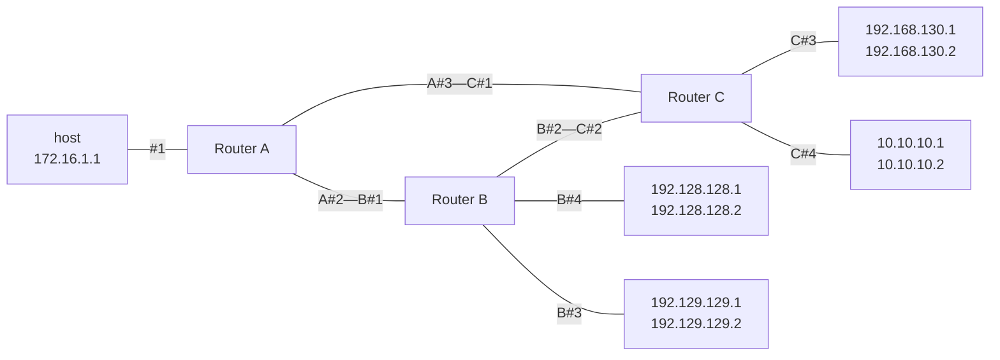

# 大阪大学 情報科学研究科 情報工学 2014年8月実施 ネットワーク

## **Author**
祭音Myyura (co-authored with GPT 5.6 SOL)

## **Description**

### (1)

ビット誤り率を $p$（$0<p<1/2$）とする2元対称通信路で、2元符号

$$
C=\{00000,11111\}
$$

を用いる。各符号語は等確率で送信される。

- (1-1) 受信語の誤り数が3、4、5ビットとなる確率を、それぞれ $p$ を用いて表せ。
- (1-2) 最尤復号法で誤って復号する確率を求めよ。
- (1-3-1) 限界距離復号法における限界距離 $d$ の最大値を求めよ。
- (1-3-2) $p=1/10$ とする。誤復号確率を $1/1000$ 以下に抑えつつ正復号確率を最大にする $d$ と、その正復号確率を求めよ。

### (2)

IPの経路制御について答えよ。

- (2-1) スタティック／ダイナミックルーティング、OSPF、RIP、リンクステート型、距離ベクトル型、BGPに関する空欄（あ）〜（か）を、次の選択肢から埋めよ。

```text
(a) IS-IS protocol                      (i) 最適ルーティング
(b) コスト最小                         (j) リンクステート
(c) 距離ベクトル                       (k) 交換される情報量が少ない
(d) ブロードキャスト                   (l) 接続状況変更時の経路収束時間が短い
(e) RSVP                                (m) ダイナミックルーティング
(f) BGP                                 (n) 経路計算量が少ない
(g) IPIP                                (o) HTTP
(h) スタティックルーティング
```

- (2-2) 次のネットワークでクラスフルルーティングを行う。デフォルトゲートウェイを用いず、図にないIPアドレスへの経路を保持しないとき、ルータAの最小経路表を示せ。ホスト間の経路は経由ルータ数が最小となるようにする。



- (2-3) ルータB、Cにインターフェース #5 を追加し、それぞれ $H_B,H_C$ 台のホストを接続する。B側には `192.130.` で始まるクラスCネットワークを $N_B$ 個、C側には `192.1.` で始まるクラスCネットワークを $N_C$ 個割り当てる。ホスト毎、クラスフル、クラスレスの各方式で、ルータAが保持する最小エントリー数を求めよ。(2-2)と同様、ホスト間の経由ルータ数を最小とし、デフォルトゲートウェイは用いない。
- (2-4) ルータCの #1 と #2 に、宛先 `192.168.130.1` のパケット $X,Y$ が同時に到着した。#3から送出されるまでの処理を「経路表」「バッファ」「競合回避」を用いて説明せよ。

### 题目描述

本题前半考查长度5重复码在二元对称信道上的最大似然译码和限界距离译码；后半考查静态/动态路由、OSPF/RIP/BGP、IPv4类地址与CIDR聚合，以及路由器输出竞争。

## **Kai**

### (1)

#### (1-1)

誤り数を $K$ とすると $K\sim\operatorname{Bin}(5,p)$ である。よって

$$
\begin{aligned}
\Pr[K=3]&=\binom53p^3(1-p)^2,\\
\Pr[K=4]&=\binom54p^4(1-p),\\
\Pr[K=5]&=p^5.
\end{aligned}
$$

#### (1-2)

最尤復号では3ビット以上反転したとき他方の符号語へ復号する。したがって

$$
\boxed{P_{\mathrm e}=\sum_{k=3}^{5}\binom5k p^k(1-p)^{5-k}}.
$$

#### (1-3-1)

最小距離は $d_{\min}=5$ であるから

$$
\boxed{d_{\max}=\left\lfloor\frac{d_{\min}-1}{2}\right\rfloor=2}.
$$

#### (1-3-2)

$p=0.1$ のとき、各 $d$ に対して

| $d$ | 誤復号確率 | 正復号確率 |
|---:|---:|---:|
| 0 | $p^5=0.00001$ | $(1-p)^5=0.59049$ |
| 1 | $5p^4(1-p)+p^5=0.00046$ | $(1-p)^5+5p(1-p)^4=0.91854$ |
| 2 | $\sum_{k=3}^{5}\binom5k p^k(1-p)^{5-k}=0.00856$ | $\sum_{k=0}^{2}\binom5k p^k(1-p)^{5-k}=0.99144$ |

となる。制約を満たす中で正復号確率が最大なのは

$$
\boxed{d=1},\qquad \boxed{P_{\mathrm{correct}}=0.91854}.
$$

### (2)

#### (2-1)

$$
\boxed{
(\text{あ})=(h),\quad
(\text{い})=(m),\quad
(\text{う})=(j),\quad
(\text{え})=(c),\quad
(\text{お})=(l),\quad
(\text{か})=(f)
}.
$$

#### (2-2)

| 宛先IPアドレス | サブネットマスク | 出力先 |
|---|---|---|
| 172.16.0.0 | 255.255.0.0 | #1 |
| 192.128.128.0 | 255.255.255.0 | #2 |
| 192.129.129.0 | 255.255.255.0 | #2 |
| 192.168.130.0 | 255.255.255.0 | #3 |
| 10.0.0.0 | 255.0.0.0 | #3 |

#### (2-3)

$$
\begin{array}{c|c}
\text{方式} & \text{最小エントリー数}\\ \hline
\text{ホスト毎} & \boxed{9+H_B+H_C}\\
\text{クラスフル} & \boxed{5+N_B+N_C}\\
\text{クラスレス} & \boxed{4}
\end{array}
$$

クラスレスでは、最長一致を用いて次の4エントリーに集約できる。

| 宛先プレフィックス | 出力先 |
|---|---|
| `172.16.0.0/16` | #1 |
| `10.0.0.0/8` | #3 |
| `192.0.0.0/8` | #3 |
| `192.128.0.0/14` | #2 |

`192.128.0.0/14` は第2オクテットが128～131の範囲を表し、B側の `192.128.*`、`192.129.*`、`192.130.*` に対して、C側の `192.*` 用 `/8` より優先される。#1、#2には各1エントリーが必要であり、#3の `10.*` と `192.*` はデフォルト経路なしでは1エントリーにまとめられないため、4は最小である。

#### (2-4)

$X,Y$ の宛先を経路表で検索すると、双方の出力先は #3 となる。両パケットを #3 の出力バッファへ格納し、競合回避処理で一方を選んで送信する。他方はバッファで待機し、#3が空いた後に送信する。バッファに空きがなければパケットは廃棄され得る。
