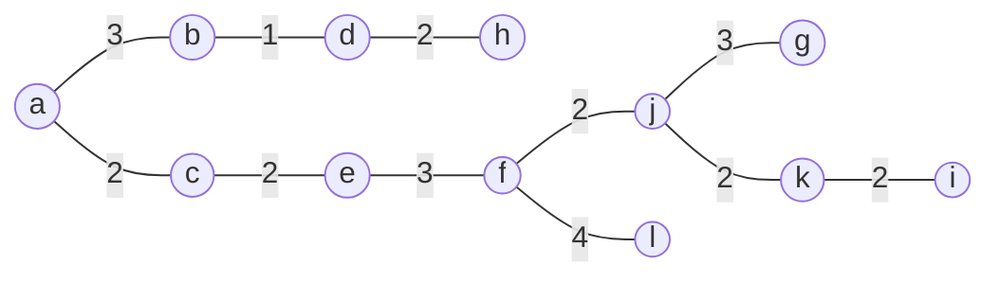
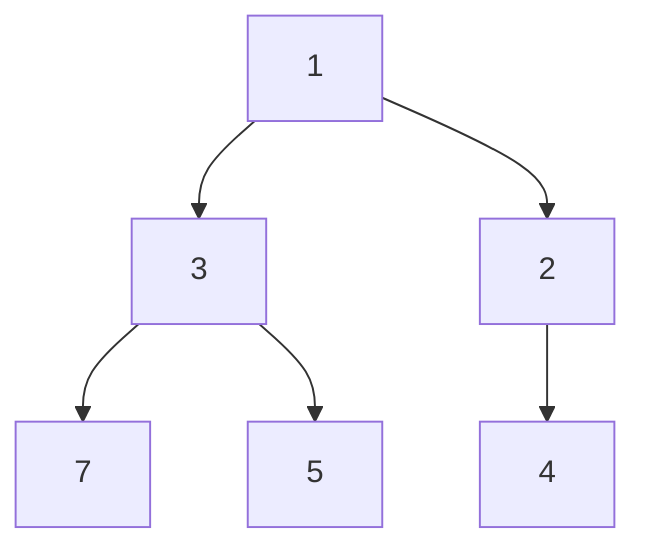

# 大阪大学 電子情報学専攻 2015年8月実施 専門 第3問 最小全域木

## **Author**

祭音Myyura (co-authored with GPT 5.6 SOL)

## **Description**
辺の重みが全て正の連結無向グラフを考える。頂点集合を $V$、辺集合を $E$ とする。初めに $B$ は任意の1頂点、$T=\varnothing$ とし、毎回 $B$ と $V-B$ を結ぶ最軽量辺 $\{u,v\}$（$u\notin B,v\in B$）を選び、$u$ を $B$、辺を $T$ に加える。

(1) このアルゴリズムが最小全域木を求めることを証明せよ。

(2) 次のグラフの最小全域木を求めよ。頂点は $a,b,c,d,e,f,g,h,i,j,k,l$、重み付き辺は次の通りである。

|辺|重み|辺|重み|辺|重み|
|---|---|---|---|---|---|
|ab|3|ac|2|ag|5|
|bd|1|be|4|ce|2|
|ch|6|ci|4|dh|2|
|df|5|ef|3|ej|6|
|fj|2|fl|4|gj|3|
|gk|4|hi|4|hl|7|
|ik|2|jk|2|kl|5|

(3) 対称重み行列 $L[s,t]$（無辺なら $\infty$）、$nearest[s]$（$B$ 中の最近頂点）、$mindist[s]=L[s,nearest[s]]$（$s\in B$ では $-1$）を使い擬似コードを示せ。頂点数を $n$、辺数を $m$ とする。

(4) 計算量を求めよ。(5) 二分ヒープを説明せよ。(6) 二分ヒープによる効率化、計算量、および効率化できる $n,m$ の関係を述べよ。

## **Kai**
(1) 選択済みの $T$ を含む最小全域木 $M$ が存在するという不変条件を用いる。次の最軽量辺 $e$ が $M$ になければ、$M+e$ の閉路にはカット $(B,V-B)$ を横切る別の辺 $f$ がある。$w(e)\le w(f)$ なので $M-f+e$ も最小全域木で、$T\cup\{e\}$ を含む。最後に $n-1$ 辺が選ばれ、得られる木自身が最小全域木となる。

(2) 一つの最小全域木は

$$
\boxed{\{bd,ac,ce,dh,fj,ik,jk,ab,ef,gj,fl\}},\qquad\boxed{\text{総重み}=26}.
$$



(3)

```text
r を任意の頂点とする
T = 空集合
for s in V:
    nearest[s] = r
    mindist[s] = L[s,r]
mindist[r] = -1
repeat n-1 times:
    u = mindist[s] != -1 を満たす s のうち mindist[s] が最小のもの
    T に {u, nearest[u]} を追加
    mindist[u] = -1
    for s in V:
        if mindist[s] != -1 and L[s,u] < mindist[s]:
            mindist[s] = L[s,u]
            nearest[s] = u
return T
```

(4) 最小値探索と距離更新が各 $O(n)$、反復数 $n-1$ より $\boxed{O(n^2)}$。

(5) 最小二分ヒープは、完全二分木の各親のキーが子のキー以下であるデータ構造。最小値は根にあり、挿入、最小要素削除、キー減少は $O(\log n)$ で行える。



(6) 未選択頂点を `mindist` をキーとするヒープに入れ、最小要素削除で $u$ を選び、隣接辺で値が改善するたびにキー減少を行う。隣接リストを用いれば $n$ 回の削除と高々 $m$ 回のキー減少により

$$
\boxed{O((n+m)\log n)=O(m\log n)}.
$$

$m\log n=o(n^2)$、特に $m=O(n)$ の疎グラフで漸近的に有利である。重み行列の全行を毎回走査したままでは $O(n^2)$ が残るので、効率化には隣接辺を列挙できる表現が必要である。
