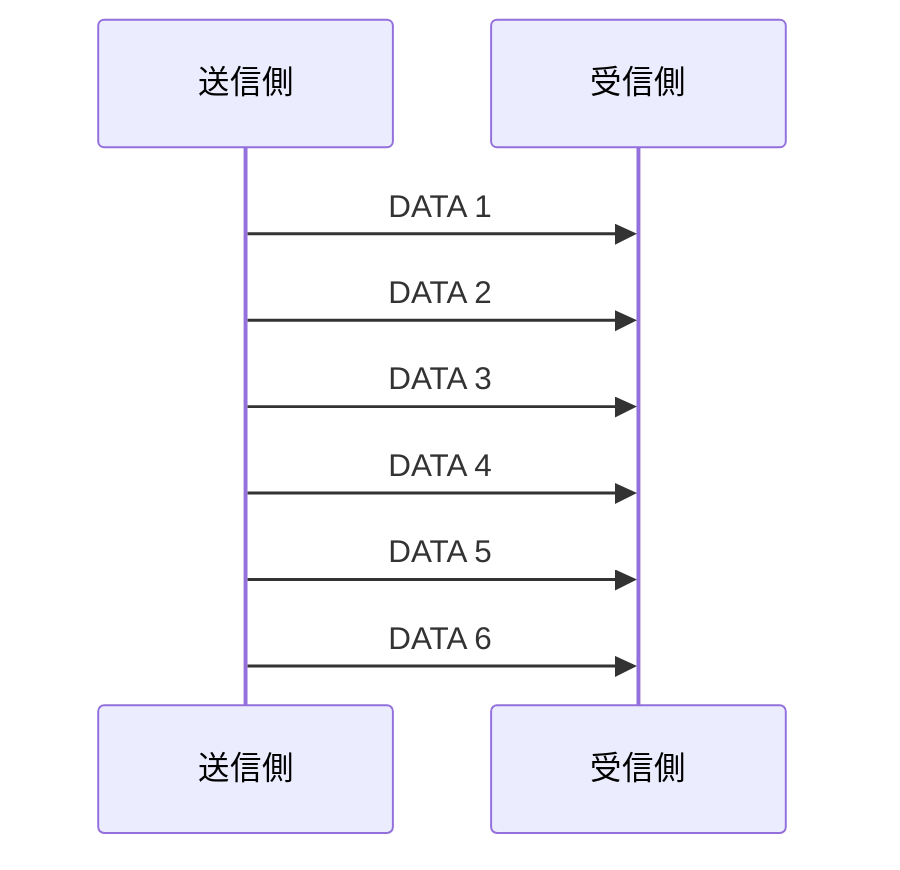

# 大阪大学 情報科学研究科 情報工学 2016年8月実施 ネットワーク

## **Author**
祭音Myyura (co-authored with GPT 5.6 SOL)

## **Description**

### (1)

記憶がない情報源の2元ハフマン符号化について答えよ。

- (1-1-1) $p(a)=0.8, p(b)=0.2$ である情報源 $S_0$ の復号木と平均符号語長を示せ。
- (1-1-2) $S_0$ の2次拡大 $S_0^2$ について、$aa,ab,ba,bb$ の生起確率、すべての2元ハフマン復号木、および情報源記号1個当たりの平均符号語長を求めよ。
- (1-2) 情報源 $S$ の $n$ 次拡大 $S^n$ を考える。$S^n$ の2元ハフマン符号の、情報源記号1個当たりの平均符号語長を $l_n$ とする。次を埋めよ。

```text
S^n のエントロピーは（あ）である。
H(S) <= l_n < H(S) +（い）。
l_{n_0}=H(S)+δ（δ>0）なら、n >=（う）を満たす n について
l_n < l_{n_0} となる。
```

### (2)

トランスポート層プロトコルについて答えよ。(2-2)ではセグメントの喪失は発生しないものとする。

- (2-1) フロー制御、ふくそう制御、再送制御に関する空欄（あ）〜（か）を選択肢から埋めよ。

```text
(a) セグメントサイズ     (g) IPアドレス
(b) データ転送速度       (h) 喪失
(c) 過負荷               (i) メモリサイズ
(d) 転送遅延             (j) ポート番号
(e) 経路                 (k) スループット
(f) ループ               (l) 処理速度
```

- (2-2-1) ストップアンドウェイト方式で、データセグメントが $P$ byteのデータと $H$ byteのヘッダからなり、データセグメントをネットワーク層へ渡してから対応するACKを受け取るまでの平均RTTが $T$ 秒である。平均スループットを求めよ。
- (2-2-2) スループットの観点からストップアンドウェイトの問題点を説明せよ。
- (2-2-3) ウィンドウサイズを3セグメントとするスライディングウィンドウ方式の転送を、データ転送だけ図示せよ。
- (2-3) 再送タイマが大きすぎる場合と小さすぎる場合の問題、およびTCPの一般的実装で再送タイマを定める方法を説明せよ。

### 题目描述

本题考查二元Huffman编码及扩展信源平均码长，同时考查传输层流量/拥塞/重传控制、停等协议、滑动窗口和TCP自适应重传超时。

## **Kai**

### (1)

#### (1-1-1)

一例として $a\mapsto0, b\mapsto1$ とする。

```text
(root)
├─0→ a
└─1→ b
```

$$
\boxed{\bar L=0.8\cdot1+0.2\cdot1=1}.
$$

#### (1-1-2)

$$
P(aa)=0.64,\quad P(ab)=P(ba)=0.16,\quad P(bb)=0.04.
$$

同率の $ab,ba$ のどちらを $bb$ と先に併合するかにより、復号木は次の2通りである。

```text
木1: aa=0, ab=10, ba=110, bb=111
木2: aa=0, ba=10, ab=110, bb=111
```

符号語対1個当たりの平均長は

$$
0.64\cdot1+0.16\cdot2+0.16\cdot3+0.04\cdot3=1.56.
$$

したがって情報源記号1個当たりでは

$$
\boxed{\bar L_2=1.56/2=0.78}.
$$

#### (1-2)

$$
\boxed{(\text{あ})=nH(S)},\qquad
\boxed{(\text{い})=\frac1n},\qquad
\boxed{(\text{う})=\frac1\delta}.
$$

実際、$H(S)\le l_n<H(S)+1/n$ であり、$n\ge1/\delta$ なら

$$
l_n<H(S)+\frac1n\le H(S)+\delta=l_{n_0}.
$$

### (2)

#### (2-1)

$$
\boxed{
(\text{あ}),(\text{い})=(i),(l)\ \text{（順不同）},\quad
(\text{う})=(b),\quad
(\text{え})=(c),\quad
(\text{お})=(d),\quad
(\text{か})=(h)
}.
$$

#### (2-2-1)

1 RTTごとに1個、すなわち $8(P+H)$ bitのデータセグメントを転送するので

$$
\boxed{\frac{8(P+H)}{T}\ \mathrm{bit/s}}.
$$

#### (2-2-2)

ACKを受信するまで次のデータセグメントを送れないため、伝送路が空く時間が生じる。特にRTTが大きいとリンク帯域を十分利用できず、スループットが低下する。

#### (2-2-3)



ACKの矢印は設問の指示に従い省略した。DATA 1～3を連続送信し、各ACKの受信で送信窓を1セグメントずつ進めてDATA 4、5、6を送る。

#### (2-3)

設定値が大きすぎると、セグメント喪失後の再送が遅れ、スループットが低下する。小さすぎると、セグメントまたはACKが到着する前にタイムアウトし、不要な再送とふくそう制御を生じる。

TCPではRTT標本から平滑化RTTとRTT偏差を更新し、例えば

$$
\boxed{\mathrm{RTO}=\mathrm{SRTT}+4\,\mathrm{RTTVAR}}
$$

として適応的に設定する。連続タイムアウト時には指数バックオフを行う。
