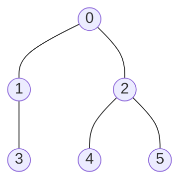
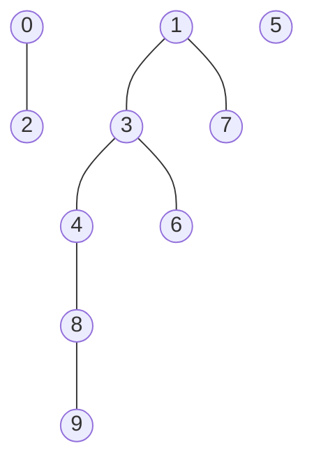

# 大阪大学 情報科学研究科 情報工学 2017年7月実施 アルゴリズムとプログラミング

## **Author**
祭音Myyura

## **Description**
図1に示す ANSI-C 準拠である C 言語のプログラム (program) は任意の 2 人が同じ組織 (organization) に所属するか判定し, その結果を出力 (output) するものである.
人(構成員(member)と呼ぶ)は $N$ 人 ($N$ は正の整数 (positive integer)) 存在し, 各構成員には直属の上司 (direct supervisor) である構成員が 1 人以下 (1 or less) 存在する.
組織は一つ以上存在し, 各組織は, 各構成員を点 (ノード (node)), その直属の上司を親 (parent) とする木 (tree) で表される.
同じ組織に所属する構成員は, その組織の最上位の上司を根 (root) とする一つの木を構成する.

各構成員にはそれぞれ $0 \sim N-1$ の整数 (integer) が構成員番号として重複なく付与されている.
配列 (array) p は構成員番号 i である構成員の直属の上司の構成員番号を要素 (element) として p\[i\] に格納し, 直属の上司が存在しない場合は自身の構成員番号を格納する.
このデータ構造を用い, 関数 same は 2 人の構成員番号を引数とし, 同じ組織に所属するかどうかを標準出力に出力する.
input.txt, pair.txt という図 2 および図3にそれぞれ示すようなフォーマットのファイルが存在するものとし, 図 1 のプログラムでそれらを読み込み実行する.
input.txt の 1 行目には構成員の総数 $N$ ($N$ は N_MAX 以下の正の整数), 2 行目以降の各行には, 構成員とその直属の上司の構成員番号のペア (pair) がこの順で書かれている.
pair.txt の各行には, 同じ組織に所属するか判定したい構成員のペアの構成員番号が書かれている.
以下の各問に答えよ.

(1) 図1のプログラムは, 図2の input.txt と図 3 の pair.txt を読み込み実行する. 以下の各小問に答えよ.

- (1-1) 21 ~ 29 行目で読み込まれる全ての木を示せ, ただし図 4 にならい, 丸でノードを, 丸の中の数字で構成員番号を, 線で枝 (edge)を表すこと.
- (1-2) find(x) が意味する内容を, xを用いて説明せよ.
- (1-3) 14 行目の空欄 A に当てはまる式を, 15 行目の空欄 B に当てはまる条件式をそれぞれ書け.

(2) 非常に大きな数の構成員に対し, 多数の無作為に選ばれた構成員のペアのそれぞれが同じ組織に所属するか判定したい. そのため, このようなデータを含む input.txt および pair.txt を図 1 のプログラムで読み込み実行する, ただし, 図 1 のプログラム 2 行目の N_MAX の値を適切に変更するものとする. 以下の各小問に答えよ.

- (2-1) 関数 same を実行する際の, 1 回当たりの平均時間計算量 (average time complexity) をオーダ表記 (order notation) で表せ, また理由も答えよ, ただし, ノードの平均の深さ (average depth) を $h$ とする.
- (2-2) ここで, 関数 find の 9 行目を変更し, 最上位の上司を格納するように配列 p を更新することで, 実行時間を短縮できる場合がある. 以下に答えよ.
  - (2-2-1) 変更後の 9 行目を一文で書け.
  - (2-2-2) 関数 same を十分大きな回数実行した場合に漸近する, 1 回当たりの平均時間計算量をオーダ表記で表せ. また理由も答えよ.

```text
#include <stdio.h>
#define N_MAX 1000
int p[N_MAX];

int find(int x) {
    if (p[x] == x)
        return x;
    else
        return find(p[x]);
}
void same(int x, int y) {
    int n, m;
    n = find(x);
    m = [   空欄 A   ];
    if ([   空欄 B   ])  /* 同じ組織に所属する */
        printf("%d & %d are in the same organization.\n", x, y);
    else
        printf("%d & %d are in different organizations.\n", x, y);
}
int main(void) {
    FILE *fp;
    int n, i, j, sv;
    fp = fopen("input.txt", "r");
    fscanf(fp, "%d", &n);
    for (i = 0; i < n; i++)
        p[i] = i;
    while (fscanf(fp, "%d %d", &i, &sv) != EOF)
        p[i] = sv;
    fclose(fp);
    fp = fopen("pair.txt", "r");
    while (fscanf(fp, "%d %d", &i, &j) != EOF)
        same(i, j);
    fclose(fp);
    return 0;
}
```
### <center> 図１ プログラム</center>

```text
10
2   0
3   1
4   3
6   3
7   1
8   4
9   8
```
### <center> 図２ input.txt</center>

```text
9   7
6   4
0   2
```
### <center> 図３ pair.txt</center>


### <center> 図４ 木の表記例</center>


## **Kai**

### (1)

(1-1)



(1-2) `find(x)` は、構成員 $x$ の属する組織の根、すなわち最上位の上司の構成員番号を返す。

(1-3) $\boxed{A:\texttt{find(y)},\quad B:\texttt{n == m}}$。

### (2)

(2-1) 根まで親をたどる回数は深さに等しく、2回の `find` を行うので $\boxed{O(h+1)}$（通常は $O(h)$ と表記）。

(2-2-1)

```c
return p[x] = find(p[x]);
```

(2-2-2) $\boxed{O(1)}$。組織を変更せず多数の無作為な検索を繰り返すと、各非根ノードの親は経路圧縮によって根へ更新され、平均探索長は定数へ近づく。
