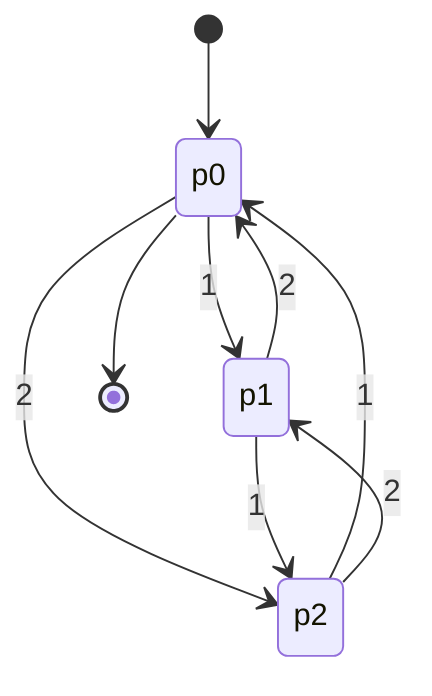
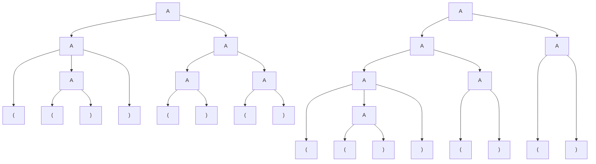

# 大阪大学 情報科学研究科 情報工学 2018年度 計算理論

## **Author**

祭音Myyura (co-authored with GPT 5.6 SOL)

## **Description**
### (1) オートマトン

(1-1) 以下の有限オートマトンの受理言語を表す正規表現を、選択肢1～8から一つずつ選べ。遷移を $\delta(q,a),\delta(q,b)$ の順で記す。記載のない遷移は存在しない。

|図|開始／最終状態|遷移|
|---|---|---|
|(i)|$q_0/\{q_2\}$|$q_0:(q_1,q_0),\ q_1:(q_2,q_1),\ q_2:(\varnothing,q_2)$|
|(ii)|$q_0/\{q_1\}$|$q_0:(q_1,q_1),\ q_1:(q_2,q_2),\ q_2:(q_0,q_0)$|
|(iii)|$q_0/\{q_2\}$|$q_0:(q_1,q_0),\ q_1:(q_1,q_2),\ q_2:(q_1,q_0)$|
|(iv)|$q_0/\{q_0,q_2\}$|$q_0:(\{q_0,q_3\},\{q_1,q_2\}),\ q_1:(\varnothing,q_0),\ q_2:(q_3,q_2),\ q_3:(q_2,\varnothing)$|

選択肢は、1. $(a+b)a^*b^*$、2. $b^*a+aa^*(a+b)$、3. $(a+bb)^*(aa+b)^*$、4. $b^*+a^*+b^*a^*$、5. $(a+b)^*ab$、6. $b^*a^*b(a+b)^*$、7. $b^*ab^*ab^*$、8. $((a+b)(a+b)(a+b))^*(a+b)$。

(1-2) $\{1,2\}$ 上の正の十進整数で3の倍数となるものを認識する。十進整数を3で割った余りは各桁の和を3で割った余りと等しいことを用いてよい。例えば1221、222111は受理され、1211、2222は受理されない。

- (1-2-1) 状態 $p_0,p_1,p_2$、開始・最終状態 $p_0$ のDFAを示せ。
- (1-2-2) スタック記号 $Z,1,2$ を使うPDAを完成せよ。開始状態 $q_0$ から $q_1$ へ $(\varepsilon,Z)/Z,(1,Z)/1Z,(2,Z)/2Z$、$q_1$ から最終状態 $q_2$ へ $(\varepsilon,Z)/Z$ がある。$q_1$ の自己遷移に $(2,1)/\varepsilon,(1,2)/\varepsilon$ のほか必要な動作をすべて示せ。$(a,b)/c$ は入力 $a$ を読み、スタック先頭 $b$ を $c$ に置換することを表す。

### (2) 文脈自由文法

生成規則 $A\to AA\mid(A)\mid()$、開始記号 $A$ の言語を $L$ とする。

- (2-1) $L$ に属する長さ6以下の語をすべて挙げよ。
- (2-2) `(())()()` の異なる構文木をすべて示せ。
- (2-3),(2-4) `()()()()` と `()()()()()` の異なる構文木の個数を求めよ。
- (2-5) 空でない釣合いの取れた括弧列がすべて $L$ に属することを、次の長さに関する帰納法の空欄［ア］～［エ］を埋めて示せ。$\Rightarrow$ は規則の1回の適用、$\Rightarrow^*$ は0回以上の適用を表す。

長さ2の列 `()` は $A\Rightarrow[ア]$ により生成される。$k\ge2$ を偶数とし、長さ $k$ 以下の釣合いの取れた非空列がすべて $L$ に属すると仮定する。長さ $k+2$ の釣合いの取れた列 $x$ が二つの釣合いの取れた非空列の連結 $x=vw$ に分解できれば、$A\Rightarrow^*v$、$A\Rightarrow^*w$ より $A\Rightarrow[イ]=x$ である。分解できなければ、長さ $k$ の釣合いの取れた列 $y$ を用いて $x=[ウ]$ と表せる。$A\Rightarrow^*y$ より $A\Rightarrow[エ]=x$ である。

## **Kai**
### (1)

(1-1) $\boxed{(i):7,\quad(ii):8,\quad(iii):5,\quad(iv):3}$。

(i)は $a$ がちょうど2回、(ii)は長さが $1\pmod3$、(iii)は末尾が $ab$ となる語を受理する。(iv)は上側で $a$ または $bb$ を反復し、$b$ または $aa$ で下側へ移った後、$b$ または $aa$ を反復する。

(1-2-1) $p_r$ を各桁の和が $r\pmod3$ である状態とする。



(1-2-2) 追加する自己遷移は

$$
\boxed{(1,Z)/1Z,\quad(2,Z)/2Z,\quad(1,1)/2,\quad(2,2)/1}.
$$

スタックは $Z,1Z,2Z$ のいずれかとなり、先頭記号で剰余0,1,2を保持する。

### (2)

(2-1)

```text
()
()(), (())
()()(), ()(()), (())(), (()()), ((()))
```

(2-2) 2個である。どちらの木も葉を左から読むと `(())()()` となる。



(2-3),(2-4) `()` を $n$ 個連結した語の構文木数は、根での分割位置により $T_1=1$, $T_n=\sum_{j=1}^{n-1}T_jT_{n-j}$。よって

$$
T_2=1,\quad T_3=2,\quad\boxed{T_4=5,\quad T_5=14}.
$$

(2-5) 長さ2では $A\Rightarrow()$。より短い釣合いの取れた非空列は生成できるとする。$x=vw$ と二つの非空の釣合いの取れた列に分解できれば $A\Rightarrow AA\Rightarrow^*vw=x$。できなければ $x=(y)$ と表され、$y$ はより短い釣合いの取れた列なので $A\Rightarrow(A)\Rightarrow^*(y)=x$。

したがって

$$
\boxed{(ア)=(),\quad(イ)=AA\Rightarrow^*vw,\quad(ウ)=(y),\quad(エ)=(A)\Rightarrow^*(y)}.
$$
