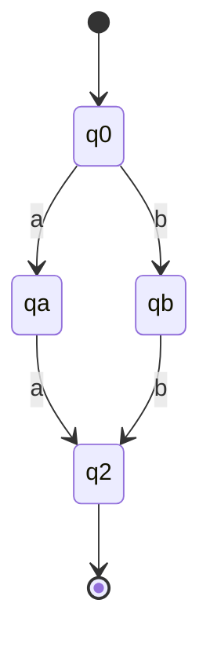
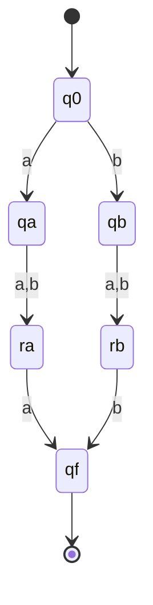

# 大阪大学 情報科学研究科 情報工学 2019年度 計算理論

## **Author**

祭音Myyura (co-authored with GPT 5.6 SOL)

## **Description**
### (1) 回文

アルファベットを $\{a,b\}$ とし、空語も回文とする。

- (1-1),(1-2) 長さ2、長さ3の回文をそれぞれ認識するDFAを示せ。
- (1-3) 全ての回文の言語が正規でないことを、次の反復補題を用いた背理法で示せ。

正規言語 $L$ に対し正整数 $n$ が存在し、任意の $v\in L$, $|v|\ge n$ は $v=xyz$, $|xy|\le n$, $|y|\ge1$ と分解でき、すべての整数 $k\ge0$ について $xy^kz\in L$ となる。
- (1-4) 開始状態 $q_0$、初期スタック記号 $Z$ のPDAで、$q_0$ の自己遷移は $(a,s)/0s,(b,s)/1s$（$s\in\{Z,0,1\}$）である。$q_1$ で $(a,0)/\varepsilon,(b,1)/\varepsilon$ により取り出し、$(\varepsilon,Z)/Z$ で最終状態 $q_2$ へ移る。中央位置を推測する $q_0\to q_1$ の遷移をすべて示せ。スタック記号は $Z,0,1$ とする。遷移 $(r,s)/t$ は入力 $r$ を読み、スタック先頭 $s$ を列 $t$ で置き換えることを表す。$t$ の左端を新しいスタック先頭とし、$t=\varepsilon$ なら取り出すだけ、$r=\varepsilon$ なら入力を消費しない。解答もこの形式を用いよ。

### (2) 文脈自由文法

$$
A\to aAbA\mid bAaA\mid\varepsilon
$$

を生成規則、$A$ を開始記号とする言語 $L$ を考える。

$|w|$ は語長、$|w|_a,|w|_b$ はそれぞれ $a,b$ の個数、$\alpha\Rightarrow\beta$ は生成規則を1回適用する導出を表す。

- (2-1) 次の空欄［ア］を埋め、$w\in L$ なら $|w|_a=|w|_b$ を示せ。規則適用回数 $k$ について帰納法を用いる。$k=1$ なら $A\Rightarrow\varepsilon$ なので両者0である。$k>1$ とし、$k-1$ 回以下の適用で得られる任意の語は両者の個数が等しいと仮定する。$k$ 回で得られる語も両者の個数が等しい理由は［ア］である。
- (2-2) 次の空欄［イ］～［エ］を埋め、$|w|_a=|w|_b$ なら $w\in L$ を示せ。$|w|$ は0以上の偶数である。基底 $|w|=0$ で成立する理由は［イ］である。$|w|>0$ では、それより短い、$a,b$ の個数が等しい語はすべて $L$ に属すると仮定する。先頭が $a$ なら、より短い $v_1,v_2\in L$ によって $w=av_1bv_2$ と分解できることを用いてよい。このとき $A\Rightarrow[ウ]\Rightarrow\cdots\Rightarrow av_1bv_2=w$。先頭が $b$ なら同様に $w=bv_1av_2$ と分解でき、$A\Rightarrow[エ]\Rightarrow\cdots\Rightarrow bv_1av_2=w$。

## **Kai**
### (1)

(1-1) 未記載の遷移は全て非受理の死状態へ移り、死状態は全入力で自己遷移する。

(1-2) 同じく未記載の遷移は死状態へ移る。

(1-3) 正規と仮定し、反復長を $n$ とする。回文 $a^nba^n$ を $xyz$、$|xy|\le n$, $|y|\ge1$ と分割すると $y=a^k$（$k\ge1$）。$y$ を0回反復した $xz=a^{n-k}ba^n$ は回文でなく、反復補題に矛盾する。

(1-4) $T\in\{Z,0,1\}$ のそれぞれについて

$$
\boxed{(\varepsilon,T)/T,\quad(a,T)/T,\quad(b,T)/T}
$$

の計9個。最初は偶数長の中央、残りは奇数長の中央の1文字を読み飛ばす遷移である。

### (2)

(2-1) ［ア］：1回の導出では $A\Rightarrow\varepsilon$ で両者0個。非空語は最初の規則により $av_1bv_2$ または $bv_1av_2$ となる。$v_1,v_2$ には帰納法の仮定を適用でき、そこに $a,b$ を各1個加えるので個数は等しい。

(2-2) ［イ］：空語は $A\Rightarrow\varepsilon$ で生成できる。［ウ］は $aAbA$、［エ］は $bAaA$ である。非空語の先頭が $a$ のとき、先頭から数えた $a$ と $b$ の個数差が初めて0となる位置を選ぶ。この位置の文字は $b$ であり、$w=av_1bv_2$ と書け、$v_1,v_2$ はともに $a,b$ を同数含む。帰納法により

$$
A\Rightarrow aAbA\Rightarrow^*av_1bv_2=w.
$$

先頭が $b$ の場合も $w=bv_1av_2$ と分解し

$$
A\Rightarrow bAaA\Rightarrow^*bv_1av_2=w.
$$

したがって所要の言語をちょうど生成する。
