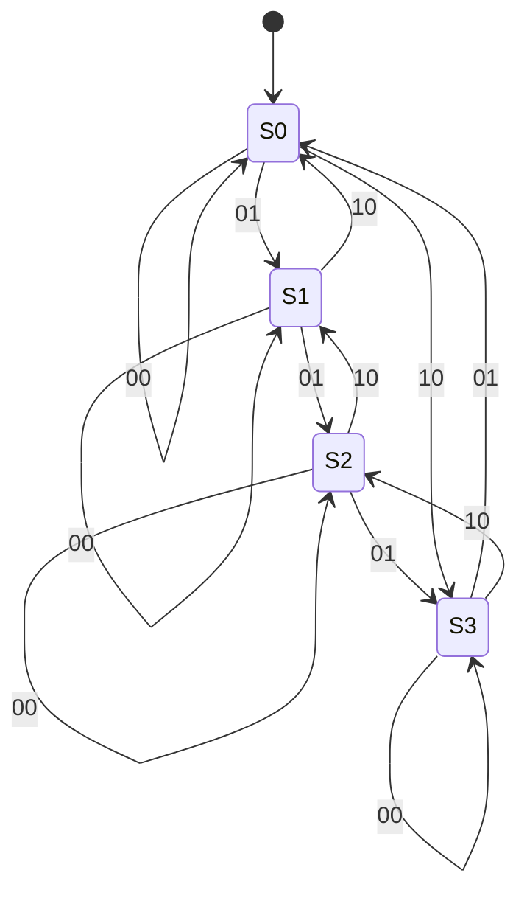

# 大阪大学 情報科学研究科 情報工学 2019年度 論理設計

## **Author**

祭音Myyura (co-authored with GPT 5.6 SOL)

## **Description**

### (1-1) 論理ゲート

入力 $x,y$ を持ち、pMOS 2個を並列、nMOS 2個を直列に接続した相補回路の出力を、さらにCMOSインバータへ接続する。全体が実現する論理ゲートを、1.OR、2.NOR、3.XOR、4.AND、5.NANDから選べ。
### (2) 左論理シフト

入力 $X=(x_3,x_2,x_1,x_0)$ と出力 $Y$ は符号なし4 bit整数である。スイッチ $p_3,p_2,p_1,p_0$ のうち1である添字の最大値 $K$ だけ左シフトし、空いた桁は0とする。選択信号 $s_0$ が0なら入力をそのまま、1なら左1 bitシフトした値を選ぶ。続いて $s_1$ が0ならそのまま、1なら左2 bitシフトする。例えば $X=0001$, $(p_3,p_2,p_1,p_0)=(0,0,1,1)$ なら $Y=0010$ である。

- (2-1) $X=0001$, $(p_3,p_2,p_1,p_0)=(0,1,1,0)$ の出力を求めよ。
- (2-2) $s_1,s_0$ を $p_i$ の最簡積和形で表せ。

### (3) アップダウンカウンタ

Moore型4進カウンタを2個のエッジトリガ型Dフリップフロップとクロック入力 $clk$ で設計する。状態 $S_0,S_1,S_2,S_3$ の出力 $Q_1Q_0$ はそれぞれ00,01,10,11、初期状態は $S_0$。制御入力 $x_1x_0=00$ では保持、01では1増加、10では1減少する。3の次は0、0の前は3とし、11は禁止入力である。

- (3-1) 状態遷移図を示せ。
- (3-2) 次の状態遷移表の空欄(A)～(L)を $S_0$～$S_3$ で埋めよ。

|現在の状態|入力00|入力01|入力10|
|---|---|---|---|
|$S_0$|(A)|(B)|(C)|
|$S_1$|(D)|(E)|(F)|
|$S_2$|(G)|(H)|(I)|
|$S_3$|(J)|(K)|(L)|
- (3-3) $D_1,D_0$ を $x_1,x_0,Q_1,Q_0$ の最簡積和形で表せ。

## **Kai**

### (1-1)

前段は $\overline{xy}$ を出力するNANDで、後段で反転するため $z=xy$。よって $\boxed{4.\ \mathrm{AND}}$。
### (2)

(2-1) 最大の有効添字は2なので $\boxed{Y=0100}$。

(2-2) $K$ の2進表現が $s_1s_0$ である。優先順位を考慮すると

$$
\boxed{s_1=p_3+p_2,\qquad s_0=p_3+\overline{p_2}p_1}.
$$

### (3)

(3-1)

(3-2)

|現在|00|01|10|
|---|---|---|---|
|$S_0$|$S_0$|$S_1$|$S_3$|
|$S_1$|$S_1$|$S_2$|$S_0$|
|$S_2$|$S_2$|$S_3$|$S_1$|
|$S_3$|$S_3$|$S_0$|$S_2$|

(3-3) 禁止入力11をドントケアとして簡単化すると

$$
\boxed{\begin{aligned}
D_1={}&Q_0Q_1\overline{x_0}+Q_0\overline{Q_1}x_0
+\overline{Q_0}Q_1\overline{x_1}+\overline{Q_0}\overline{Q_1}x_1,\\
D_0={}&\overline{Q_0}x_0+\overline{Q_0}x_1+Q_0\overline{x_0}\overline{x_1}.
\end{aligned}}
$$
