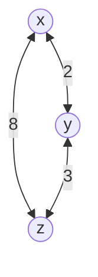
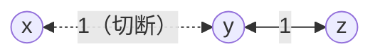
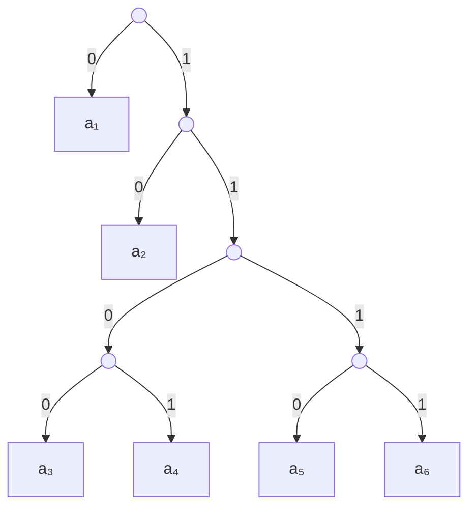

# 大阪大学 情報科学研究科 情報工学 2018年8月実施 ネットワーク

## **Author**
祭音Myyura (co-authored with GPT 5.6 SOL)

## **Description**

### (1)

記憶がない情報源 $S=\{a_1,\ldots,a_s\}$ の記号数は $s\ge2$ とする。$a_i$ の生起確率は $2^{-m_i}$ であり、$m_1,\ldots,m_s$ は $1\le m_1\le\cdots\le m_s$ を満たす整数とする。各 $a_i$ の符号語長が $m_i$ となる瞬時復号可能な2元符号の存在を考える。

- (1-1) 特別な場合として、$s=6, m_1=1, m_2=2, m_3=m_4=m_5=m_6=4$ である情報源 $S_0$ を考える。
  - (1-1-1) 復号木を一つ示せ。
  - (1-1-2) 平均符号語長と、底を2とするエントロピーを求めよ。
- (1-2) 記号数 $s$ に関する数学的帰納法で、所要の符号が存在することを示す。
  - (1-2-1) 以下の文章の空欄（あ）〜（お）を埋めて、常に $m_{s-1}=m_s$ であることを示せ。（い）〜（え）には「偶数」または「奇数」を入れよ。

    $2^{m_s}\sum_{i=1}^{s}2^{-m_i}=\boxed{\text{あ}}$ である。$m_s\ge1$ なので、$2^{m_s}\sum_{i=1}^{s}2^{-m_i}$ は（い）である。$m_{s-1}\ne m_s$ と仮定すれば、$2^{m_s}\sum_{i=1}^{s-1}2^{-m_i}$ は（う）であり、これらの差 $2^{m_s}\sum_{i=1}^{s}2^{-m_i}-2^{m_s}\sum_{i=1}^{s-1}2^{-m_i}$ は（え）となるが、差の値は

    $$
    2^{m_s}\sum_{i=1}^{s}2^{-m_i}-2^{m_s}\sum_{i=1}^{s-1}2^{-m_i}=\boxed{\text{お}}
    $$

    であり矛盾する。

  - (1-2-2) $s=2$ の場合を示せ。
  - (1-2-3) $s-1$ 記号以下で成立すると仮定し、$s$ 記号でも成立することを示せ。
- (1-3) 次の文章の空欄を埋めよ。（う）には人名の姓、（お）には「がある」または「はない」を入れよ。

  一般の場合に、情報源 $S$ の2を底とするエントロピーは（あ）である。小問 (1-2) で存在を示した符号化の平均符号語長は（い）であり、（う）の（え）定理から、$S$ の $n$ 次拡大に対する符号化を考えた場合に、一記号あたりの平均符号語長がより小さい符号化が存在する可能性（お）。

### (2)

同期的な距離ベクトル型ルーティングを考える。全ノードの集合を $\mathcal N$、ノード $i$ から $j$ へのリンクコストを $c(i,j)\ge0$ とする。$c(i,i)=0$ とし、リンクが存在しなければ $c(i,j)=\infty$ とする。$d_i(j)$ はノード $i$ が保持する、$i$ から $j$ への最小コスト経路のコストである。$\mathcal N=\{x,y,z\}$ なら $D_i=[d_i(x),d_i(y),d_i(z)]$ と表す。初期値は $d_i(j)=c(i,j)$ とし、各ステップで全ノードが同期的に次の動作I、IIを行う。

- 動作I：各ノード $i$ は $D_i$ を隣接ノードへ送り、自身へ送信された距離ベクトルを受信する。
- 動作II：受信したすべての距離ベクトルを用いて、自身の $D_i$ を更新する。

前ステップと現ステップの間で、すべての $D_i$ に変化がなければ経路が収束したという。

- (2-1) $D_i$ の更新式を示せ。
- (2-2) 次のネットワークで、送信された距離ベクトルは喪失せず届くものとする。初期状態の直後の更新をstep 1として、各ステップにノード $x$ が受信する $D_y,D_z$ と更新後の $D_x$ を、収束するまで示せ。



- (2-3) 次のネットワークは切断前に収束しており、$D_y=[1,0,1]$ である。その後 $x-y$ 間が切断され、$c(x,y)=c(y,x)=\infty$ となった。リンク切断直後の更新をstep 1とする。距離ベクトルは、切断されたリンクを介しては到着しないものとする。



  - (2-3-1) step 1〜3終了時の $d_y(x)$ を示せ。
  - (2-3-2) count-to-infinityが生じる理由を説明せよ。
  - (2-3-3) リンクステート型では同問題が生じない理由を説明せよ。


## **Kai**

### (1)

#### (1-1-1)

一例として

```text
a₁ = 0
a₂ = 10
a₃ = 1100
a₄ = 1101
a₅ = 1110
a₆ = 1111
```

とする。復号木は次の通りである。



#### (1-1-2)

$$
\bar L=\frac12\cdot1+\frac14\cdot2+4\cdot\frac1{16}\cdot4=\boxed{2}.
$$

$p_i=2^{-m_i}$ より

$$
H(S_0)=-\sum_i p_i\log_2p_i=\sum_i m_i2^{-m_i}=\boxed{2}.
$$

#### (1-2-1)

$$
\boxed{(\text{あ})=2^{m_s}},\quad
\boxed{(\text{い})=\text{偶数}},\quad
\boxed{(\text{う})=\text{偶数}},\quad
\boxed{(\text{え})=\text{偶数}},\quad
\boxed{(\text{お})=1}.
$$

確率和に $2^{m_s}$ を掛けると

$$
2^{m_s}\sum_{i=1}^{s}2^{-m_i}=2^{m_s}
$$

は偶数である。$m_{s-1}\ne m_s$ なら $i\le s-1$ の項の和も偶数だが、残る第 $s$ 項は $2^{m_s}2^{-m_s}=1$ となり矛盾する。よって $m_{s-1}=m_s$ である。

#### (1-2-2)

$s=2$ では $m_1=m_2=m$ であり、$2\cdot2^{-m}=1$ から $m=1$。$a_1\mapsto0, a_2\mapsto1$ とすればよい。

#### (1-2-3)

$m_{s-1}=m_s=m$ とし、$a_{s-1},a_s$ を確率

$$
2^{-m}+2^{-m}=2^{-(m-1)}
$$

の一記号 $a'$ に併合する。帰納法の仮定により得られる $a'$ の符号語を $w$ とし、$a_{s-1}\mapsto w0, a_s\mapsto w1$ に置換すれば、符号語長はともに $m$ で接頭語条件も保たれる。

#### (1-3)

$$
\boxed{
(\text{あ})=\sum_{i=1}^{s}m_i2^{-m_i},\quad
(\text{い})=\sum_{i=1}^{s}m_i2^{-m_i},\quad
(\text{う})=\text{シャノン},\quad
(\text{え})=\text{第一},\quad
(\text{お})=\text{はない}
}.
$$

平均符号語長がエントロピーに等しく下限を達成しているため、拡大情報源でも一記号当たりの平均符号語長をさらに小さくできない。

### (2)

#### (2-1)

ノード $i$ の隣接ノード集合を $\Gamma(i)$ とすると、$j\ne i$ について

$$
\boxed{
d_i^{\mathrm{new}}(j)=
\min_{k\in\Gamma(i)}\bigl(c(i,k)+d_k(j)\bigr)
}.
$$

また $d_i^{\mathrm{new}}(i)=0$ とする。旧値 $d_i(j)$ を独立な候補として残すのではなく、旧経路を使う場合も、その次ホップが広告した距離を介して評価する。

#### (2-2)

初期値は

$$
D_x=[0,2,8],\quad D_y=[2,0,3],\quad D_z=[8,3,0].
$$

| ステップ | $x$ が受信する $D_y$ | $x$ が受信する $D_z$ | 更新後の $D_x$ |
|---:|---|---|---|
| 1 | $[2,0,3]$ | $[8,3,0]$ | $[0,2,5]$ |
| 2 | $[2,0,3]$ | $[5,3,0]$ | $[0,2,5]$ |

step 2で変化がなくなり収束する。

#### (2-3-1)

切断直前に $z$ が広告した $x$ までのコスト2をstep 1で利用するため

$$
\boxed{
\begin{array}{c|ccc}
&\text{step 1}&\text{step 2}&\text{step 3}\\ \hline
d_y(x)&3&3&5
\end{array}}
$$

となる。

#### (2-3-2)

切断後も $y$ は「$z$ が $x$ への経路を持つ」、$z$ は「$y$ が $x$ への経路を持つ」と互いの古い距離情報を採用する。このため広告コストが $3,4,5,\ldots$ と増加し続ける。

#### (2-3-3)

リンクステート型では、切断情報を全ノードへフラッディングし、各ノードが同じトポロジから最短経路を再計算する。隣接ノードの距離値を互いに経路として信じ続けないため、count-to-infinityは生じない。
