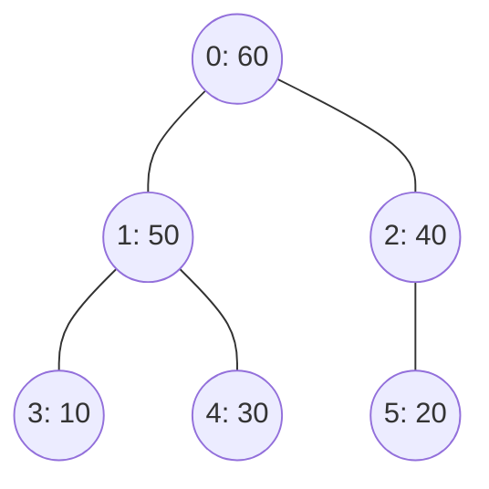

# 大阪大学 情報科学研究科 情報工学 2019年8月実施 アルゴリズムとプログラミング

## **Author**
祭音Myyura

## **Description**
図１に示すANSI-C準拠であるC言語のプログラムは、複数の整数のデータを、二分木を利用して昇順に整列して出力するプログラムである。
図１のプログラムでは、配列の添え字が二分木の節点番号に対応している。
ただし、二分木の根の節点番号を $0$ とし、節点番号が $i$ の節点に子がある場合、左の子の節点番号を $2i+1$、右の子の節点番号を $2i+2$ とする。
また、配列に格納されたデータは、二分木の対応する節点のデータを示している。

整列するデータは図２に示すような形式のファイル data.txt で与えられ、1 行目には整列するデータの個数 $n\ (n \ge 1)$、2 行目以降の $n$ 行には整列するデータの値が書かれている。
図３は、図２の data.txt を与えて図１のプログラムを実行した場合の、28 行目が実行される直前の配列 d に対応する二分木であり、丸が節点、丸の左側の数字が節点番号、丸の中の数字がデータの値、線分が枝を示している。
図１のプログラムに関する以下の各問に答えよ。

(1) 40 行目で呼び出されている関数 sort で実現されている整列アルゴリズムは、一般に何と呼ばれているか名称を答えよ。

(2) 図２の data.txt を与えてプログラムを実行した場合の、28 行目が実行された直後の配列 d に対応する二分木を図示せよ。ただし、図３にならい、丸で節点、丸の左側の数字が節点番号、丸の中の数字がデータの値、線分が枝を示すこと。

(3) 11 行目および 12 行目が実行されることより、節点番号が current の節点のデータとその子のデータの間に成立する関係を説明せよ。

(4) 関数 sort で実現されている整列アルゴリズムの最悪時間計算量を、整列するデータの個数 $n$ 用いて理由と共にオーダー表記で示せ。

(5) 関数 sort において、28 行目の実行時に関数 swap が呼び出される回数を $T(n)$ とする。$n$ は整列するデータの個数である。28 行目を変更し、28 行目の for ループの繰り返し回数と $T(n)$ の最大値をできる限り削減 (28 行目の実行に要する最悪時間計算量を削減)することを考える。以下の各小問に答えよ.

- (5-1) 下記の(あ)~(え)を埋めて変更後の 28 行目を完成させよ.

```text
for (i = (あ); 0 <= i; i--) downh( (い), (う), (え) );
```

- (5-2) 変更後のプログラムにおける $T(n)$ の $n$ に関するオーダ表記を理由と共に示せ. $\sum_{j=0}^{h} \frac{j}{2^j} = 2 - \frac{2 + h}{2^h}$ を用いてよい.

(6) 下線 (ア)~(エ)で示す条件式を必要に応じて変更し、データを降順 (descending order) に整列して出力することを考える。変更後のプログラムにおける下線(ア)~(エ)の条件式をそれぞれ答えよ。


```text
#include <stdio.h>
#include <stdlib.h>
void swap(int d[], int p, int q) {
    int tmp;
    tmp = d[p]; d[p] = d[q]; d[q] = tmp;
}
void downh(int d[], int n, int k) {
    int child, current = k;
    while (current < n / 2) {
        child = current * 2 + 1;
        if ((child + 1 < n) && (d[child] < d[child + 1])) child++;  // (ア) child + 1 < n, (イ) d[child] < d[child + 1]
        if (d[current] < d[child]) swap(d, current, child);  // (ウ) d[current] < d[child]
        else break;
        current = child;
    }
}
void uph(int d[], int k) {
    int parent, current = k;
    while (0 < current) {
        parent = (current - 1) / 2;
        if (d[parent] < d[current]) swap(d, parent, current);  // (エ) d[parent] < d[current]
        else break;
        current = parent;
    }
}
void sort(int d[], int n) {
    int i;
    for (i = 1; i < n; i++) uph(d, i);
    for (i = n - 1; 0 < i; i--) { swap(d, 0, i); downh(d, i, 0); }
}
int main() {
    int i, N, *D;
    FILE *fp;
    fp = fopen("data.txt", "r");
    fscanf(fp, "%d", &N);
    D = (int*) malloc(sizeof(int) * N);
    for (i = 0; i < N; i++) fscanf(fp, "%d", &D[i]);
    fclose(fp);

    sort(D, N);

    for (i = 0; i < N; i++) printf("%d ", D[i]);
    printf("\n");
    free(D);
    return 0;
}
```
### <center> 図１</center>

```text
6
40
30
50
10
60
20
```
### <center> 図２ data.txt</center>


### <center> 図３ 二分木の例</center>


## **Kai**

### (1)

**ヒープソート**。

### (2)



### (3)

大きい方の子を選び、親より大きければ交換するので、処理対象だった親の位置の値は、存在する両方の子の値以上になる。

### (4)

上向き・下向きの調整は各 $O(\log n)$ で、建設と取出しを各 $O(n)$ 回行う。したがって最悪時間計算量は $\boxed{O(n\log n)}$。

### (5)

(5-1)

```c
for (i = n / 2 - 1; 0 <= i; i--) downh(d, n, i);
```

(5-2) 高さが $h$ 以上の節点数は高々 $\lfloor n/2^h\rfloor$。交換回数は各節点の高さの総和以下なので

$$
T(n)\le\sum_{h\ge1}\left\lfloor\frac n{2^h}\right\rfloor<n.
$$

よって $\boxed{T(n)=O(n)}$。

### (6)

```c
/* (ア) */ child + 1 < n
/* (イ) */ d[child] > d[child + 1]
/* (ウ) */ d[current] > d[child]
/* (エ) */ d[parent] > d[current]
```

最小ヒープから最小値を末尾へ移すため、降順となる。
