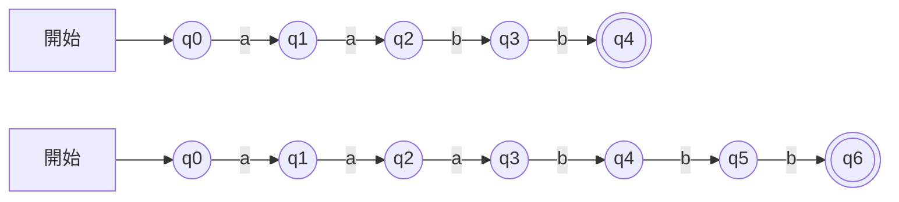
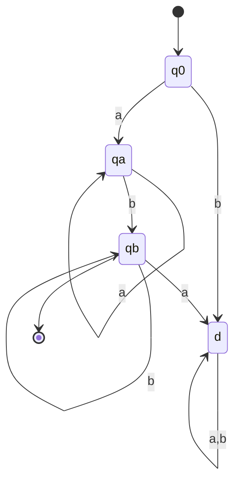

# 大阪大学 情報科学研究科 情報工学 2020年度 計算理論

## **Author**

祭音Myyura (co-authored with GPT 5.6 SOL)

## **Description**
### (1) $a^nb^n$ の認識

$L=\{a^nb^n\mid n\ge1\}$ とする。

- (1-1) PDAの開始状態 $q_0$ は $(a,Z)/0Z$ で自己遷移し、$q_1$ から最終状態 $q_2$ へは $(\varepsilon,Z)/\varepsilon$ で移る。$q_0$ の追加自己遷移(A)、$q_0\to q_1$ の遷移(B)、$q_1$ の自己遷移(C)を示せ。スタック記号は $Z,0$ で、初期スタックは $Z$。遷移 $(r,s)/t$ は入力 $r$ を読み、先頭記号 $s$ を列 $t$ に置換する。$t$ の左端が新しいスタック先頭となり、$t=\varepsilon$ なら取り出すだけ、$r=\varepsilon$ なら入力を消費しない。
- (1-2-1) $L_2=\{a^nb^n\mid n=2\}$ と $L_3=\{a^nb^n\mid n=3\}$ のDFAを、全入力の遷移を含めて示せ。
- (1-2-2) 次の背理法の空欄(D)を埋めよ。$L$ を認識するDFAが存在すると仮定し、その状態数を $k$ とする。入力 $a^kb^k$ のうち $a$ を $i$ 個（$0\le i\le k$）読み終えた状態を $p_i$ とすると、［(D)］。よって仮定と矛盾し、そのようなDFAは存在しない。
- (1-3) $L'=\{a^nb^m\mid n,m\ge1\}$ のDFAを全遷移付きで示せ。

### (2) CYK法

文法 $G=(V,T,P,S)$ は非終端記号集合 $V$、終端記号集合 $T$、生成規則 $P$、開始記号 $S$ からなる。Chomsky標準形では規則は $X\to YZ$ または $X\to a$（$X,Y,Z\in V$, $a\in T$）に限る。入力 $w=a_1\cdots a_n$ に対し、$M[i,j]$（$1\le i\le j\le n$）を部分語 $a_i\cdots a_j$ を導出できる非終端記号の集合とする。次のアルゴリズムを用いる。

```text
すべての M[i,j] (1 ≤ i ≤ j ≤ n) ← 空集合
for i = 1 to n do
    規則 X → a_i が P にある全 X を M[i,i] に追加
end for
for ℓ = 2 to n do
    for i = 1 to n-ℓ+1 do
        j ← i+ℓ-1
        for k = i to j-1 do
            Y ∈ M[i,k], Z ∈ M[k+1,j], X → YZ ∈ P
            を満たす全 X を M[i,j] に追加
        end for
    end for
end for
S ∈ M[1,n] なら Yes、そうでなければ No を出力
```


(2-1) 規則

$$
S\to AB,\quad A\to CA\mid AA\mid a,\quad B\to DB\mid b,\quad C\to a,\quad D\to b
$$

を持ち、$V=\{A,B,C,D,S\}$、$T=\{a,b\}$、開始記号 $S$ の文法を考える。入力 `aaab` の全ての $M[i,j]$ を表で示せ。

参考として、同じ文法で入力 `bab` を処理すると、次の表となり $S\notin M[1,3]$ のため No を出力する。

|$M[i,j]$|$j=1$|$j=2$|$j=3$|
|---|---|---|---|
|$i=1$|$\{B,D\}$|$\varnothing$|$\varnothing$|
|$i=2$|—|$\{A,C\}$|$\{S\}$|
|$i=3$|—|—|$\{B,D\}$|

(2-2) 文法 $S\to AB\mid SA\mid BS\mid\varepsilon$, $A\to a$, $B\to b$ に上記アルゴリズムをそのまま適用すると誤判定する長さ2以上の語を示し、理由を説明せよ。

## **Kai**
### (1)

(1-1)

$$
\boxed{(A):(a,0)/00,\quad(B):(b,0)/\varepsilon,\quad(C):(b,0)/\varepsilon}.
$$

(1-2-1) $L_r$（$r=2,3$）について状態を $q_0,\ldots,q_{2r},d$ とする。開始は $q_0$、最終は $q_{2r}$ だけ。次の規則で全遷移が定まる。

$$
\begin{array}{c|cc}
\text{状態}&a&b\\\hline
q_i\ (0\le i<r)&q_{i+1}&d\\
q_i\ (r\le i<2r)&d&q_{i+1}\\
q_{2r}&d&d\\
d&d&d
\end{array}
$$



図の主経路以外の遷移は表の通り死状態 $d$ へ移る。

(1-2-2) $a$ を0個から $k$ 個まで読んだ時点の $k+1$ 状態のうち、ある $0\le i<j\le k$ で状態が一致する。その区間の $a^{j-i}$ をもう1回読むと、同じ状態へ戻るので $a^{k+j-i}b^k$ も受理される。しかしこれは $L$ に属さず矛盾する。

(1-3)



### (2)

(2-1)

|$M[i,j]$|$j=1$|$j=2$|$j=3$|$j=4$|
|---|---|---|---|---|
|$i=1$|$\{A,C\}$|$\{A\}$|$\{A\}$|$\{S\}$|
|$i=2$|—|$\{A,C\}$|$\{A\}$|$\{S\}$|
|$i=3$|—|—|$\{A,C\}$|$\{S\}$|
|$i=4$|—|—|—|$\{B,D\}$|

$S\in M[1,4]$ なので **Yes**。

(2-2) $\boxed{w=aa}$ を選ぶ。文法では

$$
S\Rightarrow SA\Rightarrow SAA\Rightarrow AA\Rightarrow aa
$$

と導出できる。一方、アルゴリズムは $M[1,1]=M[2,2]=\{A\}$ とし、右辺が $AA$ の規則がないので $M[1,2]=\varnothing$ としてNoを返す。空語を生成する $S$ による長さ0の部分語を処理しないことが原因である。
