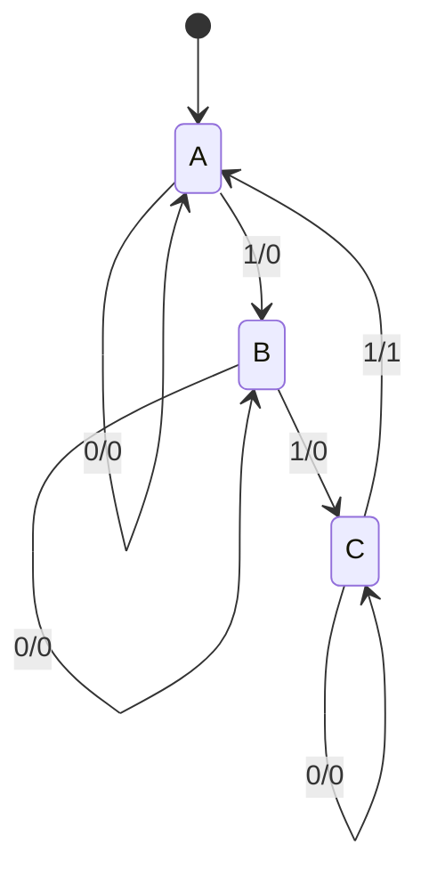
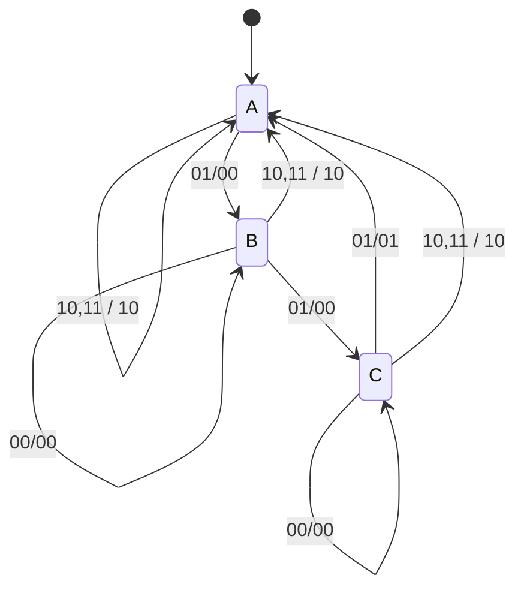

# 大阪大学 情報科学研究科 情報工学 2020年度 論理設計

## **Author**

祭音Myyura (co-authored with GPT 5.6 SOL)

## **Description**

300円の券を販売し、100円硬貨のみを1枚ずつ受け付け、300円に達すると直ちに発券する同期式券売機を設計する。1クロックの入力 $x_0=1$ は100円投入、出力 $y_0=1$ は発券を表す。状態 $A,B,C$ は累計0,100,200円で、状態変数 $(k_0,k_1)$ を順に $(0,0),(0,1),(1,0)$ と割り当てる。

- (2-1) Mealy型状態遷移図を示せ。
- (2-2) 次状態 $k_0^+,k_1^+$ と出力 $y_0$ の最簡積和形を求めよ。
- (2-3) 入力 $x_1$ と出力 $y_1$ を追加した図4の回路は、次のゲート接続を持つ（積はAND、和はOR、上線はNOT）。初期状態と入出力を含む状態遷移図を示せ。未定義状態からの遷移は考えない。

$$
\begin{aligned}
y_0&=k_0x_0\overline{x_1},&y_1&=x_1,\\
k_0^+&=k_0\overline{x_0}\overline{x_1}+k_1x_0\overline{x_1},\\
k_1^+&=k_1\overline{x_0}\overline{x_1}+\overline{k_0}\overline{k_1}x_0\overline{x_1}.
\end{aligned}
$$

- (2-4) 追加された機能を理由とともに説明せよ。

## **Kai**
(2-1)

(2-2) 未定義状態11をドントケアとして

$$
\boxed{k_0^+=k_0\overline{x_0}+k_1x_0,\quad
k_1^+=k_1\overline{x_0}+\overline{k_0}\overline{k_1}x_0,\quad y_0=k_0x_0}.
$$

(2-3) 遷移ラベルを入力 $x_1x_0$/出力 $y_1y_0$ とする。

(2-4) $x_1$ を取消しボタン、$y_1$ を返金指令とすれば、**購入取消し・返金機能**が追加されたと解釈できる。$x_1=1$ では投入信号に優先して発券を抑え、$y_1=1$ を出力し、累計金額の状態を $A$ に戻す。
