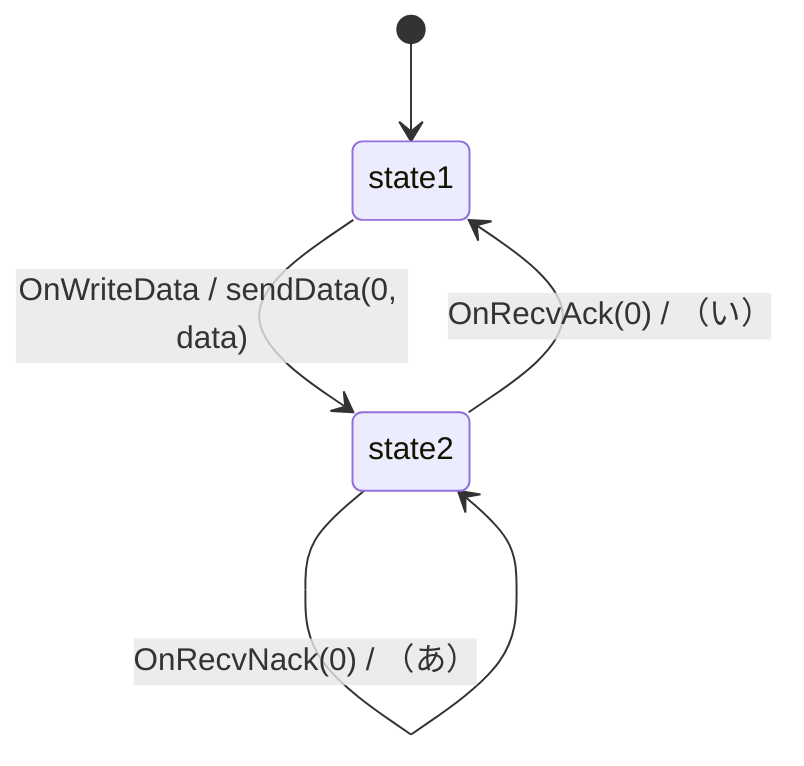
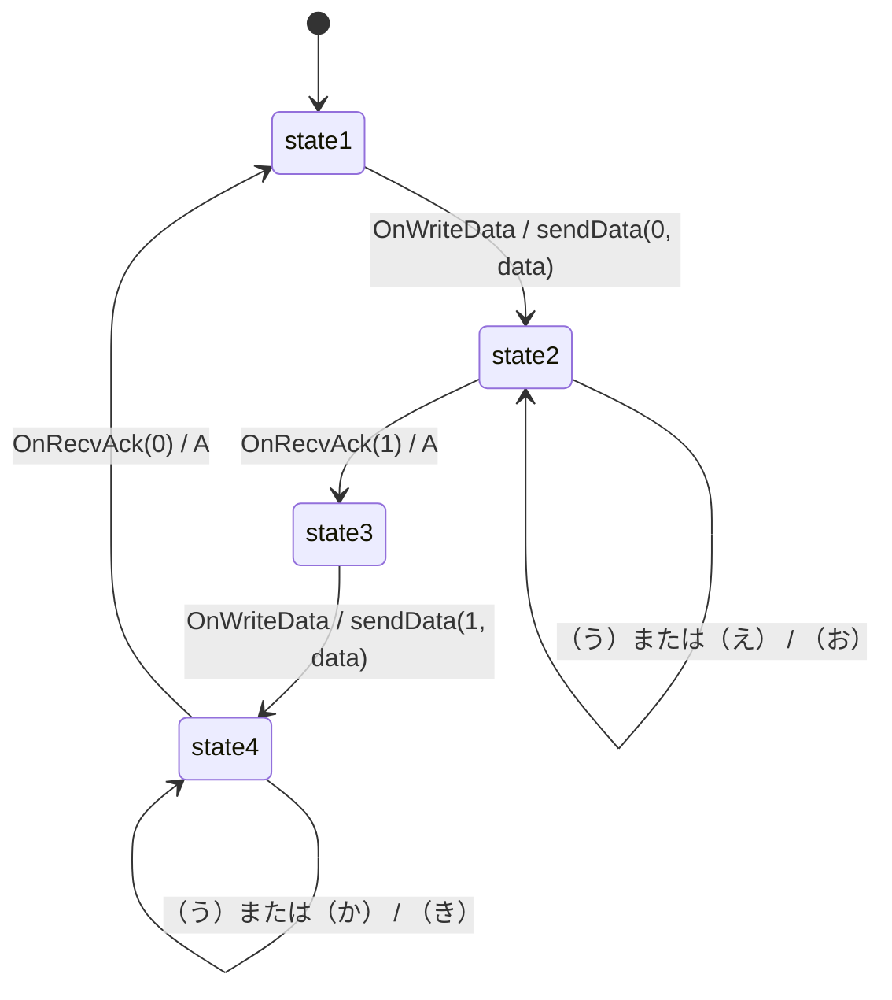

# 大阪大学 情報科学研究科 情報工学 2019年8月実施 ネットワーク

## **Author**
祭音Myyura (co-authored with GPT 5.6 SOL)

## **Description**

### (1)

ビット誤りを生じ得る伝送路で、送信側アプリケーションのファイルをデータに分割し、データパケットとして受信側へ転送する。端末は受信パケットのビット誤りを検出でき、(1-1)〜(1-3)ではパケットは喪失しないものとする。

- (1-1) プロトコル1ではデータと応答のシーケンス番号を0とする。正常なデータには `Ack(0)`、誤りのあるデータには `Nack(0)` が返り、応答には誤りがない。次の（あ）、（い）を埋めよ。`A` は何もしないアクションである。`OnWriteData` は送信アプリケーションからデータを受け取って変数 `data` に格納するイベント、`OnRecvAck(k)`／`OnRecvNack(k)` は番号 $k\in\{0,1\}$ の肯定／否定応答を受信するイベント、`sendData(k,data)` はその番号とペイロードを持つパケットを送信する動作である。

- (1-2-1) プロトコル2では、誤りのある応答を受けると `OnRecvBiterr / sendData(0,data)` で再送する。送信ファイルと受信ファイルが一致しない条件を一つ示し、理由を説明せよ。
- (1-2-2) プロトコル3はシーケンス番号0、1を交互に用いる。正常受信時のACKは次に期待する番号、誤り検出時のACKは現在期待する番号を持つ。次の（う）〜（き）を埋めよ。

- (1-3) 帯域1600 bit/s、片道伝搬遅延10 ms、端末処理時間0、ACK長8 bit、データパケット長24 bitとする。プロトコル3で1秒当たりに転送できる最大データパケット数を、計算過程とともに求めよ。
- (1-4) パケット喪失も生じるとする。受信端末を変更せず、送信端末がデータまたはACKの喪失へ対処する方法を説明せよ。

### (2)

- (2-1) 次の文章の空欄（あ）〜（お）を埋めよ。

  誤り検出法の一例である（あ）は、元の情報ビットに対し、1の総数が奇数または偶数となるようチェックビットを付す方法である。7ビットで表す文字・記号の符号は最小ハミング距離が1だが、チェックビットを付すと（い）となる。一般に、最小ハミング距離が（い）の符号は（う）ビットの誤りをすべて検出できる。連続したビットに生じる（え）にも対処するため巡回符号が用いられ、次数 $r$ の生成多項式を用いる巡回符号は（お）ビット以下の（え）を必ず検出できる。
- (2-2-1) 次数 $r$ の生成多項式 $G(x)$、符号長 $n$、情報長 $m=n-r$ とし、情報ビット $a_{m-1}a_{m-2}\cdots a_1a_0$ に対し、$M(x)=a_{m-1}x^{m-1}+a_{m-2}x^{m-2}+\cdots+a_1x+a_0$ とする。符号語多項式 $F(x)$ の生成法を説明せよ。
- (2-2-2) $G(x)=x^4+x+1, n=15$ とし、情報ビット `00011010011` から $F(x)$ を生成せよ。
- (2-2-3) 受信語多項式から誤りを検出する方法を説明せよ。

## **Kai**

### (1)

#### (1-1)

$$
\boxed{(\text{あ})=\operatorname{sendData}(0,\mathrm{data})},\qquad
\boxed{(\text{い})=A}.
$$

#### (1-2-1)

受信端末が正常なデータをアプリケーションへ渡した後、そのACKにビット誤りが生じる場合である。送信端末は同じデータを再送するが、プロトコル2では新旧を識別できないため、受信側は同じデータを再び渡す。よって受信ファイルに重複が生じる。

#### (1-2-2)

$$
\begin{aligned}
(\text{う})&=\operatorname{OnRecvBiterr},\\
(\text{え})&=\operatorname{OnRecvAck}(0),\\
(\text{お})&=\operatorname{sendData}(0,\mathrm{data}),\\
(\text{か})&=\operatorname{OnRecvAck}(1),\\
(\text{き})&=\operatorname{sendData}(1,\mathrm{data}).
\end{aligned}
$$

#### (1-3)

1回の送受信に要する時間は

$$
T=\frac{24}{1600}+0.010+\frac{8}{1600}+0.010=0.040\ \mathrm{s}.
$$

したがって

$$
\boxed{1/T=25\ \mathrm{packets/s}}.
$$

#### (1-4)

データ送信時に再送タイマを開始し、期待するACKより先にタイムアウトしたら、保存したデータを同じシーケンス番号で再送する。正しいACKを受けたらタイマを停止する。再送による重複は受信側が交互ビットの番号で判定できる。

### (2)

#### (2-1)

$$
\boxed{
(\text{あ})=\text{パリティ検査符号},\quad
(\text{い})=2,\quad
(\text{う})=1,\quad
(\text{え})=\text{バースト誤り},\quad
(\text{お})=r
}.
$$

#### (2-2-1)

$x^rM(x)$ を $G(x)$ で割った余りを $R(x)$（$\deg R<r$）とする。2元体では加算と減算が同じなので

$$
\boxed{F(x)=x^rM(x)+R(x)}
$$

とすれば $F(x)$ は $G(x)$ で割り切れる。

#### (2-2-2)

$$
M(x)=x^7+x^6+x^4+x+1,
$$

$$
x^4M(x)=(x^7+x^6+x^2+x+1)G(x)+(x^3+1).
$$

したがって

$$
\boxed{F(x)=x^{11}+x^{10}+x^8+x^5+x^4+x^3+1},
$$

15ビット表現は

$$
\boxed{000110100111001}.
$$

#### (2-2-3)

受信語多項式を $G(x)$ で割る。余りが非零なら誤りを検出する。余りが零でも、誤り多項式が $G(x)$ の倍数である誤りは検出できない。
