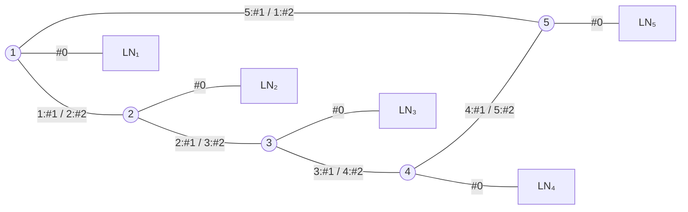

# 大阪大学 情報科学研究科 情報工学 2021年8月実施 ネットワーク

## **Author**
祭音Myyura (co-authored with GPT 5.6 SOL)

## **Description**

### (1)

$2n+1$ 個のノードをリング状に接続する。ノード $i$ のIF#0はローカルネットワーク $LN_i$、IF#1は時計回り、IF#2は反時計回りのノードへ接続され、全リンクコストは1である。$n=2$ の構成は次の通りである。

時刻 $t=0$ ではノード $i$ の経路表は $(LN_i,\mathrm{IF\#0},1)$ の1項だけを持ち、1 time stepで隣接ノード間の経路情報交換が1回完了する。

- (1-1) $n=2$ のとき、$t=1,2$ にノード1が保持する経路表を示せ。
- (1-2) 各ノードの経路表を最大2エントリーとし、全ローカルネットワーク間を到達可能にする。ノード1の経路表を一つ示し、パケットが経由するリンク数として定義される最大経路長を $n$ で表せ。
- (1-3) 最大 $k$ エントリー（$k\ge2$）で全ネットワークを到達可能にし、最大経路長を最小化する。その値を $n,k$ で表し、導出せよ。

### (2)

情報源アルファベット $A=\{a,b,c,d,e,f\}$ に対して次の符号が与えられる。

| $A$ | $C_1$ | $C_2$ | $C_3$ | $C_4$ | $C_5$ |
|---|---|---|---|---|---|
| $a$ | 111 | 000 | 01 | 100 | 11 |
| $b$ | 011 | 001 | 1 | 10 | 01 |
| $c$ | 01 | 010 | 11 | 000 | 10 |
| $d$ | 00 | 011 | 101 | 01 | 001 |
| $e$ | 010 | 100 | 00 | 110 | 000 |
| $f$ | 110 | 101 | 100 | 001 | 011 |

- (2-1) 瞬時に復号可能な符号をすべて答えよ。
- (2-2) 一意に復号可能な符号をすべて答えよ。
- (2-3) クラフトの不等式、瞬時復号可能性、および一意復号可能符号の平均符号語長に関する空欄を、次から選べ。

$$
\begin{array}{ll}
(\text{ア})\ \sum_x1/\ell(x)>1,
& (\text{イ})\ \sum_x1/\log_2\ell(x)\le1,\\
(\text{ウ})\ \sum_x2^{-\ell(x)}\le1,
& (\text{エ})\ \text{クラフトの不等式と瞬時復号可能性は同値},\\
(\text{オ})\ \text{クラフトの不等式を満たすが瞬時復号不能な場合がある},
& (\text{カ})\ \text{瞬時復号可能だがクラフトの不等式を満たさない場合がある},\\
(\text{キ})\ L_C(X)\ge H(X),
& (\text{ク})\ L_C(X)<H(X)+1,\\
(\text{ケ})\ L_C(X)\le H(X).&
\end{array}
$$

### 题目描述

本题前半要求在奇数节点环上用受限条数的路由表保证全网可达，并最小化最坏路径长度；后半区分前缀码与唯一可译码，使用Sardinas–Patterson判定，并考查Kraft不等式及信源编码下界。

## **Kai**

### (1)

#### (1-1)

$t=1$ の経路表は

| 宛先 | インターフェース | 到達コスト |
|---|---|---:|
| $LN_1$ | IF#0 | 1 |
| $LN_2$ | IF#1 | 2 |
| $LN_5$ | IF#2 | 2 |

$t=2$ の経路表は

| 宛先 | インターフェース | 到達コスト |
|---|---|---:|
| $LN_1$ | IF#0 | 1 |
| $LN_2$ | IF#1 | 2 |
| $LN_3$ | IF#1 | 3 |
| $LN_4$ | IF#2 | 3 |
| $LN_5$ | IF#2 | 2 |

である。

#### (1-2)

各ノードで自分のローカルネットワークへの経路と、時計回りのデフォルト経路を持てばよい。ノード1では

| 宛先 | インターフェース | 到達コスト |
|---|---|---:|
| $LN_1$ | IF#0 | 1 |
| その他（default） | IF#1 | — |

となる。リング上の最悪の転送は $2n$ リンクであり、送信元と宛先のローカルネットワーク接続を各1本含むため

$$
\boxed{L_{\max}=2n+2}.
$$

#### (1-3)

ノード $i$ で、自分宛、時計回りのdefault、および反時計回りに近い

$$
LN_{i-1},LN_{i-2},\ldots,LN_{i-m},\qquad m=\min(k-2,n)
$$

への個別経路を持つ。個別経路のない最遠宛先まで時計回りに $2n-m$ リンクを要し、完全な経路表でもリングの直径 $n$ 未満にはできない。したがってリング内の最小最大長は

$$
\max\{n,2n+2-k\}.
$$

両端のローカルネットワーク接続を加えて

$$
\boxed{L_{\max}^{*}=\max\{n,2n+2-k\}+2}.
$$

追加できる個別経路は高々 $k-2$ 個なので、最大迂回距離の大きい宛先から割り当てても $2n+2-k$ の下界が残る。上の構成はこの下界を達成する。

### (2)

#### (2-1)

$C_2$ は固定長である。他の符号にはそれぞれ接頭語関係がある。したがって

$$
\boxed{C_2}
$$

のみである。

#### (2-2)

Sardinas–Patterson法で $C_1$ は

$$
S_1=\{0,1\},\qquad S_2=\{0,1,10,11\},\qquad S_3=S_2
$$

となり、空語を含まないので一意復号可能である。$C_2$ も固定長なので一意復号可能である。一方

$$
\begin{aligned}
C_3 &: d=101=1\,01=ba,\\
C_4 &: ad=100\,01=10\,001=bf,\\
C_5 &: ff=011\,011=01\,10\,11=bca
\end{aligned}
$$

という反例がある。よって

$$
\boxed{C_1,C_2}.
$$

#### (2-3)

クラフトの不等式は $\sum_x2^{-\ell(x)}\le1$ である。これは与えられた符号自体の瞬時復号可能性の十分条件ではない。また、一意復号可能な符号には $L_C(X)\ge H(X)$ が成立する。したがって

$$
\boxed{(a)=\text{ウ},\qquad(b)=\text{オ},\qquad(c)=\text{キ}}.
$$
