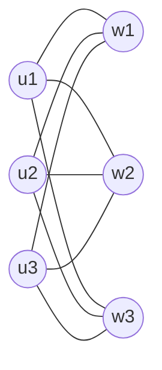
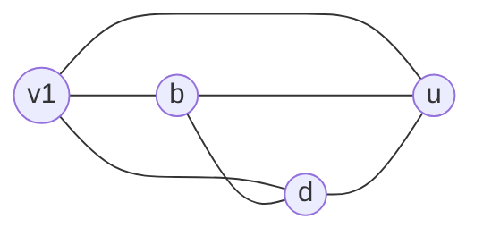
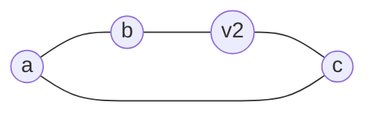

# 大阪大学 情報科学研究科 情報工学 2024年7月実施 離散構造

## **Author**
祭音Myyura (co-authored with GPT 5.6 SOL)

## **Description**

以下では有限単純無向グラフを扱う。グラフ $G=(V,E)$ の $k$-彩色を、任意の辺 $\{u,v\}\in E$ で $c(u)\ne c(v)$ となる写像 $c:V\to\{0,1,\ldots,k-1\}$ とし、その個数を $\gamma(G,k)$ とする。

### (1)

題図の4グラフを、頂点集合 $V=\{1,2,3,4\}$ と次の辺集合で等価に表す。ただし、$ij$ は辺 $\{i,j\}$ を表す。

| グラフ | 辺集合 |
|---|---|
| $G_1$ | $\{12,13,14\}$ |
| $G_2$ | $\{12,23,34,41\}$ |
| $G_3$ | $\{12,23,34,41,13\}$ |
| $G_4$ | $\{12,23,34,41,13,24\}=E(K_4)$ |

- (1-1) 3-彩色可能だが2-彩色可能でないものをすべて選べ。
- (1-2) 2-彩色可能な6頂点グラフのうち、辺数が最大のものを一つ図示せよ。
- (1-3) $\mathcal G_3$、$\mathcal G_2$、閉路グラフ全体の集合 $C$、木全体の集合 $T$ の包含・交差関係をVenn図で示せ。

### (2)

辺 $e=\{x,y\}$ の削除を $G-e$、端点 $x,y$ を一頂点 $v_e$ にまとめる縮約を $G/e$ とする。題図のグラフ $H$ を次で表す。

$$
V(H)=\{a,b,c,d,u\},\qquad
E(H)=\{ab,ac,cd,bd,cu,ub,ud\},
$$

$$
e_1=ac,\qquad e_2=ud.
$$

- (2-1) $H/e_1$ と $H/e_2$ を図示せよ。
- (2-2) 辺を持たない $n$ 頂点グラフについて $\gamma(G,k)$ を求めよ。
- (2-3) 任意の辺 $e\in E$ について

  $$
  \gamma(G,k)=\gamma(G-e,k)-\gamma(G/e,k)
  $$

  を示せ。
- (2-4) (2-3)を用い、$n$ 頂点の任意の木 $T$ について

  $$
  \gamma(T,k)=k(k-1)^{n-1}
  $$

  を $n$ に関する帰納法で示せ。

### 题目描述

本题考查二分图与图着色、极值构造、树和圈图的集合关系、边删除与收缩，以及色多项式的删除-收缩递推。

## **Kai**

### (1)

#### (1-1)

$G_1$ は木、$G_2=C_4$ なので2-彩色可能である。$G_3$ は三角形を含むため2-彩色不能だが3-彩色可能である。$G_4=K_4$ は4色を要する。よって

$$
\boxed{G_3}.
$$

#### (1-2)

2色の色類の大きさを $p,6-p$ とすると、辺は異なる色類の間にしか置けないため

$$
|E|\le p(6-p)\le 3\cdot3=9.
$$

等号を達成する完全二部グラフ

$$
\boxed{K_{3,3}}
$$

を取ればよい。



#### (1-3)

$$
T\subsetneq\mathcal G_2\subsetneq\mathcal G_3,\qquad
C\subsetneq\mathcal G_3,\qquad T\cap C=\varnothing.
$$

また、偶数長閉路は $C\cap\mathcal G_2$ に属し、奇数長閉路は $C\setminus\mathcal G_2$ に属する。

```text
┌────────────────────────────── 𝒢₃ ─┐
│  ┌────────────────── 𝒢₂ ─┐       │
│  │  ┌── T ──┐            │       │
│  │  └───────┘   ╭────────┼── C ╮ │
│  │              │ 偶数長閉路 │    │
│  └──────────────┼─────────┘    │ │
│                 │ 奇数長閉路      │ │
│                 ╰────────────────╯ │
└────────────────────────────────────┘
```

### (2)

#### (2-1)

$a,c$ を $v_1$ に縮約すると

$$
E(H/e_1)=\{v_1b,v_1d,v_1u,bd,bu,du\},
$$

ゆえに $H/e_1\simeq K_4$ である。



$u,d$ を $v_2$ に縮約すると、重複する辺は一辺にまとめられ

$$
E(H/e_2)=\{ab,ac,bv_2,cv_2\},
$$

ゆえに $H/e_2\simeq C_4$ である。



#### (2-2)

各頂点へ独立に $k$ 色のいずれかを割り当てられるので

$$
\boxed{\gamma(G,k)=k^n}.
$$

#### (2-3)

$G-e$ の適正彩色を、$e=\{x,y\}$ の端点について分ける。

- $c(x)\ne c(y)$ の彩色は、辺 $e$ を戻しても適正であり、$G$ の彩色と一対一に対応する。
- $c(x)=c(y)$ の彩色は、$x,y$ を同一頂点へ縮約することで $G/e$ の彩色と一対一に対応する。

したがって

$$
\gamma(G-e,k)=\gamma(G,k)+\gamma(G/e,k),
$$

すなわち

$$
\boxed{\gamma(G,k)=\gamma(G-e,k)-\gamma(G/e,k)}.
$$

#### (2-4)

$n=1$ では $\gamma(T,k)=k=k(k-1)^0$ である。

$n-1$ 頂点の木で成立すると仮定し、$n$ 頂点の木 $T$ の葉 $v$ とその接続辺 $e$ を取る。$T'=T-v$ とすると、$T/e$ は $n-1$ 頂点の木、$T-e$ は $T'$ と孤立頂点 $v$ の非交和である。帰納法の仮定より

$$
\gamma(T/e,k)=k(k-1)^{n-2},\qquad
\gamma(T-e,k)=k^2(k-1)^{n-2}.
$$

よって

$$
\begin{aligned}
\gamma(T,k)
&=\gamma(T-e,k)-\gamma(T/e,k)\\
&=k^2(k-1)^{n-2}-k(k-1)^{n-2}\\
&=\boxed{k(k-1)^{n-1}}.
\end{aligned}
$$
