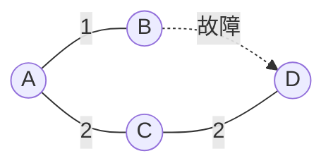

# 大阪大学 情報科学研究科 情報工学 2025年8月実施 ネットワーク

## **Author**
祭音Myyura (co-authored with GPT 5.6 SOL)

## **Description**

ルーティングプロトコルについて答えよ。

### (1)

直線状のネットワークを考える。

```text
A ─── B ─── C ─X─ D
              C-Dリンクが故障
```

ノード集合を $N$、ノード $x$ の隣接集合を $N_x$ とする。各ノードは宛先 $z\ne x$ について、ホップ数 $d_x(z)$ と次ホップ $n_x(z)$ を保持する。$d_x(z)$ の上限を $M$（$M>|N|+1$）とし、$d_x(z)=M$ なら到達不能、次ホップを `-` とする。

各同期制御周期では、(a) 更新前の全距離を隣接ノードへ送信し、(b) 情報を受信できない隣接ノードとのリンクを故障とみなして $N_x$ から除き、(c) 次で全宛先を更新する。

$$
\begin{cases}
d_x(z)=1,\ n_x(z)=z, & z\in N_x,\\
d_x(z)=\min_{y\in N_x}(d_y(z)+1),\ n_x(z)=\arg\min_{y\in N_x}(d_y(z)+1),
  & z\notin N_x,\ \min_y(d_y(z)+1)<M,\\
d_x(z)=M,\ n_x(z)=\text{--}, & \text{それ以外}.
\end{cases}
$$

$i$ 回目の更新後の表は次の通りである。

| ノードA：宛先 | $d_A$ | $n_A$ |
|---|---:|---|
| B | 1 | B |
| C | 2 | B |
| D | 3 | B |

| ノードB：宛先 | $d_B$ | $n_B$ |
|---|---:|---|
| A | 1 | A |
| C | 1 | C |
| D | 2 | C |

| ノードC：宛先 | $d_C$ | $n_C$ |
|---|---:|---|
| A | 2 | B |
| B | 1 | B |
| D | 1 | D |

$i+1$ 回目の更新前にCがC-Dリンク故障を検出した。

- (1-1) $i+1$、$i+2$ 回目の更新後のA、B、Cの経路表を示せ。
- (1-2) A、B、Cのすべてが初めてDを到達不能とみなす制御周期を $i$ で表し、理由を説明せよ。

### (2)

- (2-1) 同じネットワークでリンクステート型ルーティングを動作させる。Cが故障を検出してからA、B、CすべてがDを到達不能とするまでの動作を2、3行で説明せよ。
- (2-2) リンク故障後、一部のノードが交換情報を受信できないと、故障リンクを通らない経路が存在してもパケットが届かないことがある。更新を受信できないノードが存在する場合としない場合の転送経路を比較して理由を説明せよ。

### 题目描述

本题在线形网络中按给定同步距离向量算法分析断链后的两轮路由表及count-to-infinity，再考查链路状态协议的故障泛洪、最短路重算，以及状态未同步导致环路或黑洞的原因。

## **Kai**

### (1)

#### (1-1)

$i+1$ 回目の更新後は次の通りである。

| ノード | 宛先 | 距離 | 次ホップ |
|---|---|---:|---|
| A | B | 1 | B |
| A | C | 2 | B |
| A | D | 3 | B |
| B | A | 1 | A |
| B | C | 1 | C |
| B | D | 2 | C |
| C | A | 2 | B |
| C | B | 1 | B |
| C | D | 3 | B |

$i+2$ 回目の更新後は次の通りである。

| ノード | 宛先 | 距離 | 次ホップ |
|---|---|---:|---|
| A | B | 1 | B |
| A | C | 2 | B |
| A | D | 3 | B |
| B | A | 1 | A |
| B | C | 1 | C |
| B | D | 4 | AまたはC |
| C | A | 2 | B |
| C | B | 1 | B |
| C | D | 3 | B |

$i+2$ 回目のBからDへの候補はA経由、C経由ともに4である。題意に同値時の規則がないため、次ホップはA、Cのいずれも許される。

#### (1-2)

$i+k$ 回目（$k\ge1$）のDへの距離は、$M$ に達するまでは

$$
(d_A,d_B,d_C)=
\begin{cases}
(k+2,k+1,k+2), & k\text{ が奇数},\\
(k+1,k+2,k+1), & k\text{ が偶数}
\end{cases}
$$

となる。$k=M-2$ では一方の組が $M$、他方が $M-1$ となり、次周期にすべて $M$ へ飽和する。よって初めて全ノードがDを到達不能とするのは

$$
\boxed{i+M-1\text{ 回目}}.
$$

故障後も各ノードが隣接ノードの古い経路をDへの経路と誤認し、距離を1ずつ増やすcount-to-infinityが原因である。

### (2)

#### (2-1)

Cは「C-D断」を表すリンク状態広告をBへ送り、Bはデータベースを更新してAへフラッディングする。A、B、Cが同じトポロジ情報を得た後に各自が最短経路を再計算し、Dへの経路がないため到達不能とする。

#### (2-2)

例えば次の構成でB-Dが故障したとする。



Aだけが故障情報を受信していなければ、Aは旧経路 $A\to B\to D$ を選ぶ。一方、更新済みのBは代替路の次ホップをAとするため、パケットは $A\to B\to A\to\cdots$ とループする。Aも更新を受ければ $A\to C\to D$ を選び到達できる。

原因はリンク状態データベースが不一致で、各ノードの次ホップが同じ最短路木を構成せず、ループまたはブラックホールを生じるためである。
