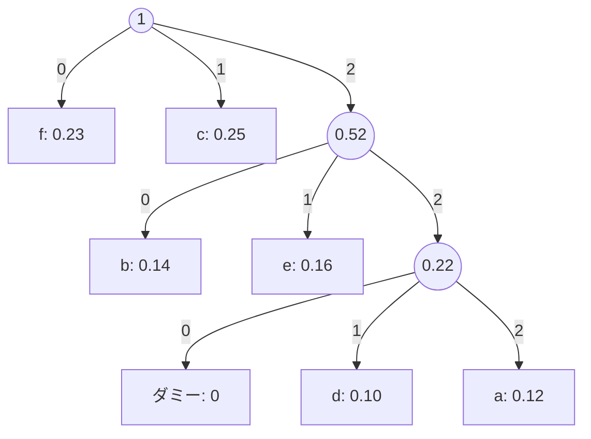

# 大阪大学 基礎工学研究科 電子光科学 (システム創成専攻) 2017年度 電子光科学 \[I-5\]

## **Author**

祭音Myyura (co-authored with GPT 5.6 SOL)

## **Description**

瞬時に復号可能な情報源符号について以下の問に答えよ。

(1) $r$ 元符号の木において、葉以外の節点（内部節点）から必ず $r$ 本の枝が伸びている場合、葉の枚数の一般式を求めよ。ただし、$r$ は 2 以上の整数とする。

(2) 情報源アルファベットを $A=\{a,b,c,d,e,f\}$、各記号の生起確率を $P(a)=0.12$、$P(b)=0.14$、$P(c)=0.25$、$P(d)=0.10$、$P(e)=0.16$、$P(f)=0.23$ とする。符号器アルファベットを $B=\{0,1,2\}$ として、平均符号語長が最短となる瞬時符号を構成せよ。さらに、そのときの平均符号語長 $L$ も求めよ。

## **Kai**

### (1)
内部節点数を $m$、葉数を $l$ とする。枝数は $rm$ である一方、木の頂点数から $m+l-1$ でもある。したがって

$$
\boxed{l=(r-1)m+1}.
$$

### (2)
3 元ハフマン符号を作る。葉数を奇数にするため確率 $0$ のダミー記号を1つ加える。
最小の3項を順にまとめると

$$
0+0.10+0.12=0.22,\qquad0.14+0.16+0.22=0.52,\qquad0.23+0.25+0.52=1.
$$

得られる最適符号の一例は

|記号|確率|符号語|長さ|
|---|---:|---|---:|
|$a$|0.12|222|3|
|$b$|0.14|20|2|
|$c$|0.25|1|1|
|$d$|0.10|221|3|
|$e$|0.16|21|2|
|$f$|0.23|0|1|

よって $\boxed{L=3(0.12+0.10)+2(0.14+0.16)+0.25+0.23=1.74}$。
