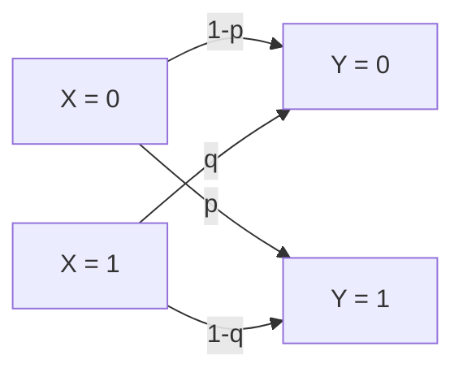

# 大阪大学 基礎工学研究科 電子光科学 (システム創成専攻) 2018年度 電子光科学 \[I-5\]

## **Author**

祭音Myyura (co-authored with GPT 5.6 SOL)

## **Description**

下図の通信路について、以下の問に答えよ。ただし、$X,Y$ はそれぞれ通信路の入力と出力を表す確率変数であり、$0\le p\le1$、$0\le q\le1$ とする。対数の底を 2 として、2 元エントロピー関数

$$
h(u)=-u\log u-(1-u)\log(1-u)
$$

を用いよ。

(1) 入力の確率分布を $P_X(0)=r$、$P_X(1)=1-r$ として、$X$ と $Y$ の相互情報量を求めよ。ただし、$0\le r\le1$ とする。

(2) $q=p$ の場合について、通信路容量 $C$ を求めて、$p$ に対する依存性を図示せよ。

## **Kai**

### (1)
$P_Y(0)=r(1-p)+(1-r)q$、$H(Y\mid X)=rh(p)+(1-r)h(q)$ より

$$
\boxed{I(X;Y)=h\bigl(r(1-p)+(1-r)q\bigr)-rh(p)-(1-r)h(q)}.
$$

### (2)
$q=p$ なら $I(X;Y)=h(p+r(1-2p))-h(p)$。$h(u)\le1$ であり、$r=1/2$ で等号が成立するので

$$
\boxed{C=1-h(p)\quad\text{bit/記号}}.
$$

$C(0)=C(1)=1$、$C(1/2)=0$ で、$p=1/2$ に関して対称である。

