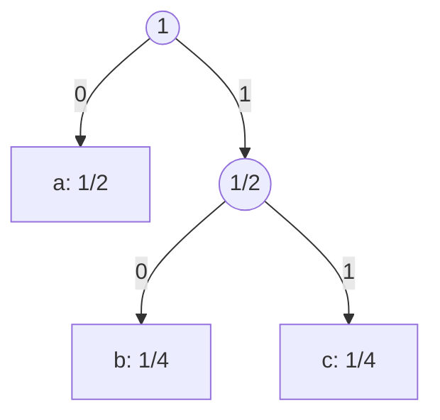
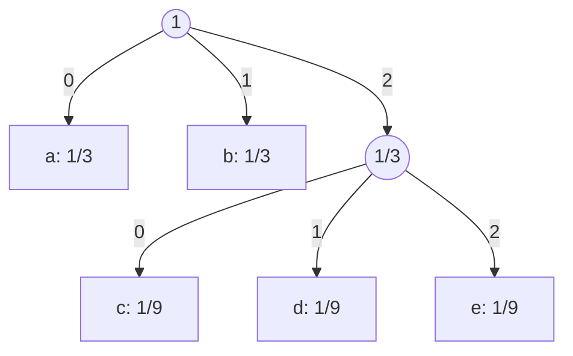

# 大阪大学 基礎工学研究科 電子光科学 (システム創成専攻) 2021年度 電子光科学 \[I-4\]

## **Author**

祭音Myyura (co-authored with GPT 5.6 SOL)

## **Description**

情報源アルファベット $A$ の値を確率分布 $P$ にしたがってとる確率変数を $X$ とする。$X$ が記号 $x\in A$ をとる確率を $P(x)$、記号 $x$ の符号語長を $l(x)$ として、瞬時符号 $C$ の平均符号語長 $L(C)$ を

$$
L(C)=\sum_{x\in A}P(x)l(x)
$$

によって定義する。情報源符号化逆定理によると、瞬時符号の平均符号語長を情報源エントロピー $H(X)$ より小さくすることはできない。すなわち、$L(C)\ge H(X)$ が成り立つ。以下の各問に答えよ。ただし、対数の底は省略せずに明示せよ。

(1) 符号アルファベットが $B=\{0,1\}$ の場合に、この定理における $H(X)$ の定義を書け。

(2) 問 (1) で、この定理の等号が成り立つ情報源（確率分布）の例をひとつあげて、その符号の木を描き、定理の等号が成り立つことを示せ。ただし、情報源記号は 3 つ以上とする。

(3) 符号アルファベットが $B=\{0,1,\ldots,q-1\}$ の場合、$q\ge3$ ならば平均符号語長は問 (1) で定義した $H(X)$ より小さくなり得る。この場合でも、この定理が成り立つためには、$H(X)$ をどう定義すればよいか書け。

(4) $q=3$ の場合について、この定理の等号が成り立つ情報源（確率分布）の例をひとつあげて、その符号の木を描き、定理の等号が成り立つことを示せ。ただし、情報源記号は 4 つ以上とする。

## **Kai**

### (1)

$$
\boxed{H(X)=-\sum_{x\in A}P(x)\log_2P(x)}.
$$

### (2)
$P(a)=1/2$、$P(b)=P(c)=1/4$ とし、符号語を $0,10,11$ とする。

$$
L(C)=\tfrac12+2\cdot\tfrac14+2\cdot\tfrac14=\tfrac32
=-\tfrac12\log_2\tfrac12-2\cdot\tfrac14\log_2\tfrac14=H(X).
$$

### (3)
符号語長を $q$ 元記号の個数で測るので

$$
\boxed{H(X)=-\sum_{x\in A}P(x)\log_qP(x)}.
$$

### (4)
$P(a)=P(b)=1/3$、$P(c)=P(d)=P(e)=1/9$ とし、符号語をそれぞれ $0,1,20,21,22$ とする。

$$
L(C)=2\cdot\tfrac13+3\cdot\tfrac19\cdot2=\tfrac43
=-2\cdot\tfrac13\log_3\tfrac13-3\cdot\tfrac19\log_3\tfrac19=H(X).
$$
