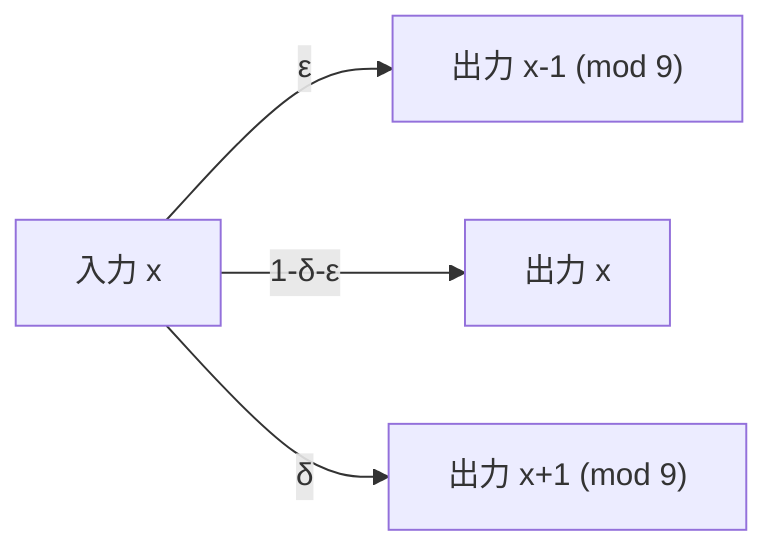

# 大阪大学 基礎工学研究科 電子光科学 (システム創成専攻) 2022年度 電子光科学 \[I-4\]

## **Author**

祭音Myyura (co-authored with GPT 5.6 SOL)

## **Description**

図の通信路について、以下の問に答えよ。ただし、$\delta\ge0$、$\varepsilon\ge0$、$\delta+\varepsilon\le1$ とする。

入力・出力記号は $0,1,\ldots,8$。各入力 $x$ からの遷移は、添字を 9 を法として、次の図で与えられる。

(1) この通信路の通信路容量 $C_0$ を計算せよ。

(2) 通信路容量 $C_0$ を最小にする $\delta,\varepsilon$、および、そのときの $C_0$ を求めよ。

(3) 問 (2) の最小の $C_0$ と同じ伝送速度で誤りの無い通信を行う方法を説明せよ。ただし、符号長は 1 とする。

## **Kai**

### (1)
$\alpha=1-\delta-\varepsilon$ とする。どの入力に対しても条件付きエントロピーは

$$
H(Y\mid X)=-\alpha\log_2\alpha-\delta\log_2\delta-\varepsilon\log_2\varepsilon.
$$

$H(Y)\le\log_2 9$ であり、入力を一様分布とすれば出力も一様分布となるため、等号を達成する。よって

$$
\boxed{C_0=\log_2 9+\alpha\log_2\alpha+\delta\log_2\delta+\varepsilon\log_2\varepsilon}.
$$

ただし $0\log_2 0=0$ とする。

### (2)
3 点分布のエントロピーは一様分布のとき最大となるので

$$
\boxed{\delta=\varepsilon=\frac13,\qquad \min C_0=\log_2 9-\log_2 3=\log_2 3}.
$$

### (3)
送信記号を $0,3,6$ の3つに限定する。各記号から出力され得る集合は

$$
0:\{8,0,1\},\qquad3:\{2,3,4\},\qquad6:\{5,6,7\}.
$$

これらは互いに交わらないため、出力が属する集合で送信記号を誤りなく決定できる。一様に3記号を用いれば伝送速度は $\boxed{\log_2 3\text{ bit/使用}}$ となる。
