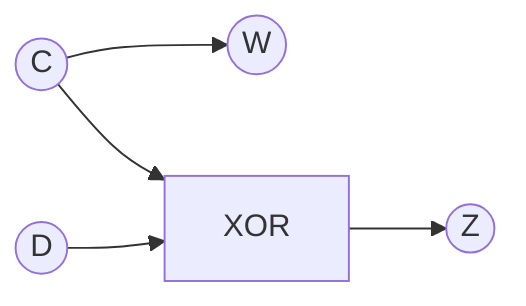

# 大阪大学 基礎工学研究科 電子光科学 (システム創成専攻) 2024年度 電子光科学 \[II-4\]

## **Author**

祭音Myyura (co-authored with GPT 5.6 SOL)

## **Description**

ディジタル論理回路について答えよ。L、Hはそれぞれ0、1に対応する。

(1) 回路1は、入力 $X$ を反転して $Y$ とANDを取る枝と、入力 $Y$ を反転して $X$ とANDを取る枝をもち、両枝をORに入力して出力 $Z$ を得る。その論理式を積和標準形で書け。

(2) 回路1の動作表を完成させよ。

(3) 回路2では $A=X$、$B=X\oplus Y$、$C=A\oplus B$、$D=B$ と接続し、$C,D$ を未知の組合せ回路Nへ入力する。Nの出力を $W,Z$ とし、次表の指定を満たす。表の $A,B,C,D$ を埋めよ。

|$X$|$Y$|$A$|$B$|$C$|$D$|$W$|$Z$|
|---|---|---|---|---|---|---|---|
|L|L|||||L|L|
|L|H|||||H|L|
|H|L|||||L|H|
|H|H|||||H|H|

(4) XORゲートのみを用いてNを構成し、端子 $C,D,W,Z$ を明示した回路図を描け。

## **Kai**

### (1)

$$
\boxed{Z=\overline X Y+X\overline Y}.
$$

### (2)

|$X$|$Y$|$Z$|
|---|---|---|
|L|L|L|
|L|H|H|
|H|L|H|
|H|H|L|

### (3)

$C=X\oplus(X\oplus Y)=Y$、$D=X\oplus Y$ より

|$X$|$Y$|$A$|$B$|$C$|$D$|$W$|$Z$|
|---|---|---|---|---|---|---|---|
|L|L|L|L|L|L|L|L|
|L|H|L|H|H|H|H|L|
|H|L|H|H|L|H|L|H|
|H|H|H|L|H|L|H|H|

### (4)

$$
\boxed{W=C,\qquad Z=C\oplus D}.
$$

$C$ を $W$ へ直接接続し、$C,D$ を1個のXORへ入力して $Z$ を得る。

