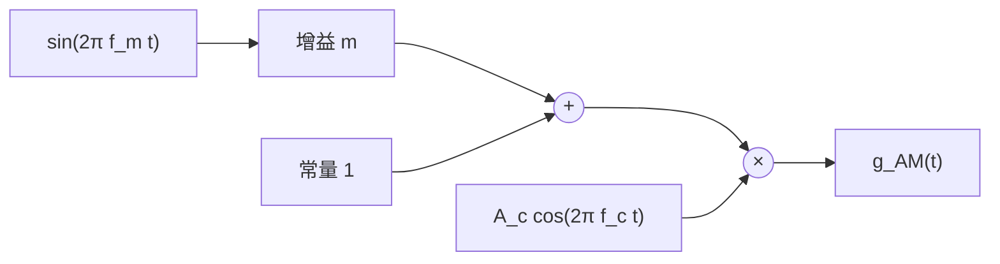

# 東北大学 工学研究科 電気・情報系 2014年3月実施 専門科目 問題2 通信工学

## **Author**

祭音Myyura (co-authored with GPT 5.6 SOL)

## **Description**

### 日本語原題

Fig. 2 (a)に示すような，振幅変調（AM）方式の伝送系がある。伝送路は理想的で，損失はないものとする。ここで $s(t)$ は $s(t)=\sin(2\pi f_mt)$ で表される，周波数 $f_m$ の低周波入力信号である。また $g_{\rm AM}(t)$ と $n(t)$ はそれぞれ AM 信号と両側電力スペクトル密度 $kT/2$ の白色雑音を表す。ここで，$k$ はボルツマン定数，$T$ は絶対温度で表した周囲温度である。また変調度および搬送波の振幅と周波数をそれぞれ $m,A_c,f_c$ とする。受信機において増幅器の利得は $G$，雑音指数は $F$ である。またバンドパスフィルタ（BPF）は中心周波数を $f_c$ とする，通過帯域幅 $2f_T$ の下式で表される理想的な通過特性を持つものとする。

$$
H(f)=\begin{cases}1,&\bigl||f|-f_c\bigr|<f_T,\\0,&\text{その他}\end{cases}
$$

なお $f_m,f_c$ および $f_T$ は $0<f_m<f_T\ll f_c$ の関係を満足する。このとき，以下の問に答えよ。

(1) Fig. 2 (b)に示す構成要素を用いて，送信機（Fig. 2 (a)の破線で囲んだ部分）のブロック図を描け。ただしそれぞれの構成要素は何度用いてもよい。

(2) AM 信号 $g_{\rm AM}(t)$ の式を求めよ。

(3) $g_{\rm AM}(t)$ の電力効率 $\eta_{\rm AM}$ の式を求めよ。

(4) 検波器出力信号の信号対雑音電力比 $(S/N)$ を dB を単位として求めよ。ただし $g_{\rm AM}(t)$ の電力は $-110\,\mathrm{dBW}$（ただし $0\,\mathrm{dBW}=1\,\mathrm W$），$m=1,f_m=2\,\mathrm{kHz},F=6\,\mathrm{dB},k=1.38\times10^{-23}\,\mathrm{J/K},T=300\,\mathrm K$ とする。

必要なら，$\log_{10}1.38\cong0.14$，$\log_{10}2\cong0.30$，$\log_{10}3\cong0.48$ を用いてよい。

### 题目描述

理想无损信道传送单音调幅信号。基带为 $s(t)=\sin(2\pi f_mt)$，载波振幅、频率分别为 $A_c,f_c$，调制度为 $m$。信道加入双边功率谱密度 $kT/2$ 的白噪声；接收机依次为增益 $G$、噪声系数 $F$ 的放大器、理想带通滤波器以及检波器。滤波器满足

$$
H(f)=\begin{cases}1,&\bigl||f|-f_c\bigr|<f_T,\\0,&\text{其他},\end{cases}\qquad 0<f_m<f_T\ll f_c.
$$

1. 用加法器、乘法器、振荡器及放大器画出发射机框图。
2. 求 AM 信号 $g_{\rm AM}(t)$。
3. 求功率效率 $\eta_{\rm AM}$。
4. 已知接收 AM 信号功率为 $-110\,\mathrm{dBW}$，$m=1$，$f_m=2\,\mathrm{kHz}$，$F=6\,\mathrm{dB}$，$k=1.38\times10^{-23}\,\mathrm{J/K}$，$T=300\,\mathrm K$，求检波输出信噪比（dB）。可用 $\log_{10}1.38\simeq0.14$、$\log_{10}2\simeq0.30$、$\log_{10}3\simeq0.48$。

## **Kai**

### (1)、(2)

$$
\boxed{g_{\rm AM}(t)=A_c[1+m\sin(2\pi f_mt)]\cos(2\pi f_ct)}.
$$

### (3)

载波功率为 $P_c=A_c^2/2$，两边带功率之和为 $P_s=m^2A_c^2/4$，故

$$
P=P_c+P_s=\frac{A_c^2(2+m^2)}4,\qquad
\boxed{\eta_{\rm AM}=\frac{m^2}{2+m^2}}.
$$

### (4)

采用高信噪比包络检波近似（或理想同步检波），令最终基带等效噪声带宽为 $B$，噪声系数的线性值为 $F_\ell=10^{6/10}$。去掉直流后，输出信号功率与噪声功率分别为 $m^2A_c^2/2$、$2F_\ell kTB$，故

$$
\boxed{\left(\frac SN\right)_o=\frac{m^2P}{(2+m^2)F_\ell kTB}}.
$$

当输出低通带宽取 $B=f_m=2000\,\mathrm{Hz}$ 时，

$$
10\log_{10}(S/N)_o=-110-10\log_{10}3-6-10\log_{10}(kT f_m)
\simeq\boxed{50.0\,\mathrm{dB}}.
$$

若仅由题设带通滤波器限制噪声，则 $B=f_T$，答案为

$$
\boxed{50.0-10\log_{10}\frac{f_T}{2000\,\mathrm{Hz}}\quad\mathrm{dB}}.
$$

题面未给 $f_T$ 数值及检波后的低通带宽，因此数值 $50.0\,\mathrm{dB}$ 对应 $B=f_m$ 的选择。
