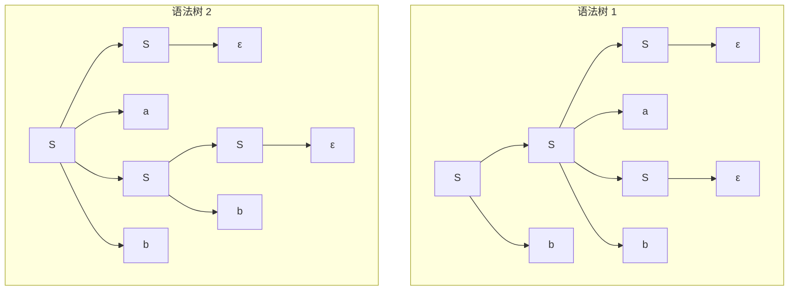
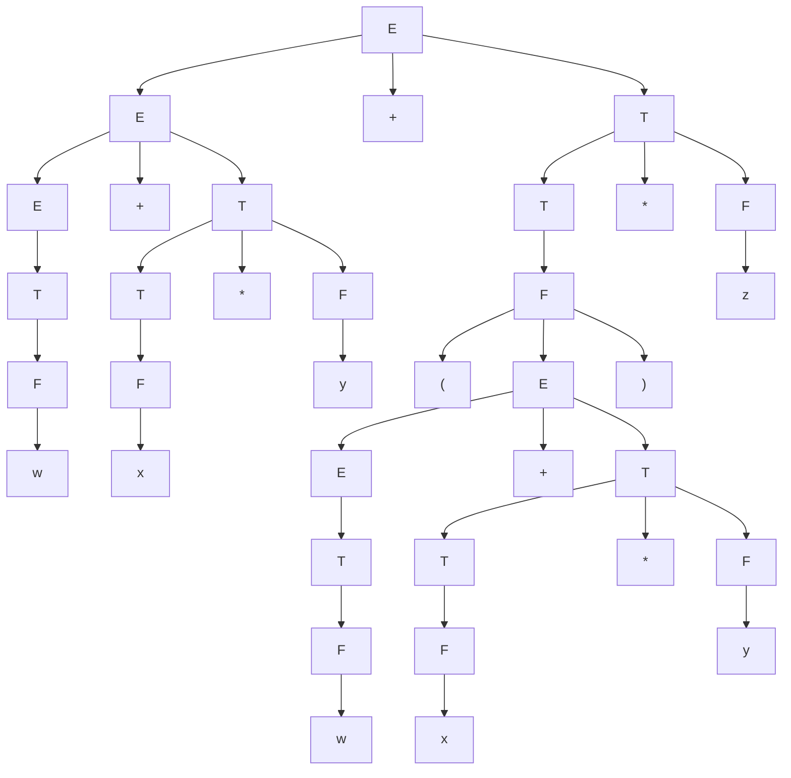

# 東北大学 工学研究科 電気・情報系 2014年3月実施 専門科目 問題5 計算機2

## **Author**


祭音Myyura (co-authored with GPT 5.6 SOL)

## **Description**

### 日本語原題

(1) BNF 記法による次の文法 $G$ を考える。ただし，$a,b$ は終端記号，$\varepsilon$ は空系列を表す。

$$
\langle S\rangle::=\langle S\rangle a\langle S\rangle b\mid\langle S\rangle b\mid\varepsilon
$$

- (a) $G$ で文字列 $abb$ を生成する構文木を全て示せ。
- (b) $G$ で文字列 $abb$ を生成する最左導出を全て示せ。

(2) 加算 $+$，乗算 $*$，括弧 $(\ )$，および，変数 $w,x,y,z$ で構成される算術式の集合 $F$ を考える。ただし，$*$ は $+$ より高い優先順位をもつものとし，全ての演算子は左結合とする。

- (a) $F$ の算術式を生成する曖昧でない文法を BNF 記法で与えよ。
- (b) 問(2)(a)で与えた文法を用いて次の算術式を生成する構文木を示せ。

$$
w+x*y+(w+x*y)*z
$$

- (c) $w=2,x=3,y=4,z=5$ のとき，問(2)(b)の算術式の値がスタックを用いて計算される。計算に必要なスタック領域の大きさを示せ。その根拠をスタックの状態遷移を示し説明せよ。

### 题目描述

1. 给定文法 $S::=SaSb\mid Sb\mid\varepsilon$，其中 $a,b$ 为终结符，$\varepsilon$ 为空串。(a) 画出生成 `abb` 的全部语法树；(b) 写出全部最左推导。
2. 算术表达式由变量 $w,x,y,z$、加法 `+`、乘法 `*` 和括号组成；乘法优先于加法，各运算符均左结合。(a) 用 BNF 给出无歧义文法；(b) 画出 $w+x*y+(w+x*y)*z$ 的语法树；(c) 取 $w=2,x=3,y=4,z=5$，用栈计算该表达式，给出所需栈空间及状态变化。

## **Kai**

### (1)

(a) 恰有以下两棵语法树：



(b) 对应的全部最左推导为

$$
S\Rightarrow Sb\Rightarrow SaSbb\Rightarrow aSbb\Rightarrow abb,
$$

$$
S\Rightarrow SaSb\Rightarrow aSb\Rightarrow aSbb\Rightarrow abb.
$$

### (2)

(a)

```text
<E> ::= <E> + <T> | <T>
<T> ::= <T> * <F> | <F>
<F> ::= (<E>) | w | x | y | z
```

(b) 对应上述文法的语法树如下：



(c) 按语法树从左到右求值，后缀序列为

```text
w x y * + w x y * + z * +
```

栈从底到顶的变化为

$$
\begin{gathered}
[]\to[2]\to[2,3]\to[2,3,4]\to[2,12]\to[14]\\
\to[14,2]\to[14,2,3]\to[14,2,3,4]\to[14,2,12]\\
\to[14,14]\to[14,14,5]\to[14,70]\to[84].
\end{gathered}
$$

故此标准栈求值过程需 **4 个数值单元**，结果为 $\boxed{84}$。
