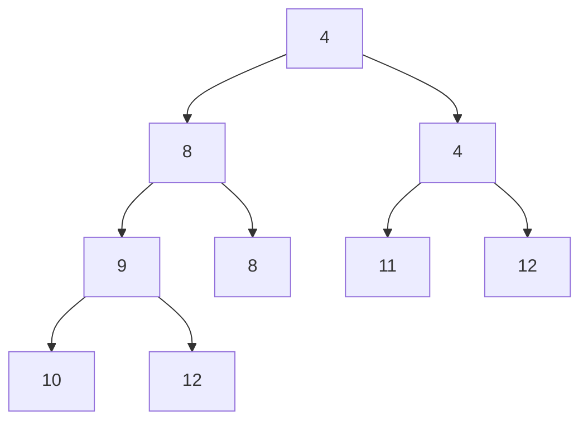
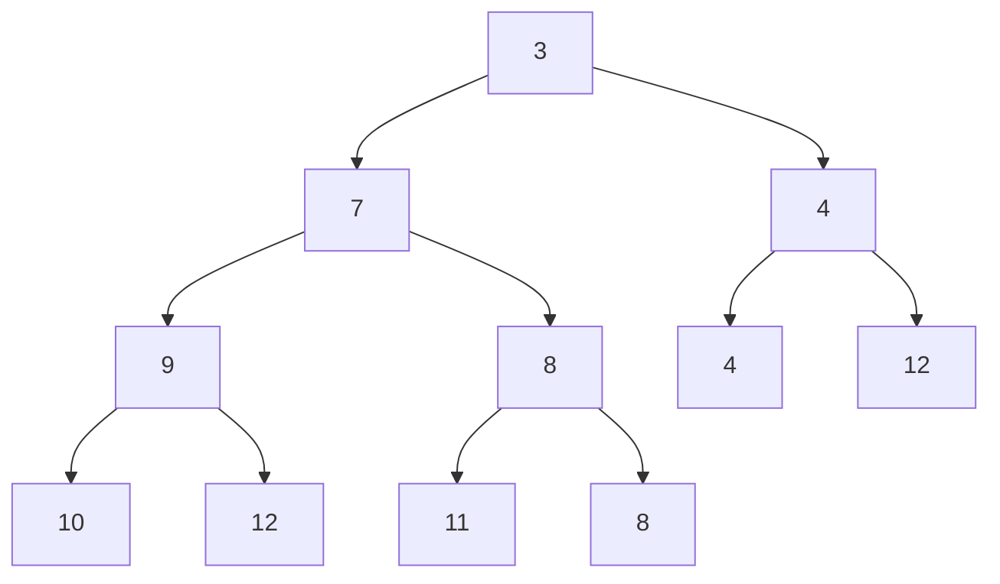

# 東北大学 工学研究科 電気・情報系 2014年8月実施 基礎科目 問題4 情報基礎2

## **Author**

祭音Myyura (co-authored with GPT 5.6 SOL)

## **Description**

### 日本語原題

以下の2つの条件を満たす二分木をヒープと呼ぶ。

（条件1）木の最も深いレベル以外は完全に埋まっている。最も深いレベルは左から右へ順に埋まっている。

（条件2）各ノードに格納された整数値は，子ノードに格納された値より小さいか等しい。

以下の問に答えよ。

(1) 根に格納されている整数値をヒープから削除する手順の概略を説明し，Fig. 4 に示されたヒープから根に格納されている整数値 $3$ を削除して得られるヒープを図示せよ。

(2) ヒープに新しい整数値を挿入する手順の概略を説明し，Fig. 4 に示されたヒープに整数値 $7$ を挿入して得られるヒープを図示せよ。

(3) 条件1のみを満たす二分木が与えられたとき，条件2も満たすように修正する手順の概略を説明し，その時間計算量が節点数 $n$ に対して $O(n\log n)$ であることを示せ。

### 题目描述

最小堆满足：(i) 除最后一层外各层均满，最后一层从左到右连续填入；(ii) 父节点值不大于子节点值。给定堆的层序序列为

$$
[3,8,4,9,8,4,12,10,12,11].
$$

1. 说明删除根节点的算法，画出删除 $3$ 后的堆。
2. 说明插入算法，画出向原堆插入 $7$ 后的堆。
3. 给定仅满足条件 (i) 的二叉树，说明将其改成堆的方法，证明时间为 $O(n\log n)$。

## **Kai**

### (1)

用最后节点 $11$ 替换根并删除末位，再不断与较小的子节点交换：$11\leftrightarrow4\leftrightarrow4$。结果的层序序列为

$$
\boxed{[4,8,4,9,8,11,12,10,12]}.
$$

时间 $O(\log n)$。

### (2)

把 $7$ 放入末位，依次与大于它的父节点交换。本题 $7$ 先后与两个 $8$ 交换，结果为

$$
\boxed{[3,7,4,9,8,4,12,10,12,11,8]}.
$$

时间 $O(\log n)$。

### (3)

把节点按层序存入数组，依次处理 $i=2,\ldots,n$：把 $A[i]$ 视为新加入前缀堆的元素，沿父链上浮。每轮结束后 $A[1..i]$ 都是堆，故最终满足两条件。

第 $i$ 次上浮至多 $\lfloor\log_2i\rfloor$ 层，总时间

$$
O\!\left(\sum_{i=2}^n\log i\right)=O(n\log n).
$$

也可从最后一个非叶节点开始自底向上作下沉，进一步达到 $O(n)$。
