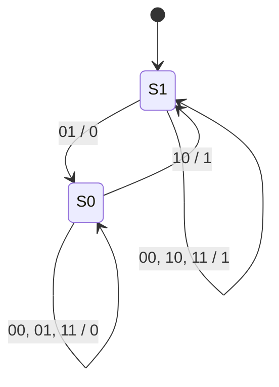
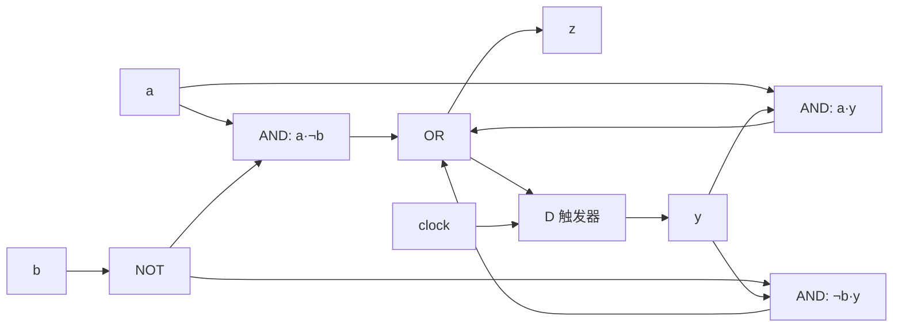

# 東北大学 工学研究科 電気・情報系 2014年8月実施 専門科目 問題4 計算機1

## **Author**

祭音Myyura (co-authored with GPT 5.6 SOL)

## **Description**

### 日本語原題

クロックに同期して，各時刻 $t=1,2,\ldots$ に2つの1ビット信号 $a_t,b_t\in\{0,1\}$ を受け取り，1ビット信号 $z_t\in\{0,1\}$ を出力する順序回路を考える。本順序回路は，$(a_ta_{t-1}\cdots a_2a_1)_2\ge(b_tb_{t-1}\cdots b_2b_1)_2$ のとき $1$ を出力し，それ以外では $0$ を出力する。ただし，$(\ )_2$ は2進数の値を表す。

(1) 入力系列 $a_4a_3a_2a_1=1100,b_4b_3b_2b_1=1001$ に対する出力系列 $z_4z_3z_2z_1$ を示せ。

(2) 本順序回路の状態遷移図を示せ。ただし，$(a_ta_{t-1}\cdots a_2a_1)_2\ge(b_tb_{t-1}\cdots b_2b_1)_2$ の状態を $S_1$，それ以外の状態を $S_0$ とする。

(3) 本順序回路の励起式（状態式）及び出力式を，AND，OR，NOT を用いた最簡積和形で示せ。ただし，現在の状態を表す状態信号を $y\in\{0,1\}$，次の状態を表す状態信号を $Y\in\{0,1\}$ とする。状態割り当ては $S_0\Leftrightarrow y=0,S_1\Leftrightarrow y=1$ とする。

(4) D フリップフロップ一つと適当な論理ゲートを用いて，本順序回路の回路図を示せ。D フリップフロップの初期状態も示すこと。

### 题目描述

同步电路按最低位到最高位的顺序接收 $a_t,b_t$，当

$$
(a_ta_{t-1}\cdots a_1)_2\ge(b_tb_{t-1}\cdots b_1)_2
$$

时输出 $z_t=1$，否则输出 $0$。

1. 对输入 $a_4a_3a_2a_1=1100$、$b_4b_3b_2b_1=1001$，求 $z_4z_3z_2z_1$。
2. 以 $S_1$ 表示此前 $a$ 不小于 $b$，$S_0$ 表示其他情况，画出状态图。
3. 当前状态 $y\in\{0,1\}$，$S_0\leftrightarrow0,S_1\leftrightarrow1$，次态为 $Y$。用 AND、OR、NOT 的最简与或式给出次态与输出。
4. 用一个 D 触发器及逻辑门画出电路，并给出初态。

## **Kai**

### (1)

按时刻 $1,2,3,4$ 比较的数对为 $(0,1),(0,1),(4,1),(12,9)$，故

$$
\boxed{z_4z_3z_2z_1=1100}.
$$

### (2)

新到达的位更高：$ab=10$ 时直接进入 $S_1$，$ab=01$ 时进入 $S_0$，两位相等则保留原状态。

标注为“输入 $ab$ / 当前输入处理后的输出”。

### (3)

$$
Y=a\bar b\lor(ab\lor\bar a\bar b)y
=\boxed{a\bar b\lor ay\lor\bar by},\qquad\boxed{z=Y}.
$$

### (4)

空前缀表示的两个整数均为 $0$，故初态为 $\boxed{y_0=1}$。图中组合输出 $z_t=Y$ 在输入稳定后取值，触发器在有效沿保存该次态。
