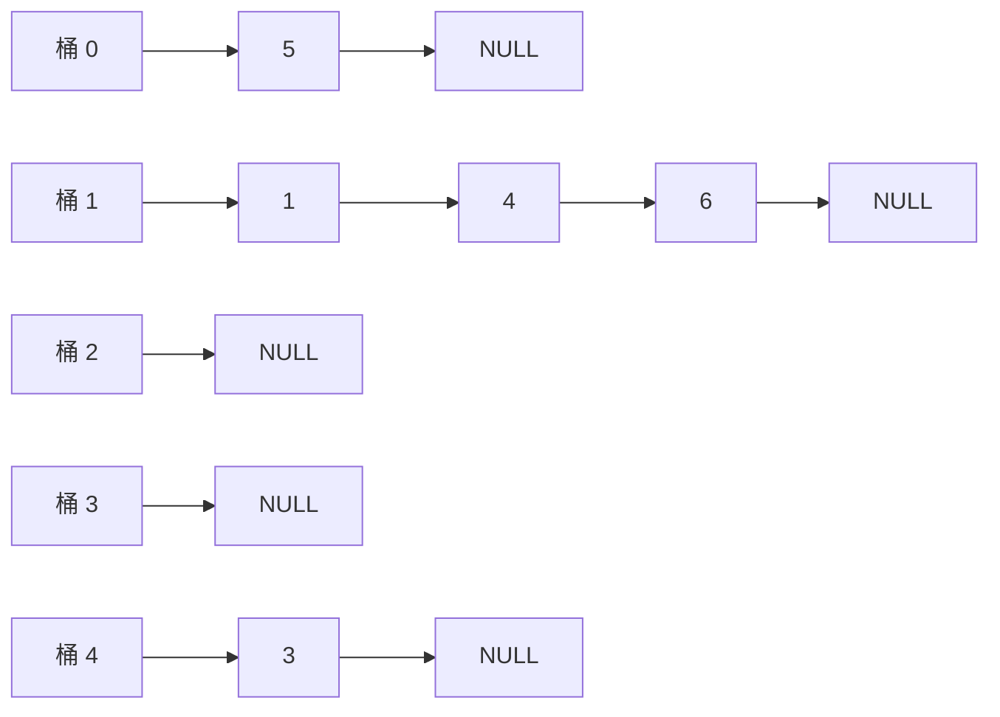

# 東北大学 工学研究科 電気・情報系 2015年3月実施 基礎科目 問題4 情報基礎2

## **Author**

祭音Myyura (co-authored with GPT 5.6 SOL)

## **Description**

### 日本語原題

重複しない非負整数の集合を保持するハッシュ表を考える。なお，ハッシュ値の衝突に備え，非負整数はハッシュ値毎の連結リストに格納することとする。また $a$ を $b$ で割ったときの剰余を $a\bmod b$ と表す。

(1) Fig. 4 に，ハッシュ関数として $h(x)=x^2\bmod5$ を用い，非負整数 $1,3,4,5$ を順に挿入したときの大きさ $B$（$B=5$）のハッシュ表 $A$ を示す。NULL は連結リストの終端を表している。このハッシュ表に非負整数 $6$ を挿入する場合の手順を説明し，その結果を図示せよ。

(2) あるハッシュ表に非負整数 $x$ が格納されているかどうかを判定する際の，最良のケース，最悪のケース，および平均的なケースを説明せよ。また，それぞれの時間計算量をオーダ記法で示せ。なお，ハッシュ表の大きさを $B$，ハッシュ表に格納されている非負整数の個数を $M$ とし，ハッシュ関数の時間計算量は $O(1)$ であると仮定せよ。

(3) 2つの関数 $h_1(x)=2x\bmod8$ と $h_2(x)=3x\bmod8$ を比較したとき，どちらがハッシュ表に用いるハッシュ関数として優れているかを説明せよ。

### 题目描述

用链地址法的哈希表保存互不相同的非负整数。表长 $B=5$，$h(x)=x^2\bmod5$；按顺序插入 $1,3,4,5$ 后，各桶链表为

$$
0:[5],\quad1:[1,4],\quad2:[],\quad3:[],\quad4:[3].
$$

1. 说明插入整数 $6$ 的过程，并画出结果。
2. 判断整数 $x$ 是否存在时，说明最好、最坏、平均情况及其复杂度。表长为 $B$，已存元素数为 $M$，计算哈希函数耗时 $O(1)$。
3. 比较 $h_1(x)=2x\bmod8$ 与 $h_2(x)=3x\bmod8$，哪个更适合作为哈希函数？

## **Kai**

### (1)

$h(6)=36\bmod5=1$。检查第 $1$ 桶没有 $6$ 后，将其接在该链表末尾。

### (2)

- 最好：目标就在链首，或查询不存在的元素且桶为空，时间 $O(1)$。
- 最坏：全部 $M$ 个元素落在同一桶，且目标位于链尾或不存在，时间 $O(M+1)$。
- 平均：在简单均匀散列假设下，平均链长为负载因子 $\alpha=M/B$，查询时间为 $\boxed{O(1+M/B)}$。只有 $M/B=O(1)$ 时才能称为平均 $O(1)$。

### (3)

$\boxed{h_2}$ 更合适。因为 $\gcd(3,8)=1$，乘以 $3$ 在模 $8$ 的剩余类上是置换，八个桶都可使用；$h_1$ 只能得到 $0,2,4,6$，至多使用一半的桶，更容易发生碰撞。
