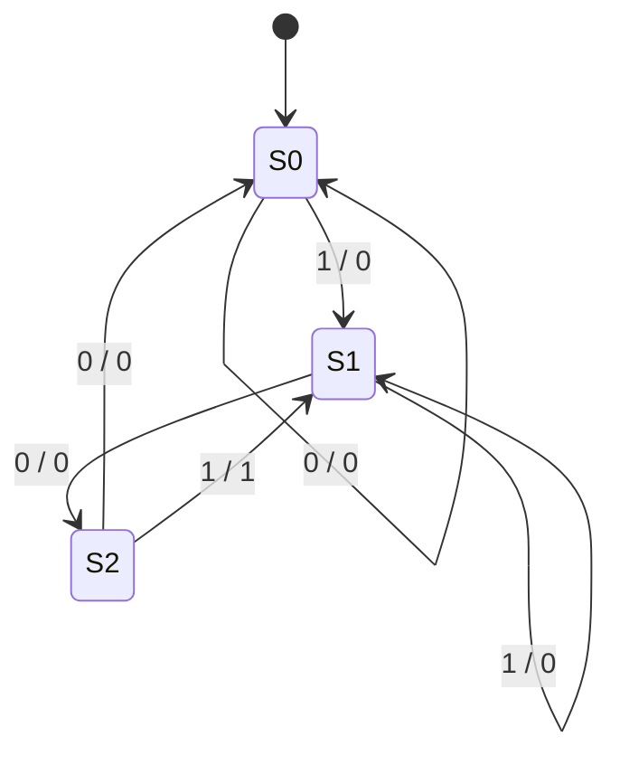
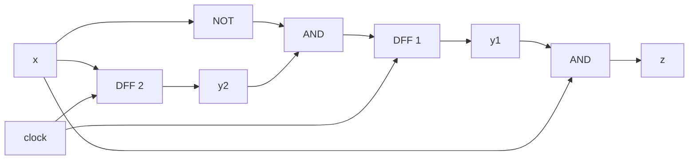

# 東北大学 工学研究科 電気・情報系 2015年3月実施 専門科目 問題4 計算機1

## **Author**

祭音Myyura (co-authored with GPT 5.6 SOL)

## **Description**

### 日本語原題

クロック信号の立ち上がりに同期して，各時刻 $t=1,2,\ldots$ に1ビット信号 $x_t\in\{0,1\}$ を受け取り，1ビット信号 $z_t\in\{0,1\}$ を出力する順序回路を考える。本順序回路は，$t\ge3$ において $x_tx_{t-1}x_{t-2}=101$ という入力系列を受け取るごとに，$1$ を出力し，それ以外では $0$ を出力する。本順序回路に関する以下の問に答えよ。

(1) 入力系列 $x_6x_5x_4x_3x_2x_1=110101$ に対する出力系列 $z_6z_5z_4z_3z_2z_1$ を示せ。また，このときの出力信号のタイミングチャートを，クロック信号および入力信号のタイミングチャートとともに示せ。ただし，ゲート遅延は無視できるほど小さいと仮定せよ。

(2) 本順序回路の状態遷移図を示せ。ただし，状態数は $3$ とせよ。

(3) 本順序回路の励起式（状態式）及び出力式を，最簡積和形の論理式で示せ。ただし，現在の状態を表す状態信号を $y_1,y_2\in\{0,1\}$，次の状態を表す状態信号を $Y_1,Y_2\in\{0,1\}$ とする。

(4) 本順序回路の回路図を D フリップフロップ二つと適当な論理ゲートを用いて示せ。D フリップフロップの初期状態も示すこと。

### 题目描述

电路在时钟上升沿依次接收位 $x_t$，当 $t\ge3$ 且 $x_tx_{t-1}x_{t-2}=101$ 时输出 $z_t=1$，其他情况输出 $0$。

1. 输入为 $x_6x_5x_4x_3x_2x_1=110101$，求 $z_6z_5z_4z_3z_2z_1$，并画出输入、时钟、输出时序。忽略门延迟。
2. 用三个状态画出状态转移图。
3. 用当前状态位 $y_1,y_2$、次态位 $Y_1,Y_2$ 写出最简与或形式的状态方程及输出方程。
4. 用两个 D 触发器及逻辑门画出电路，并给出触发器初态。

## **Kai**

### (1)

按时间顺序输入是 $1,0,1,0,1,1$，在 $t=3,5$ 检出 `101`，故

$$
\boxed{z_6z_5z_4z_3z_2z_1=010100}.
$$

| 上升沿 $t$ | 1 | 2 | 3 | 4 | 5 | 6 |
|---|---|---|---|---|---|---|
| $x_t$ |1|0|1|0|1|1|
| $z_t$ |0|0|1|0|1|0|

### (2)

以已读序列的最长匹配后缀表示状态：$S_0$ 为无匹配，$S_1$ 为 `1`，$S_2$ 为 `10`。允许重叠检测。

### (3)

取状态编码 $S_0=00,S_1=01,S_2=10$，未用状态 $11$ 作为化简时的无关项。得

$$
\boxed{Y_1=y_2\bar x,\qquad Y_2=x,\qquad z=y_1x}.
$$

这里 $z_t$ 为第 $t$ 个有效沿对“沿前状态与当前输入”的 Mealy 组合输出取样值。

### (4)

初态为 $\boxed{y_1y_2=00}$。时序图中的 $z_t$ 是有效沿的取样值；组合输出在状态更新后可以变化。
