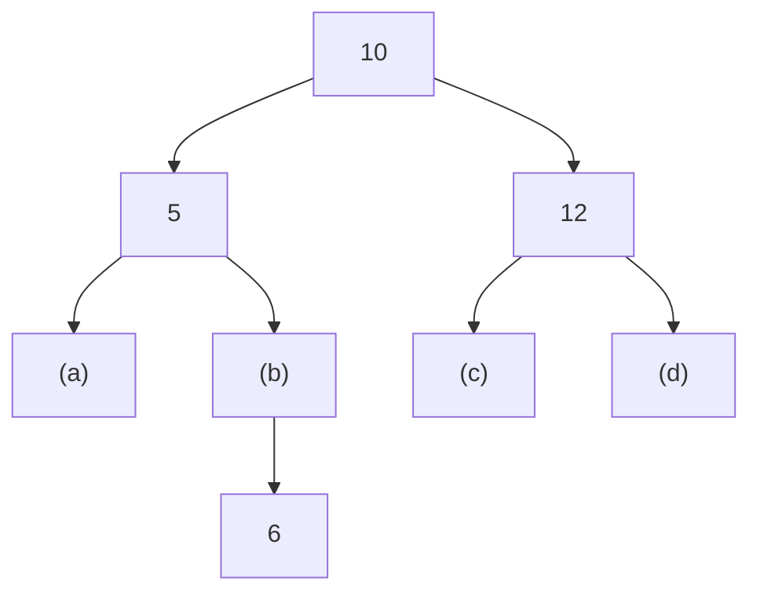
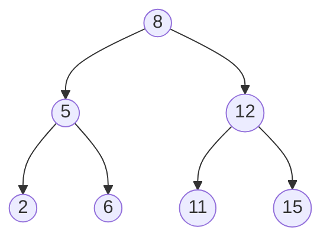

# 東北大学 工学研究科 電気・情報系 2015年8月実施 基礎科目 問題4 情報基礎2

## **Author**

祭音Myyura

校对与补充：祭音Myyura (co-authored with GPT 5.6 SOL)

## **Description**
### 日本語版
下記の条件を満たす $2$ 分木を、$2$ 分探索木と呼ぶ。

- (条件) 各節点 $u$ に対し、 $u$ の要素を $x$ とするとき、$u$ の左部分木内の要素はすべて $x$ より小さく、$u$ の右部分木内の要素はすべて $x$ より大きい。

各節点の要素 $x$ は重複しない整数であるとし、以下の問に答えよ。

(1) Fig. 4 は空の $2$ 分探索木に $10, 12, 11, 5, 8, 6, 2, 15$ を順に挿入して得られた $2$ 分探索木 $T$ を表している。要素 $(a)，(b)，(c)，(d)$ の値を示せ。

(2) Fig. 4 の $T$ から要素 $10$ を持つ節点を削除し、得られる $2$ 分探索木を示せ。なお、要素 $(a)，(b)，(c)，(d)$ について、問(1)で示した具体的な値を用いてよい。

(3) ある $2$ 分探索木から節点 $p$ を削除するアルゴリズムを与えよ。

(4) ある $2$ 分探索木のすべての要素を昇順に列挙する効率のよいアルゴリズムを示せ。

### English Version
A binary tree that satisfies the following condition is called a binary search tree.

- (Condition) For each node $u$, let $x$ be the element of $u$, each element stored in the left sub-tree of $u$ is smaller than $x$, and each element stored in the right sub-tree of $u$ is greater than $x$.

Assume that the element $x$ of each node is a unique integer. Answer the following questions.

(1) Fig. 4 shows a binary search tree $T$ obtained by inserting integers $10, 12, 11, 5, 8, 6, 2, 15$ to an empty binary search tree in this order. Show the values of elements $(a), (b), (c)$ and $(d)$.

(2) Delete the node which stores the element $10$ from $T$ in Fig. 4, and show the obtained binary search tree. For the elements $(a), (b), (c)$ and $(d)$, you can use the concrete values you give in question (1).

(3) Give an algorithm to delete a node $p$ from a binary search tree.

(4) Describe an efficient algorithm to enumerate all elements of a binary search tree in ascending order.


<figure style={{textAlign: 'center'}}>
  
</figure>

### 题目描述

若二叉树中每个节点 $u$ 的键为 $x$，其左子树所有键都小于 $x$，右子树所有键都大于 $x$，则称其为二叉搜索树。各节点保存互不重复的整数。

1. 图 4 表示从空树开始依次插入若干整数所得的二叉搜索树 $T$，求图中 (a)、(b)、(c)、(d) 的值。日文题干给出的序列为
   `10, 12, 11, 5, 8, 6, 2, 15`。
[大学公開の原題、6 ページ](https://www.ecei.tohoku.ac.jp/ecei_web/files/admission/201508kiso.pdf#page=6)



2. 从图 4 的 $T$ 中删除键为 `10` 的节点，画出所得二叉搜索树。
3. 给出从任意二叉搜索树中删除节点 $p$ 的算法，覆盖无孩子、一个孩子和两个孩子的情况。
4. 给出一种高效算法，按升序枚举二叉搜索树中的全部元素。

## **Kai**
### (1)

- $(a)$ 2
- $(b)$ 8
- $(c)$ 11
- $(d)$ 15

### (2)

用左子树最大值 `8` 替换根 `10`，再删除原来保存 `8` 的节点：



也可用右子树最小值 `11` 替换根，再删除其原节点。

### (3)

无孩子时删除节点；只有一个孩子时由该孩子替代；有两个孩子时用右子树的最小键替代，再删除该键的原节点。调用者须以返回值更新根指针。

```text
func minValue(root)
    minv = root->key
    while root->left do
        minv = root->left->key
        root = root->left
    return minv

func deleteNode(root, key)
    if root == NULL then
        return root

    if key < root->key then
        root->left = deleteNode(root->left, key)
    else if key > root->key then
        root->right = deleteNode(root->right, key)
    else
        if root->left == NULL then
            return root->right
        elif root->right == NULL then
            return root->left

        root->key = minValue(root->right)
        root->right = deleteNode(root->right, root->key)

    return root
```

单次删除沿一条树路径进行，时间与递归栈空间均为 $O(h)$，其中 $h$ 为树高。

### (4)

中序遍历按“左子树、根、右子树”的顺序输出；由 BST 条件，所得序列严格递增。

```text
func inorder(root):
    if root != NULL then
        inorder(root->left)
        print(root->key)
        inorder(root->right)
```

每个节点访问一次，时间为 $O(n)$，递归栈空间为 $O(h)$。输出全部 $n$ 个元素至少需要 $\Omega(n)$ 时间，因此该时间界最优。
