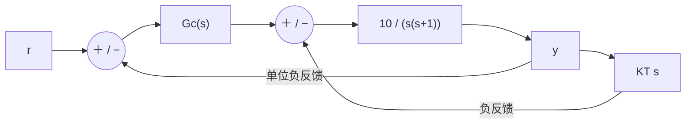

# 東北大学 工学研究科 電気・情報系 2015年8月実施 専門科目 問題1 電気工学（制御）

## **Author**

祭音Myyura (co-authored with GPT 5.6 SOL)

## **Description**

### 日本語版

Fig. 1 のようなフィードバック制御系がある。$r(t)$ は目標値，$y(t)$ は制御量である。$K_T$ は正の定数である。

(1) $G_c(s)=1$ とする。このとき，次の問に答えよ。

- (a) このフィードバック制御系の閉ループ伝達関数 $G_0(s)$ を求めよ。
- (b) このフィードバック制御系の固有周波数 $\omega_n$ を求めよ。また，減衰率が $\xi=0.5$ となる定数 $K_T$ を求めよ。
- (c) 目標値が単位ランプ関数 $r(t)=t$ であるときの定常速度偏差 $\varepsilon_v$ を求めよ。

(2) $G_c(s)=K/(s+1)$（但し，$K$ は正の定数），また $K_T=0.1$ とする。このとき，次の問に答えよ。

- (a) このフィードバック制御系の開ループ伝達関数 $G(s)$ を求めよ。
- (b) このフィードバック制御系の開ループ周波数伝達関数 $G(j\omega)$ のゲイン $|G(j\omega)|$ と位相 $\angle G(j\omega)$ を求めよ。
- (c) このフィードバック制御系のナイキスト線図の概形を描け。また，位相交差周波数 $\omega_{\pi}$ を求めよ。
- (d) このフィードバック制御系が安定となる $K$ の範囲を求めよ。

### 题目描述

系统具有外层单位负反馈；前向控制器 $G_c(s)$ 后串联对象 $P(s)=10/[s(s+1)]$。对象还具有局部负反馈 $K_Ts$，$K_T>0$。

1. 当 $G_c(s)=1$ 时：(a) 求闭环传递函数；(b) 求固有角频率 $\omega_n$，以及使阻尼比 $\xi=0.5$ 的 $K_T$；(c) 输入为单位斜坡 $r(t)=t$ 时，求稳态误差。
2. 当 $G_c(s)=K/(s+1)$、$K_T=0.1$、$K>0$ 时：(a) 求外环开环传递函数；(b) 求频率响应的增益和相位；(c) 绘制奈奎斯特曲线，求相位交越频率；(d) 求闭环稳定的 $K$ 范围。

## **Kai**

### (1)

先化简局部反馈：

$$
P_{\rm in}(s)=\frac{10}{s(s+1+10K_T)}.
$$

因此

$$
\boxed{G_0(s)=\frac{10}{s^2+(1+10K_T)s+10}.}
$$

比较 $s^2+2\xi\omega_ns+\omega_n^2$，有

$$
\boxed{\omega_n=\sqrt{10},\qquad K_T=\frac{\sqrt{10}-1}{10}\quad(\xi=0.5).}
$$

速度误差常数为 $K_v=\lim_{s\to0}sP_{\rm in}(s)=10/(1+10K_T)$，所以

$$
\boxed{\varepsilon_v=\frac{1+10K_T}{10}.}
$$

若使用 (b) 的 $K_T$，则 $\varepsilon_v=1/\sqrt{10}$。

### (2)

$$
\boxed{G(s)=\frac{10K}{s(s+1)(s+2)}.}
$$

对 $\omega>0$，

$$
|G(i\omega)|=\frac{10K}{\omega\sqrt{1+\omega^2}\sqrt{4+\omega^2}},\qquad
\arg G(i\omega)=-\frac\pi2-\arctan\omega-\arctan\frac\omega2.
$$

其实部、虚部为

$$
\Re G=-\frac{30K}{(1+\omega^2)(4+\omega^2)},\qquad
\Im G=\frac{10K(\omega^2-2)}{\omega(1+\omega^2)(4+\omega^2)}.
$$

正频率支从 $\Re G\to-15K/2,\Im G\to-\infty$ 出发，经过 $(-5K/3,0)$，最终从第二象限趋于原点；负频率支关于实轴对称。因此

$$
\boxed{\omega_{\pi}=\sqrt2.}
$$

闭环特征多项式为 $s^3+3s^2+2s+10K$。Routh 第一列为 $1,3,(6-10K)/3,10K$，故

$$
\boxed{0<K<\frac35.}
$$
