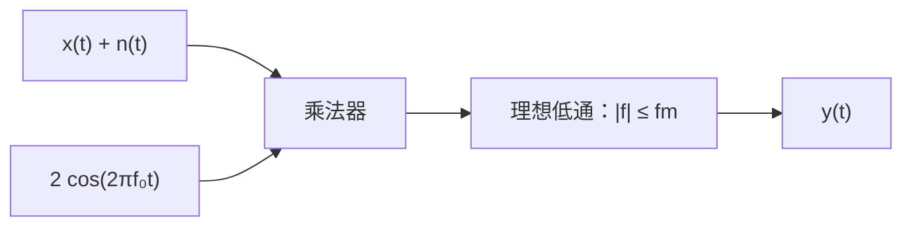

# 東北大学 工学研究科 電気・情報系 2015年8月実施 専門科目 問題2 通信工学

## **Author**

祭音Myyura (co-authored with GPT 5.6 SOL)

## **Description**

### 日本語版

Fig. 2 に示す搬送波抑圧両側波帯振幅変調を用いた伝送系を考える。伝送路は理想的で損失はないものとする。送信機において，最大周波数が $f_m$ である信号 $s(t)$ を入力とし，信号 $x(t)$ を出力とする。また，搬送波は $f_c(t)=\cos(2\pi f_0t)$ で与えられるものとする（但し $f_0\gg f_m$）。一方，受信機において局部発振波 $f_{LO}(t)$ を用いて同期ホモダイン検波することを考える。ここで，受信機内において両側電力スペクトル密度が $N_0/2$ である白色雑音 $n(t)$ が付加されるものとする。このとき以下の問に答えよ。

(1) $s(t)$ のフーリエ変換 $S(f)$ を用いて，送信機からの出力信号 $x(t)$ の周波数スペクトルを求めよ。

(2) $f_{LO}(t)=2\cos(2\pi f_0t)$ で与えられる局部発振波を用いた同期ホモダイン検波回路を図示せよ。また，その復調過程を数式を用いて説明せよ。さらに，復調信号に付与される雑音 $n(t)$ の影響について説明せよ。

(3) 局部発振波が位相誤差 $\delta\phi$ を含み $f_{LO}(t)=2\cos(2\pi f_0t+\delta\phi)$ と表される場合について，位相誤差 $\delta\phi$ が復調信号に及ぼす影響を述べよ。

### 题目描述

抑制载波双边带调幅系统中，消息 $s(t)$ 的最高频率为 $f_m$，载波为 $\cos(2\pi f_0t)$，$f_0\gg f_m$。发射输出为 $x(t)$，信道理想无损。接收端叠加双边功率谱密度为 $N_0/2$ 的白噪声 $n(t)$，再进行同步检波。

1. 用 $s(t)$ 的傅里叶变换 $S(f)$ 表示 $x(t)$ 的频谱。
2. 本振为 $2\cos(2\pi f_0t)$ 时，画出同步检波结构，以公式说明解调及噪声的影响。
3. 本振改为 $2\cos(2\pi f_0t+\delta\phi)$ 时，说明相位误差的影响。

## **Kai**

### (1)

$$
x(t)=s(t)\cos(2\pi f_0t),\qquad
\boxed{X(f)=\frac12\{S(f-f_0)+S(f+f_0)\}.}
$$

### (2)

因为 $2x(t)\cos(2\pi f_0t)=s(t)[1+\cos(4\pi f_0t)]$，低通滤除 $2f_0$ 附近频率后

$$
\boxed{y(t)=s(t)+n_b(t),\qquad n_b=\operatorname{LPF}\{2n(t)\cos(2\pi f_0t)\}.}
$$

两侧带的噪声均搬移至基带，输出双边噪声功率谱为

$$
S_{n_b}(f)=\begin{cases}N_0,&|f|\le f_m,\\0,&\text{其他},\end{cases}
$$

因此输出噪声功率为 $2N_0f_m$，若消息功率为 $P_s$，则输出信噪比为 $P_s/(2N_0f_m)$。

### (3)

乘积中的基带信号为 $s(t)\cos\delta\phi$，故

$$
\boxed{y(t)=s(t)\cos\delta\phi+n_{b,\phi}(t).}
$$

白噪声输出功率不变，信号功率及信噪比乘以 $\cos^2\delta\phi$。当 $\delta\phi=\pi/2\pmod\pi$ 时信号消失；相差 $\pi$ 时信号反相。
