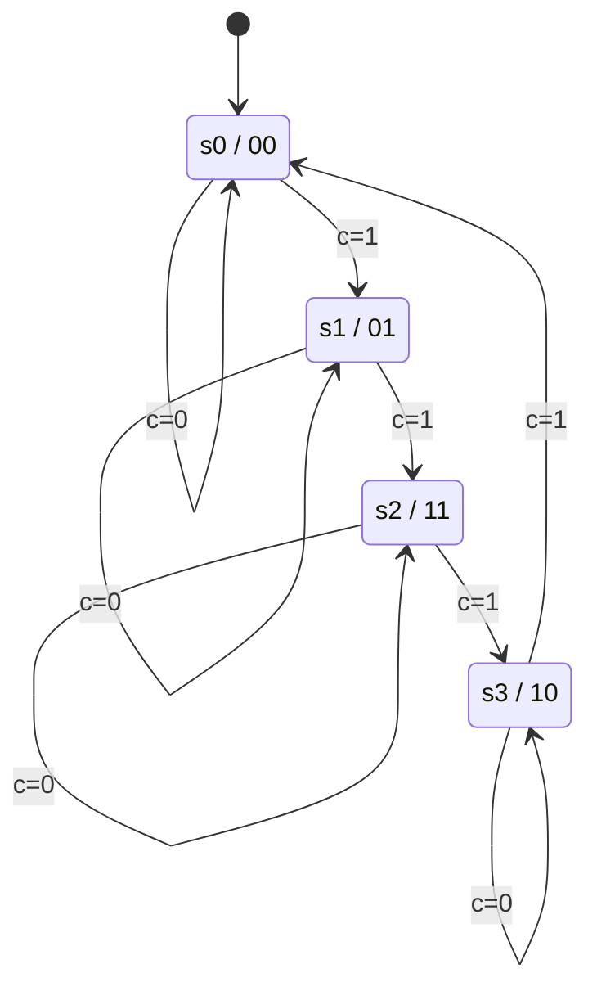
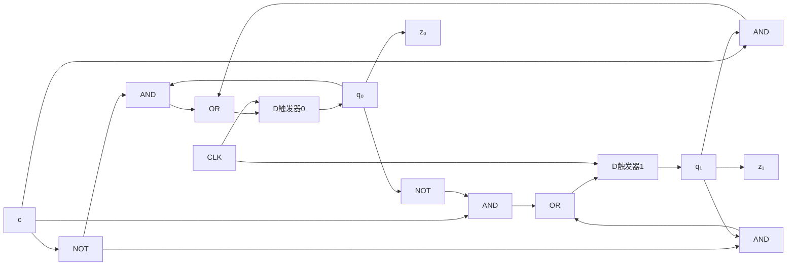

# 東北大学 工学研究科 電気・情報系 2015年8月実施 専門科目 問題4 計算機1

## **Author**

祭音Myyura (co-authored with GPT 5.6 SOL)

## **Description**

### 日本語版

クロック信号に同期して，各時刻に $1$ ビット信号 $c\in\{0,1\}$ を受け取り，$2$ ビット信号 $z_0,z_1\in\{0,1\}$ を出力する順序回路を考える。この回路の各状態 $s_i$（$0\le i\le3$）は，Table 4(a) に示す状態遷移表に従って変化し，初期状態は $s_0$ である。ここで，$p\bmod q$ は $p$ を $q$ で割った余りを意味する。以下の問に答えよ。

(1) この順序回路の状態遷移図を示せ。

(2) 現在の状態を表す状態信号を $q_0,q_1\in\{0,1\}$，次の状態を表す状態信号を $Q_0,Q_1\in\{0,1\}$ とする。状態信号の状態への割り当ては Table 4(b) に与えられる。また，出力信号 $z_0,z_1$ はそれぞれ状態信号 $q_0,q_1$ に等しいとする。この順序回路の励起式（状態式），及び出力式を，最簡積和形の論理式で表せ。

(3) この順序回路を，$2$ つの D フリップフロップ，及び任意の個数の NOT，AND，OR ゲートを用いて構成せよ。

Table 4(a)

| Present state | Next state: $c=1$ | Next state: $c=0$ |
|---|---|---|
| $s_i$ | $s_j$（$j=(i+1)\bmod4$） | $s_i$ |

Table 4(b)

| State | $(q_0,q_1)$ |
|---|---|
| $s_0$ | $(0,0)$ |
| $s_1$ | $(0,1)$ |
| $s_2$ | $(1,1)$ |
| $s_3$ | $(1,0)$ |

### 题目描述

同步顺序电路每拍接收一位输入 $c$，输出 $z_0,z_1$。状态为 $s_0,s_1,s_2,s_3$，初态 $s_0$：当 $c=1$ 时 $s_i\to s_{(i+1)\bmod4}$，当 $c=0$ 时保持状态。状态编码及输出为

| 状态 | $(q_0,q_1)=(z_0,z_1)$ |
|---|---|
| $s_0$ | $(0,0)$ |
| $s_1$ | $(0,1)$ |
| $s_2$ | $(1,1)$ |
| $s_3$ | $(1,0)$ |

1. 画状态转换图。
2. 以最简与或式给出下一状态 $Q_0,Q_1$ 和输出方程。
3. 用两个 D 触发器及任意数量的 NOT、AND、OR 门画出实现结构。

## **Kai**

### (1)

### (2)

$c=1$ 时 $(Q_0,Q_1)=(q_1,\bar q_0)$，$c=0$ 时保持，故

$$
\boxed{Q_0=\bar c q_0+cq_1,\qquad Q_1=\bar c q_1+c\bar q_0,\qquad z_0=q_0,\quad z_1=q_1.}
$$

### (3)

两个 D 输入分别连接上述 $Q_0,Q_1$，共用时钟，并初始化为 $00$。图中各“与”节点是二输入 AND，“或”节点是二输入 OR。

