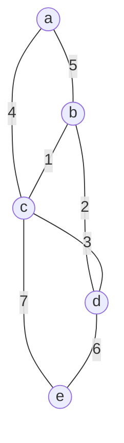

# 東北大学 工学研究科 電気・情報系 2016年3月実施 基礎科目 問題4 情報基礎2

## **Author**

祭音Myyura (co-authored with GPT 5.6 SOL)

## **Description**

### 日本語版

$n$ 個の節点の集合 $V$ と正の重みが付いた $m$ 個の枝の集合 $E$ からなる連結無向グラフ $G=(V,E)$ について考える。ある連結部分グラフ $G'$ が $G$ の全ての節点を含み，$G'$ の枝の重みの合計が最小であるとき，$G'$ を $G$ の最小全域木と呼ぶ。以下の問に答えよ。

(1) Fig. 4 に与えられたグラフ $G_1$ の隣接行列，および $G_1$ の隣接リストをそれぞれ示せ。

(2) $G$ の隣接行列，および $G$ の隣接リストを格納するのに必要な記憶域のサイズを，それぞれ $O$ 記法で示せ。

(3) Fig. 4 に与えられたグラフ $G_1$ の最小全域木を示せ。

(4) $G$ の最小全域木を求める効率のよいアルゴリズムを示せ。

### 题目描述

无向加权图 $G=(V,E)$ 有 $n$ 个顶点和 $m$ 条边，各权值为正。图的最小生成树是包含全部顶点且边权总和最小的树。给定图 $G_1$：

1. 写出 $G_1$ 的邻接矩阵和邻接表。
2. 用 $O$ 记号分别表示存储一般图 $G$ 的邻接矩阵和邻接表所需空间。
3. 给出 $G_1$ 的一棵最小生成树。
4. 给出求 $G$ 的最小生成树的高效算法。

## **Kai**

### (1)

顶点顺序取 $a,b,c,d,e$，以 $\infty$ 表示无边，加权邻接矩阵为

$$
\boxed{\begin{pmatrix}
0&5&4&\infty&\infty\\5&0&1&2&\infty\\4&1&0&3&7\\
\infty&2&3&0&6\\\infty&\infty&7&6&0
\end{pmatrix}.}
$$

| 顶点 | 邻接表（邻点，权值） |
|---|---|
| $a$ | $(b,5),(c,4)$ |
| $b$ | $(a,5),(c,1),(d,2)$ |
| $c$ | $(a,4),(b,1),(d,3),(e,7)$ |
| $d$ | $(b,2),(c,3),(e,6)$ |
| $e$ | $(c,7),(d,6)$ |

### (2)

邻接矩阵为 $O(n^2)$；邻接表为 $O(n+m)$，无向边在表中存储两次。

### (3)

按边权从小到大选择且避开环，得到

$$
\boxed{T=\{bc,bd,ac,de\},\qquad w(T)=1+2+4+6=13.}
$$

### (4)

使用 Kruskal 算法：将所有边按权值递增排序；初始化每个顶点各自所属的并查集；依次考察边 $uv$，若两端属于不同集合，则加入此边并合并集合；加入 $n-1$ 条边后结束。

每次所加的最小跨集合边均满足割性质，因此结果为最小生成树。排序为 $O(m\log m)$，并查集总时间为 $O(m\alpha(n))$，总计 $O(m\log m)$。若图不连通，则得到最小生成森林，并可报告不存在生成树。
