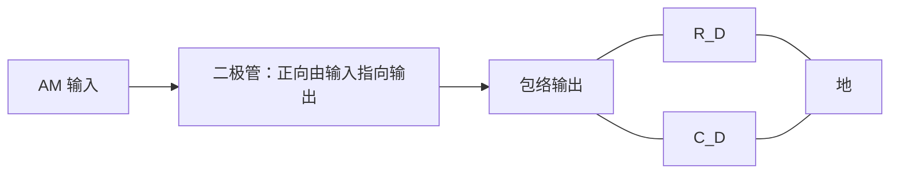

# 東北大学 工学研究科 電気・情報系 2016年3月実施 専門科目 問題2 通信工学（調幅と雑音）

## **Author**

祭音Myyura (co-authored with GPT 5.6 SOL)

## **Description**

### 日本語版

変調信号 $s(t)=\cos(2\pi f_mt)$ および搬送波 $A_c\cos(2\pi f_ct)$ により生成される振幅変調波 $g_{\mathrm{AM}}(t)=A_c\{1+m\cdot s(t)\}\cos(2\pi f_ct)$（$0<f_m\ll f_c$）を考える。ここで $m$ は変調度であり，$0<m\le1$ が満たされている。このとき，以下の問に答えよ。

(1) $g_{\mathrm{AM}}(t)$ の概形を描け。

(2) $g_{\mathrm{AM}}(t)$ の電力効率 $\eta_{\mathrm{AM}}$ の式を求めよ。また，その最大電力効率を求めよ。

上述した振幅変調波 $g_{\mathrm{AM}}(t)$ の受信機モデルを Fig. 2 に示す。受信機内では両側電力スペクトル密度が $N_0/2$ である白色雑音 $n(t)$ が付加されるものとする。バンドパスフィルタ（BPF）は中心周波数 $f_c$，通過帯域 $2f_T$ の次式で表される理想的な通過特性を持つものとする。
$$
H(f)=\begin{cases}1&\bigl||f|-f_c\bigr|\le f_T\\0&\bigl||f|-f_c\bigr|>f_T\end{cases}
$$
なお $f_m,f_c$ および $f_T$ は $f_m<f_T\ll f_c$ の関係を満足する。このとき，以下の問に答えよ。

(4) 受信機からの出力信号 $g_{\mathrm{out}}(t)$ の信号対雑音電力比 $(S/N)_{\mathrm{out}}$ の式を求めよ。また，$(S/N)_{\mathrm{out}}$ の最大値を求めよ。ここで，包絡線検波器への入力信号の信号対雑音電力比を $(S/N)_{\mathrm{in}}$ とし，搬送波振幅 $A_c$ は白色雑音振幅に比べ十分に大きいものとする。

#### 題意の要約

(3) 包絡線検波器の回路の一例を示し、その動作を説明する。原文は[大学公開の原題、3 ページ](https://www.ecei.tohoku.ac.jp/ecei_web/files/admission/201603senmon.pdf#page=3)を参照。

### 题目描述

普通调幅波为 $g_{AM}(t)=A_c[1+m\cos(2\pi f_mt)]\cos(2\pi f_ct)$，$0<m\le1$、$0<f_m\ll f_c$。

1. 画出 $g_{AM}(t)$ 的波形。
2. 求功率效率 $\eta_{AM}$ 及其最大值。
4. 接收端叠加双边功率谱密度为 $N_0/2$ 的白噪声，经过理想带通滤波器、包络检波和直流隔离。带通在 $\big||f|-f_c\big|\le f_T$ 时增益为 $1$，其他频率为 $0$，且 $f_m<f_T\ll f_c$。假设载波足够强，求输出信噪比与包络检波器输入信噪比 $(S/N)_{in}$ 的关系及其最大值。

## **Kai**

### (1)

波形围绕零快速振荡，上下包络分别为

$$
\boxed{\pm A_c[1+m\cos(2\pi f_mt)].}
$$

包络幅度的最大值、最小值分别为 $A_c(1+m),A_c(1-m)$；$m=1$ 时最小值为零。

### (2)

展开为

$$
g_{AM}=A_c\cos(2\pi f_ct)+\frac{mA_c}{2}\{\cos2\pi(f_c+f_m)t+\cos2\pi(f_c-f_m)t\}.
$$

在单位电阻归一化下，载波功率 $P_c=A_c^2/2$，两侧带总功率 $P_{SB}=m^2A_c^2/4$，故

$$
\boxed{\eta_{AM}=\frac{m^2}{2+m^2}\le\frac13,}
$$

最大值在 $m=1$ 时取得。

### (3)

可用二极管串联输入，在输出端将电阻 $R_D$ 与电容 $C_D$ 并联到地：

输入的正峰高于电容电压时二极管导通，电容快速充电；其余时间二极管截止，电容经电阻放电。选取 $1/f_c\ll R_DC_D\ll1/f_m$，可滤去载波起伏并跟踪缓慢变化的包络；再隔去直流得到调制信号。此条件是通常的时间尺度要求，还应避免调制度较大时的斜切失真。

### (4)

带通输出噪声功率为 $P_{n,in}=2N_0f_T$。把窄带噪声写为

$$
n_I(t)\cos(2\pi f_ct)-n_Q(t)\sin(2\pi f_ct),
$$

其同相分量功率为 $E[n_I^2]=2N_0f_T$。强载波近似下，去除直流后的包络输出为

$$
g_{out}(t)\simeq mA_c\cos(2\pi f_mt)+n_I(t).
$$

因此

$$
\left(\frac SN\right)_{out}=\frac{m^2A_c^2}{4N_0f_T},\qquad
\left(\frac SN\right)_{in}=\frac{A_c^2(2+m^2)}{8N_0f_T},
$$

即

$$
\boxed{\left(\frac SN\right)_{out}=\frac{2m^2}{2+m^2}\left(\frac SN\right)_{in}\le\frac23\left(\frac SN\right)_{in}.}
$$

上界在 $m=1$ 时取得。
