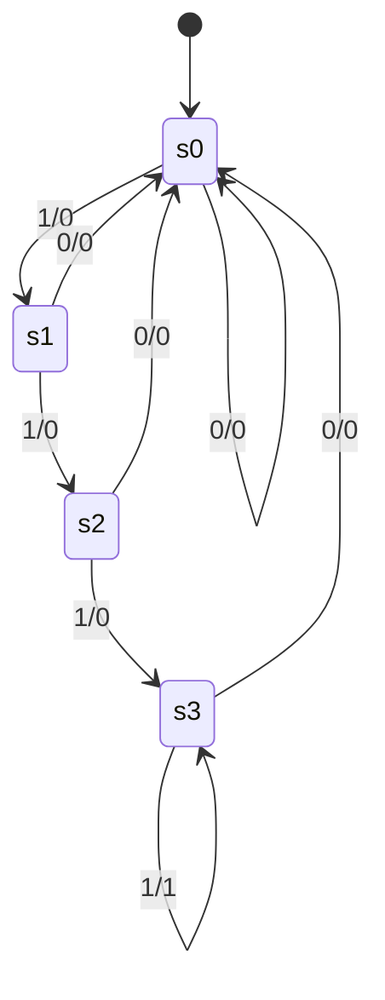
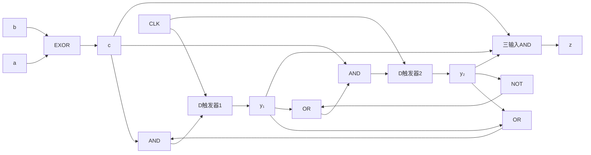

# 東北大学 工学研究科 電気・情報系 2016年3月実施 専門科目 問題4 計算機1

## **Author**

祭音Myyura (co-authored with GPT 5.6 SOL)

## **Description**

### 日本語版

クロックに同期して，各時刻 $t=1,2,\ldots$ に $2$ つの $1$ ビット信号 $a_t,b_t\in\{0,1\}$ を受け取り，$1$ つの $1$ ビット信号 $z_t\in\{0,1\}$ を出力する順序回路を考える。本順序回路は，$t\ge4$ かつ系列 $a_ta_{t-1}a_{t-2}a_{t-3}$ と $b_tb_{t-1}b_{t-2}b_{t-3}$ のハミング距離が $4$ のときに $1$ を出力し，それ以外では $0$ を出力する。なお，ハミング距離とは，桁数の等しい $2$ つの $2$ 進数において，記号が異なる桁の個数のことである。以下の問に答えよ。

(1) $2$ 入力系列 $a_6a_5a_4a_3a_2a_1=101010,\ b_6b_5b_4b_3b_2b_1=110100$ に対する出力系列 $z_6z_5z_4z_3z_2z_1$ を示せ。

(2) 本順序回路の状態遷移図を示せ。ただし，状態数は $4$ とせよ。

(3) 本順序回路の励起式（状態式）および出力式を最簡積和形の論理式で示せ。ただし，現在の状態を表す状態信号を $y_1,y_2\in\{0,1\}$，次の状態を表す状態信号を $Y_1,Y_2\in\{0,1\}$ とする。

(4) 本順序回路を，$2$ つの D フリップフロップ，および任意の個数の NOT, AND, OR, EXOR ゲートを用いて構成せよ。

### 题目描述

同步电路在 $t=1,2,\ldots$ 接收两位 $a_t,b_t$，输出一位 $z_t$。当 $t\ge4$ 且最近四位组成的两序列 $a_ta_{t-1}a_{t-2}a_{t-3}$ 与 $b_tb_{t-1}b_{t-2}b_{t-3}$ 的汉明距离为 $4$ 时，输出 $1$，否则输出 $0$。

1. 对 $a_6a_5a_4a_3a_2a_1=101010$、$b_6b_5b_4b_3b_2b_1=110100$，求 $z_6z_5z_4z_3z_2z_1$。
2. 用四个状态画状态转换图。
3. 以当前状态位 $y_1,y_2$、下一状态位 $Y_1,Y_2$ 写出最简与或式状态方程及输出方程。
4. 用两个 D 触发器和任意数量 NOT、AND、OR、EXOR 门给出电路结构。

## **Kai**

### (1)

令 $c_t=a_t\oplus b_t$，则 $c_6\cdots c_1=011110$，仅 $t=5$ 时最近四个 $c$ 均为 $1$，所以

$$
\boxed{z_6z_5z_4z_3z_2z_1=010000.}
$$

### (2)

状态表示此前连续出现 $c=1$ 的长度（在 $3$ 饱和）。编码取 $s_0=00,s_1=01,s_2=10,s_3=11$，初态 $s_0$。边标记为 $c/z$。

### (3)

$$
\boxed{Y_1=cy_1+cy_2,\qquad Y_2=cy_1+c\bar y_2,\qquad z=cy_1y_2,\quad c=a\oplus b.}
$$

其中输出用当前输入及接收该输入前的状态计算。由于初态为 $00$，前 $3$ 拍不会误报。

### (4)

两个触发器分别接收 $Y_1,Y_2$，共用时钟并清零。以下与或网络直接实现 (3)：

