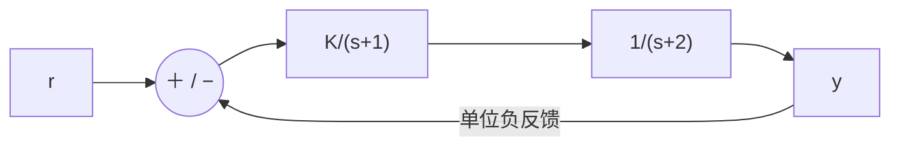

# 東北大学 工学研究科 電気・情報系 2016年8月実施 専門科目 問題1 電気工学（周波数応答・制御）

## **Author**

祭音Myyura (co-authored with GPT 5.6 SOL)

## **Description**

### 日本語版

(2) ある電気回路の伝達関数が
$$
G(s)=\frac1{(s+1)(s+2)}
$$
で与えられる。次の問に答えよ。

- (a) 周波数伝達関数 $G(j\omega)$ のゲイン $|G(j\omega)|$ と位相 $\angle G(j\omega)$ を求めよ。
- (b) 周波数伝達関数 $G(j\omega)$ のナイキスト線図の概形を描け。

(3) Fig. 1(b) に示すフィードバック制御系を考える。$r(t)$ と $y(t)$ は，それぞれ目標値と制御量である。次の問に答えよ。

- (a) このフィードバック制御系の開ループ伝達関数 $G(s)$ を求めよ。
- (b) このフィードバック制御系が安定になるための $K$ の範囲を求めよ。

### 题目描述

本题取原问题的 (2)、(3)。

2. 给定传递函数 $G(s)=1/[(s+1)(s+2)]$：(a) 求 $G(i\omega)$ 的增益与相位；(b) 画奈奎斯特曲线。
3. 单位负反馈系统的前向通路依次为 $K/(s+1)$ 和 $1/(s+2)$：(a) 求开环传递函数；(b) 求闭环稳定的 $K$ 范围。

## **Kai**

### (2)

$$
\boxed{|G(i\omega)|=\frac1{\sqrt{(1+\omega^2)(4+\omega^2)}},\qquad
\arg G(i\omega)=-\arctan\omega-\arctan\frac\omega2\quad(\omega\ge0).}
$$

其实部、虚部为

$$
\Re G=\frac{2-\omega^2}{(1+\omega^2)(4+\omega^2)},\qquad
\Im G=-\frac{3\omega}{(1+\omega^2)(4+\omega^2)}.
$$

正频率支从 $(1/2,0)$ 出发进入下半平面，在 $\omega=\sqrt2$ 处经过 $(0,-1/(3\sqrt2))$，再从第三象限趋于原点。负频率支关于实轴对称。

### (3)

$$
\boxed{G_{open}(s)=\frac K{(s+1)(s+2)}.}
$$

闭环特征多项式为 $s^2+3s+(2+K)$，二阶 Hurwitz 条件给出

$$
\boxed{K>-2.}
$$

若将 $K$ 限定为正增益，则所有 $K>0$ 均稳定。
