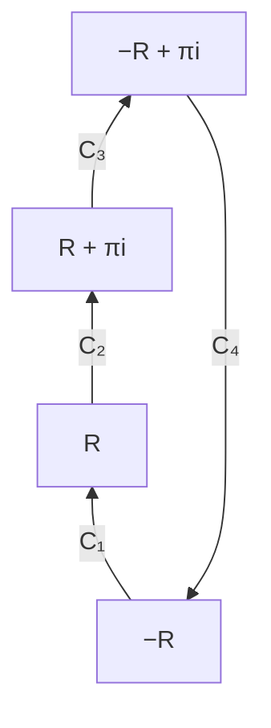

# 東北大学 工学研究科 電気・情報系 2016年8月実施 専門科目 問題7 物理専門2

## **Author**

祭音Myyura (co-authored with GPT 5.6 SOL)

## **Description**

### 日本語版

複素変数 $z$ の関数
$$
f(z)=\frac{e^{iz}}{\cosh(z)}
$$
を考える。また，$C_1,C_2,C_3$ 及び $C_4$ は，以下のように定義された積分路である（Fig. 7）。
$$
\begin{aligned}
C_1:\ z&=t&&(-R\le t\le R),\\
C_2:\ z&=R+it&&(0\le t\le\pi),\\
C_3:\ z&=-t+\pi i&&(-R\le t\le R),\\
C_4:\ z&=-R+i(\pi-t)&&(0\le t\le\pi).
\end{aligned}
$$
ただし，$t$ は媒介変数であり，$i$ は虚数単位である。$R$ は $R>0$ を満たす実数である。以下の問に答えよ。

(1) $f(z)$ のすべての孤立特異点を求めよ。

(2) 複素積分 $I=\int_{C_1+C_2+C_3+C_4}f(z)\,dz$ の値を求めよ。

(3) $\int_{C_3}f(z)\,dz=e^{-\pi}\int_{C_1}f(z)\,dz$ となることを示せ。

(4) $\lim_{R\to+\infty}\left|\int_{C_2}f(z)\,dz\right|=0$ 及び $\lim_{R\to+\infty}\left|\int_{C_4}f(z)\,dz\right|=0$ となることを示せ。

(5) 実定積分
$$
\int_{-\infty}^{\infty}\frac{e^{ix}}{\cosh(x)}\,dx
$$
の値を求めよ。ただし，$x$ は実変数である。

### 题目描述

令 $f(z)=e^{iz}/\cosh z$，$R>0$。闭合路径为矩形 $C_1+C_2+C_3+C_4$：

$$
\begin{aligned}
C_1:&\ z=t&&(-R\le t\le R),\\
C_2:&\ z=R+it&&(0\le t\le\pi),\\
C_3:&\ z=-t+\pi i&&(-R\le t\le R),\\
C_4:&\ z=-R+i(\pi-t)&&(0\le t\le\pi).
\end{aligned}
$$

1. 求全部孤立奇点。
2. 求 $I=\oint_{C_1+C_2+C_3+C_4}f(z)\,dz$。
3. 证明 $\int_{C_3}f(z)dz=e^{-\pi}\int_{C_1}f(z)dz$。
4. 证明 $R\to\infty$ 时，两条竖边上的积分均趋于零。
5. 求 $\int_{-\infty}^{\infty}e^{ix}/\cosh x\,dx$。

## **Kai**

### (1)

由 $\cosh z=0\iff e^{2z}=-1$，全部孤立奇点为

$$
\boxed{z_k=\left(k+\frac12\right)\pi i,\qquad k\in\mathbb Z.}
$$

$\sinh z_k=i(-1)^k\ne0$，故均为一阶极点。

### (2)

矩形内只有极点 $z_0=\pi i/2$，其留数为

$$
\operatorname{Res}(f,z_0)=\frac{e^{iz_0}}{\sinh z_0}=\frac{e^{-\pi/2}}i.
$$

由留数定理

$$
\boxed{I=2\pi e^{-\pi/2}.}
$$

### (3)

由 $\cosh(x+\pi i)=-\cosh x$，有 $f(x+\pi i)=-e^{-\pi}f(x)$。上边路径从 $R+\pi i$ 到 $-R+\pi i$，所以

$$
\int_{C_3}f(z)dz=\int_R^{-R}[-e^{-\pi}f(x)]dx=e^{-\pi}\int_{C_1}f(z)dz.
$$

### (4)

在 $z=\pm R+iy$、$0\le y\le\pi$ 上，$|e^{iz}|=e^{-y}\le1$，并且

$$
|\cosh(\pm R+iy)|^2=\sinh^2R+\cos^2y\ge\sinh^2R.
$$

因此两积分的绝对值均不超过 $\pi/\sinh R\to0$。

### (5)

令 $R\to\infty$，由 (2)–(4) 得

$$
(1+e^{-\pi})\int_{-\infty}^{\infty}\frac{e^{ix}}{\cosh x}dx=2\pi e^{-\pi/2}.
$$

故

$$
\boxed{\int_{-\infty}^{\infty}\frac{e^{ix}}{\cosh x}dx=\frac\pi{\cosh(\pi/2)}.}
$$
