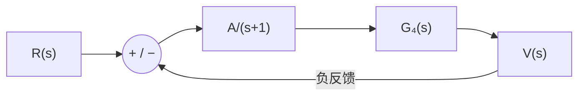

# 東北大学 工学研究科 電気・情報系 2017年3月実施 専門科目 問題1 電気工学（問2・3）

## **Author**

祭音Myyura (co-authored with GPT 5.6 SOL)

## **Description**

### 日本語版

Fig. 1(a) に示すリニアモータの電気機械系を考える。このリニアモータは巻線の中に永久磁石でできた可動部があり、巻線電流により発生する磁界により推力を得る。それぞれ、$M$ は可動部の質量、$v(t)$ は可動部の速度、$f(t)$ は推力、$d(t)$ は摩擦力である。ここで、$d(t)=\gamma v(t)$ の関係があり、$\gamma$ は摩擦係数である。また、Fig. 1(b) にリニアモータの電気的等価回路を示す。それぞれ、$R$ は巻線抵抗、$L$ は巻線インダクタンス、$e(t)$ は入力電圧、$i(t)$ は巻線電流、$e_m(t)$ は速度起電力である。ここで、$f(t)=K_fi(t)$、$e_m(t)=K_ev(t)$ の関係があり、$K_f$ と $K_e$ はそれぞれ推力定数および速度起電力定数である。また、$E(s),E_m(s),I(s),F(s)$、および $V(s)$ はそれぞれ $e(t),e_m(t),i(t),f(t)$、および $v(t)$ のラプラス変換である。

(2) Fig. 1(c) のブロック線図を簡略化し、パラメータ $M,\gamma,R,L,K_f,K_e$ の数値が与えられるとき、Fig. 1(d) に示すブロック線図が得られた。閉ループ伝達関数 $G_3(s)$ を求めよ。さらに、入力 $e(t)$ が単位インパルスのときの出力 $v(t)$ を求めよ。

(3) このリニアモータの速度制御系を Fig. 1(e) に示す。ここで、$R(s)$ は目標速度のラプラス変換である。次の問に答えよ。

(a) この速度制御系の閉ループ伝達関数 $G_5(s)$ を求めよ。

(b) $G_4(s)$ が問 (2) で求めた閉ループ伝達関数 $G_3(s)$ のとき、この制御系が安定になるための $A$ の範囲を求めよ。

### 题目描述

(2) 给定负反馈系统，前向传递函数为 $1/(s+1)^2$，反馈增益为 $2$。求闭环传递函数 $G_3(s)$，并求输入为单位冲激时的输出 $v(t)$。

(3) 在单位负反馈系统中，前向通路由 $A/(s+1)$ 与 $G_4(s)$ 串联组成。

- (a) 求闭环传递函数 $G_5(s)$。
- (b) 当 $G_4=G_3$ 时，求使系统渐近稳定的实参数 $A$ 的范围。

## **Kai**

### (2)

$$
\boxed{G_3(s)=\frac1{(s+1)^2+2}},\qquad
\boxed{v(t)=\frac1{\sqrt2}e^{-t}\sin(\sqrt2t)\quad(t\ge0)}.
$$

### (3)

$$
\boxed{G_5(s)=\frac{A G_4(s)}{s+1+A G_4(s)}}.
$$

当 $G_4=G_3$ 时，闭环特征多项式为

$$
(s+1)\big((s+1)^2+2\big)+A=s^3+3s^2+5s+3+A.
$$

Routh 表第一列为 $1,3,(12-A)/3,3+A$。全部严格为正的条件是

$$
\boxed{-3<A<12}.
$$
