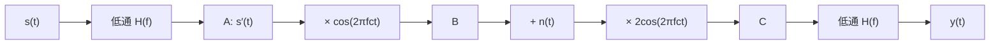

# 東北大学 工学研究科 電気・情報系 2017年3月実施 専門科目 問題2 通信工学

## **Author**

祭音Myyura (co-authored with GPT 5.6 SOL)

## **Description**

### 日本語版

Fig. 2 に示すような通信システムを考える。送信機と受信機中の理想低域通過フィルタ（LPF）の伝達関数 $H_{LPF}(f)$ は

$$
H_{LPF}(f)=\begin{cases}1&|f|\le D\text{ のとき}\\0&\text{その他}\end{cases}
$$

で与えられる。送信機の搬送波と受信機の局部発振波はそれぞれ $\cos(2\pi f_ct)$、$2\cos(2\pi f_ct)$ であり、$f_c$ は搬送波の周波数で、$f_c\gg D$ である。以下の式で表される入力信号 $s(t)$ を考える。

$$
s(t)=\begin{cases}1&0\le t\le T\text{ のとき}\\0&\text{その他}\end{cases}
$$

以下の問に答えよ。ただし、$D=1/T$ であり伝送路における損失はないものとする。

(1) $s(t)$ のフーリエ変換を求め、振幅スペクトル $|S(f)|$ を図示せよ。

(2) 点 A における信号 $s'(t)$ の振幅スペクトル $|S'(f)|$ を図示せよ。

(3) 点 B、C における入力信号のスペクトルをそれぞれ $S'(f)$ で表わし、それらの振幅スペクトルを図示せよ。

(4) Fig. 2 において $n(t)=0$ の時、受信機の出力信号 $y(t)$ は点 A における信号と等しいことを示せ。

(5) 伝送路に $n(t)\ne0$ が付加されている時、受信機の出力における雑音電力を求めよ。ただし、白色雑音の両側電力スペクトル密度を $N_0/2$ とする。

### 题目描述

信号 $s(t)=1$（$0\le t\le T$），其余为零。发送、接收两端均使用理想低通滤波器

$$
H(f)=\begin{cases}1,&|f|\le D,\\0,&\text{其他},\end{cases}\qquad D=1/T.
$$

发送端将滤波后的信号 $s'(t)$ 乘以 $\cos(2\pi f_ct)$，其中 $f_c\gg D$；信道无损，但可叠加噪声 $n(t)$。接收端乘以 $2\cos(2\pi f_ct)$ 后再低通，输出为 $y(t)$。

1. 求 $s(t)$ 的 Fourier 变换及幅度谱。
2. 求发送端低通输出 A 点的幅度谱 $|S'(f)|$。
3. 用 $S'(f)$ 表示调制后 B 点和解调后、接收滤波前 C 点的信号频谱，并画出幅度谱。
4. 证明无噪声时 $y(t)=s'(t)$。
5. 若输入噪声为双边功率谱密度 $N_0/2$ 的白噪声，求接收端输出噪声功率。

## **Kai**

取 $\mathcal F[s](f)=\int s(t)e^{-i2\pi ft}\,dt$，$\operatorname{sinc}u=\sin(\pi u)/(\pi u)$。

### (1)、(2)

$$
\boxed{S(f)=Te^{-i\pi fT}\operatorname{sinc}(fT)},\qquad |S(f)|=T|\operatorname{sinc}(fT)|.
$$

$$
\boxed{S'(f)=S(f)\boldsymbol1_{|f|\le1/T}}.
$$

$|S|$ 在 $f=0$ 达到 $T$，在非零整数倍 $1/T$ 处为零；$|S'|$ 只保留 $[-1/T,1/T]$ 的主瓣。

### (3)、(4)

无噪声的信号部分为

$$
\boxed{S_B(f)=\tfrac12S'(f-f_c)+\tfrac12S'(f+f_c)},
$$

$$
\boxed{S_C(f)=S'(f)+\tfrac12S'(f-2f_c)+\tfrac12S'(f+2f_c)}.
$$

各瓣互不重叠：B 点在 $\pm f_c$ 各有一个半高主瓣；C 点在原点有完整主瓣，在 $\pm2f_c$ 各有一个半高主瓣。接收低通仅保留 $S'(f)$，故 $Y(f)=S'(f)$，即 $\boxed{y(t)=s'(t)}$。

### (5)

乘以 $2\cos(2\pi f_ct)$ 将两侧噪声频带移至基带，输出通带内的噪声功率谱密度为

$$
\frac{N_0}{2}+\frac{N_0}{2}=N_0.
$$

因此

$$
\boxed{P_n=\int_{-D}^{D}N_0\,df=2DN_0=\frac{2N_0}{T}}.
$$
